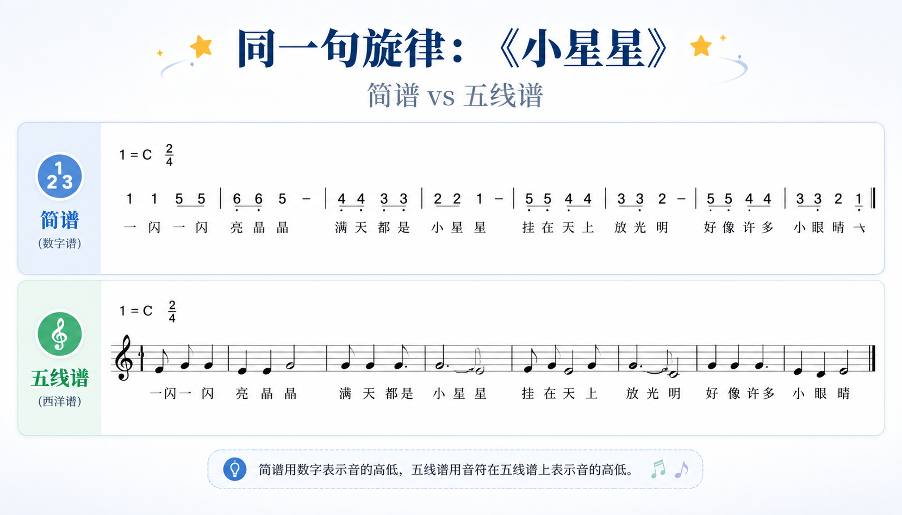
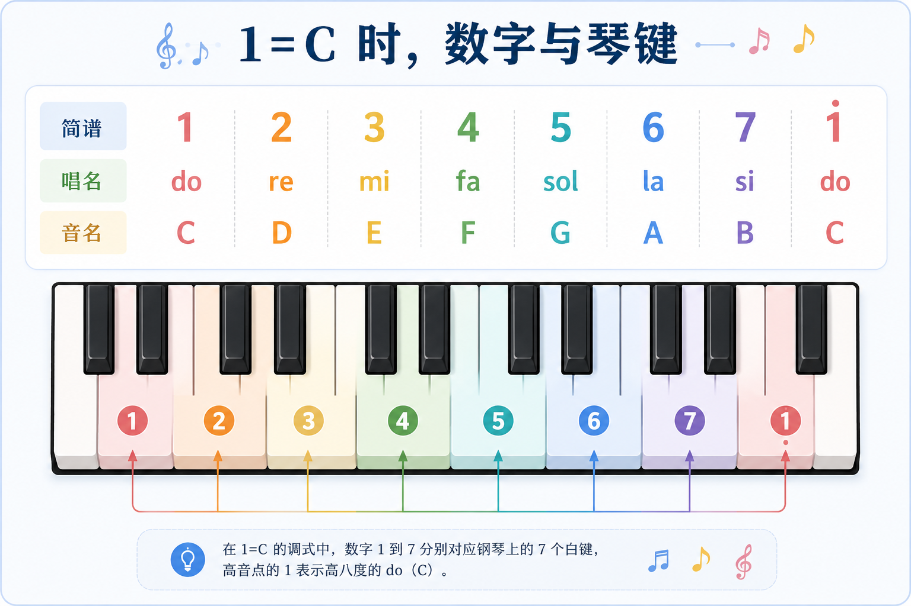
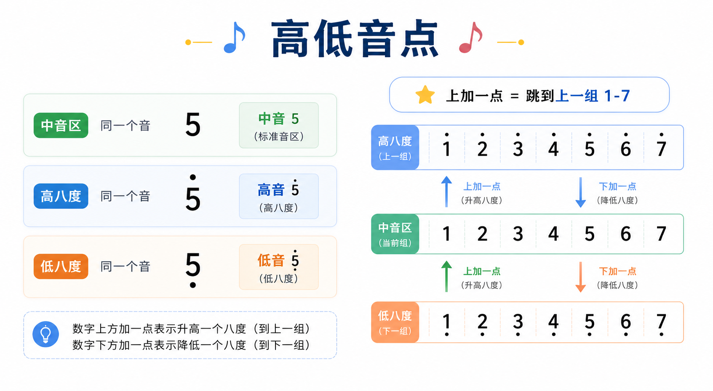
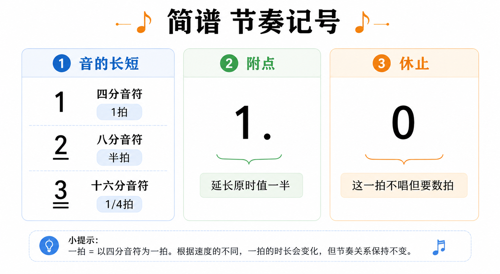
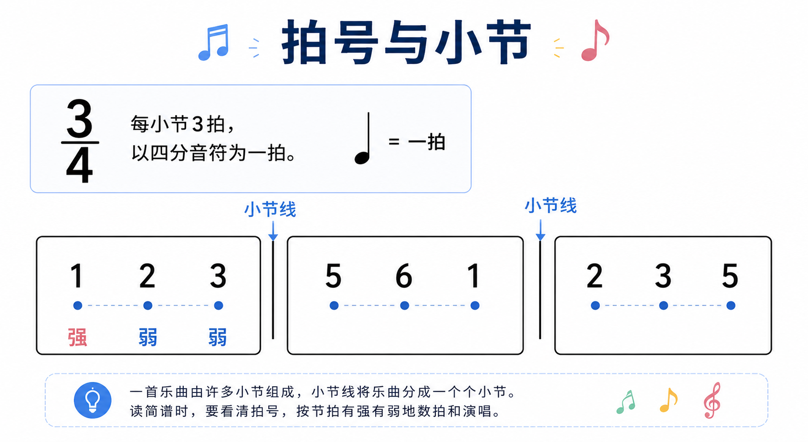
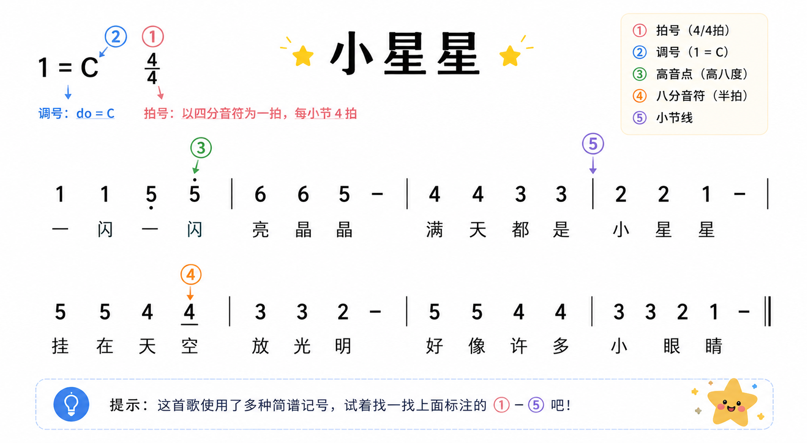
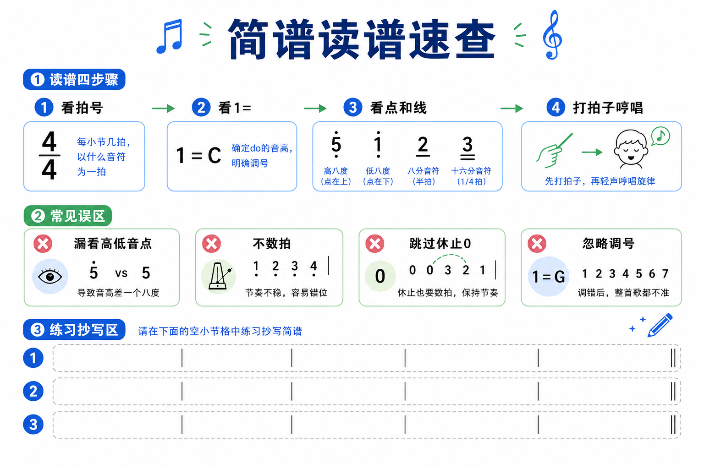

# 认识简谱：用数字读懂旋律

> 配图共 10 张，位于本文同目录 `images/`。

---

## 引言：为什么值得学简谱？

简谱用 **1 2 3 4 5 6 7** 表示音高，用 **点、线、0** 表示高低音、节奏与休止。它入门快、占地方小，在民歌、课堂、口琴/吉他谱和许多中文音乐资料里非常常见。学会简谱，不等于「会乐器」，但能让你 **看到谱子就能哼出大致旋律**，是进一步学乐器、学乐理的好台阶。

*图 1｜封面*

---

## 一、简谱是什么？和五线谱有什么关系？

**简谱**用数字记音高；**五线谱**用符头在谱线上的位置记音高。二者记录的是 **同一段声音**，只是写法不同。

*图 2｜同一句旋律：简谱 vs 五线谱*

| 对比项 | 简谱 | 五线谱 |
|--------|------|--------|
| 音高 | 数字 1–7 + 高低音点 | 符头在线/间上 |
| 节奏 | 数字下的线、附点 | 符干、符尾、附点 |
| 入门难度 | 通常更低 | 需要熟悉谱表 |
| 常见场景 | 通俗歌曲、教材、民乐 | 古典、乐队总谱 |

*图 3｜谁在用简谱？*

---

## 二、七个数字：1 到 7 唱什么？

在 **首调唱名** 里，**1 = do，2 = re，3 = mi，4 = fa，5 = sol，6 = la，7 = si**。  
**1=C** 时，数字与唱名、音名的对应关系见下图（含钢琴键盘对照）：

| 简谱 | 唱名 | 音名（1=C） |
|------|------|-------------|
| 1 | do | C |
| 2 | re | D |
| 3 | mi | E |
| 4 | fa | F |
| 5 | sol | G |
| 6 | la | A |
| 7 | si | B |

*图 4｜C 大调 1–7 与键盘*

**要点**：数字是 **音级**（第几个音），不是固定的「第几个键」；换调后 **1 仍是 do**，但键盘上的位置会整体平移。

---

## 三、高一点、低一点：高低音点

- **中音区**：数字不加点（如 `5`）。  
- **高八度**：数字 **左上** 加一点。  
- **低八度**：数字 **左下** 加一点。

*图 5｜同一音在不同八度；加点 = 跳到上一组 1–7*

读谱时 **先看点，再读数字**；漏看高低音点是最常见的「唱错八度」原因。

---

## 四、长短与停顿：节奏怎么读？

简谱里，数字默认常按 **四分音符** 理解（具体以拍号为准）。

- **一条下划线**：时值减半（常见为 **八分音符**）。  
- **两条下划线**：再减半（ **十六分音符**）。  
- **附点**（数字右侧 `·`）：延长 **原时值的一半**。  
- **0**：**休止符**，该拍 **不发声**，但要 **数拍**。

*图 6｜下划线、附点、休止 0*

### 拍号与小节

谱首有 **拍号**（如 `4/4`、`3/4`）：分母表示「以几分音符为一拍」，分子表示「每小节几拍」。**小节线** `|` 把旋律分段，每小节拍数须与拍号一致。

*图 7｜拍号与小节线（示例为 3/4）*

---

## 五、调号与变化音

谱首常写 **`1=C`**、**`1=G`** 等：表示简谱里的 **「1」对应哪个音名**。初学者先固定练 **`1=C`**，熟练后再换调。

- **`#`**：升高半音（如 `#4`）。  
- **`b`**：降低半音（如 `b7`）。  
- **`♮`**：还原，取消前面的升、降。

*图 8｜1=C / 1=G 与临时升降号*

**补充**：数字右侧横线 `-` 可 **增时**；两音间弧线表示 **连贯**；`|:` `:|` 表示 **反复**。几个数字 **上下对齐** 时表示 **同时发声**（和弦）。

---

## 六、实例：《小星星》走读一遍

用一首熟悉的曲子把前面要素串起来。对照标注图逐项看：拍号、`1=`、高低音点、下划线、小节线。

*图 9｜《小星星》标注简谱*

**自读四步**：① 看拍号 → ② 看 `1=` → ③ 看点、线、0 → ④ 打拍子哼唱。

---

## 七、读谱速查与练习

*图 10｜读谱步骤、常见误区、练习格*

**常见误区**：漏看高低音点；只唱数字不数拍；跳过休止 `0`；忽略 `1=`。

---

## 八、接下来可以怎么做？

| 阶段 | 建议 |
|------|------|
| 第 1 周 | 只练 `1=C`，读《小星星》片段，边打拍边哼 |
| 第 2 周 | 加一首 `3/4` 拍歌曲，注意第一拍强拍 |
| 第 3 周 | 试一句带 `#` 或 `b` 的旋律，对照 App 或键盘听音 |
| 长期 | 选一门乐器，把简谱当「地图」 |

---

## 发布备忘

- [x] 10 张配图已放入 `images/`
- [x] 配图已同步至 `static/blog/jianpu/`，站点路由 `/blog/jianpu`
- [ ] 在 `zhita_settings.xlsx`「文章」表增加一行标题「认识简谱」以在 `/browse/articles` 显示可点击卡片

---

*2026-05-17 · 配图齐全，可审阅发布*
