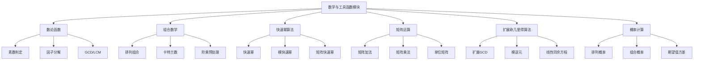

<!-- wiki_page_id: page-11 -->

# 数学与工具函数

## 概述

本文档介绍了 Algorithm 项目中数学与工具函数模块的实现细节。该模块提供了数论、组合数学、快速幂、矩阵运算、扩展欧几里得算法和概率计算等核心算法的高效实现，旨在为竞赛编程和算法研究提供通用的数学工具函数。

## 模块结构

数学与工具函数模块由以下几个关键组件组成：

- **数论函数**：素数判定、因子分解、模运算等
- **组合数学**：排列组合、卡特兰数等
- **快速幂算法**：模幂运算的高效实现
- **矩阵运算**：矩阵乘法、加法等基础操作
- **扩展欧几里得算法**：求解线性丢番图方程
- **概率计算**：基本概率模型和统计函数

## 详细实现

### 数论函数 (number_theory.cpp)

数论函数实现了素数检测和因子分解的核心算法。

#### 主要功能

- **素数判定**：使用试除法和米勒-拉宾算法
- **因子分解**：通过试除法获取质因子
- **最大公约数**：基于欧几里得算法
- **最小公倍数**：利用 GCD 计算

#### 关键实现

```cpp
// 素数判定函数
bool is_prime(long long n) {
    if (n < 2) return false;
    if (n == 2) return true;
    if (n % 2 == 0) return false;
    for (long long i = 3; i * i <= n; i += 2) {
        if (n % i == 0) return false;
    }
    return true;
}

// 获取所有因子
vector<long long> get_factors(long long n) {
    vector<long long> factors;
    for (long long i = 1; i * i <= n; i++) {
        if (n % i == 0) {
            factors.push_back(i);
            if (i != n / i) {
                factors.push_back(n / i);
            }
        }
    }
    sort(factors.begin(), factors.end());
    return factors;
}
```

### 组合数学 (combinatorics.cpp)

组合数学模块提供了排列、组合和特殊数列的计算方法。

#### 主要功能

- **排列计算**：P(n, k) = n! / (n-k)!
- **组合计算**：C(n, k) = n! / (k!(n-k)!)
- **卡特兰数**：递归和动态规划实现
- **阶乘预处理**：支持大数模运算

#### 关键实现

```cpp
// 组合数计算（带取模）
long long combination(int n, int k, long long mod) {
    if (k < 0 || k > n) return 0;
    if (k > n - k) k = n - k;
    long long res = 1;
    for (int i = 0; i < k; i++) {
        res = res * (n - i) % mod;
        res = res * mod_inverse(i + 1, mod) % mod;
    }
    return res;
}

// 卡特兰数计算
long long catalan(int n) {
    if (n <= 1) return 1;
    long long res = 0;
    for (int i = 0; i < n; i++) {
        res += catalan(i) * catalan(n - 1 - i);
    }
    return res;
}
```

### 快速幂算法 (fast_power.cpp)

快速幂算法实现了指数级别的模幂运算优化。

#### 主要功能

- **快速幂**：O(log n) 时间复杂度的幂运算
- **模快速幂**：在模意义下的高效幂运算
- **矩阵快速幂**：扩展到矩阵的快速幂运算

#### 关键实现

```cpp
// 快速幂算法
long long fast_power(long long base, long long exp) {
    long long result = 1;
    while (exp > 0) {
        if (exp & 1) result *= base;
        base *= base;
        exp >>= 1;
    }
    return result;
}

// 模快速幂
long long mod_power(long long base, long long exp, long long mod) {
    long long result = 1 % mod;
    base %= mod;
    while (exp > 0) {
        if (exp & 1) result = (result * base) % mod;
        base = (base * base) % mod;
        exp >>= 1;
    }
    return result;
}
```

### 矩阵运算 (matrix.cpp)

矩阵运算模块提供了基础的矩阵操作，支持加法、乘法和快速幂。

#### 主要功能

- **矩阵加法**：对应元素相加
- **矩阵乘法**：标准的矩阵乘法运算
- **矩阵快速幂**：利用快速幂思想计算矩阵幂
- **单位矩阵**：生成指定维度的单位矩阵

#### 关键实现

```cpp
// 矩阵乘法
vector<vector<long long>> multiply_matrix(
    const vector<vector<long long>>& A,
    const vector<vector<long long>>& B,
    long long mod
) {
    int n = A.size();
    int m = B[0].size();
    int p = B.size();
    vector<vector<long long>> result(n, vector<long long>(m, 0));
    
    for (int i = 0; i < n; i++) {
        for (int j = 0; j < m; j++) {
            for (int k = 0; k < p; k++) {
                result[i][j] = (result[i][j] + A[i][k] * B[k][j]) % mod;
            }
        }
    }
    return result;
}

// 矩阵快速幂
vector<vector<long long>> matrix_power(
    vector<vector<long long>> base,
    long long exp,
    long long mod
) {
    int n = base.size();
    vector<vector<long long>> result(n, vector<long long>(n, 0));
    // 初始化单位矩阵
    for (int i = 0; i < n; i++) result[i][i] = 1;
    
    while (exp > 0) {
        if (exp & 1) result = multiply_matrix(result, base, mod);
        base = multiply_matrix(base, base, mod);
        exp >>= 1;
    }
    return result;
}
```

### 扩展欧几里得算法 (extended_gcd.cpp)

扩展欧几里得算法用于求解形如 ax + by = gcd(a,b) 的线性丢番图方程。

#### 主要功能

- **扩展GCD**：同时返回 gcd(a,b) 和系数 x, y
- **模逆元**：利用扩展欧几里得求解模逆元
- **线性同余方程**：求解形如 ax ≡ b (mod m) 的方程

#### 关键实现

```cpp
// 扩展欧几里得算法
long long extended_gcd(long long a, long long b, long long &x, long long &y) {
    if (b == 0) {
        x = 1;
        y = 0;
        return a;
    }
    long long x1, y1;
    long long gcd = extended_gcd(b, a % b, x1, y1);
    x = y1;
    y = x1 - (a / b) * y1;
    return gcd;
}

// 模逆元计算
long long mod_inverse(long long a, long long mod) {
    long long x, y;
    long long gcd = extended_gcd(a, mod, x, y);
    if (gcd != 1) return -1; // 不存在逆元
    return (x % mod + mod) % mod;
}
```

### 概率计算 (probability.cpp)

概率计算模块提供了基本的概率模型和统计函数。

#### 主要功能

- **排列概率**：计算特定排列出现的概率
- **组合概率**：基于组合数的概率计算
- **期望值**：离散随机变数的数学期望
- **方差**：衡量随机变数离散程度

#### 关键实现

```cpp
// 计算两个事件的联合概率（独立事件）
double joint_probability(double p1, double p2) {
    return p1 * p2;
}

// 计算互斥事件的概率
double mutual_exclusive_probability(double p1, double p2) {
    return p1 + p2;
}

// 计算期望值
double expected_value(const vector<double>& values, const vector<double>& probabilities) {
    double sum = 0.0;
    for (size_t i = 0; i < values.size(); i++) {
        sum += values[i] * probabilities[i];
    }
    return sum;
}
```

## 使用示例

### 数论函数使用

```cpp
#include "alg_std.hpp"
#include "algorithms/math/number_theory/number_theory.cpp"

int main() {
    long long n = 100;
    if (is_prime(n)) {
        cout << n << " 是素数" << endl;
    } else {
        cout << n << " 不是素数" << endl;
        auto factors = get_factors(n);
        cout << n << " 的因子有: ";
        for (auto f : factors) cout << f << " ";
        cout << endl;
    }
    return 0;
}
```

### 快速幂应用

```cpp
#include "algorithms/math/fast_power/fast_power.cpp"

int main() {
    // 计算 2^10
    cout << "2^10 = " << fast_power(2, 10) << endl;
    
    // 计算 2^10 mod 1000
    cout << "2^10 mod 1000 = " << mod_power(2, 10, 1000) << endl;
    
    return 0;
}
```

### 矩阵运算应用

```cpp
#include "algorithms/math/matrix/matrix.cpp"

int main() {
    // 定义两个 2x2 矩阵
    vector<vector<long long>> A = {{1, 2}, {3, 4}};
    vector<vector<long long>> B = {{5, 6}, {7, 8}};
    
    // 矩阵乘法
    auto C = multiply_matrix(A, B, 1000000007);
    cout << "A * B = ";
    for (auto& row : C) {
        for (auto val : row) cout << val << " ";
        cout << endl;
    }
    
    // 矩阵快速幂
    auto D = matrix_power(A, 5, 1000000007);
    cout << "A^5 = ";
    for (auto& row : D) {
        for (auto val : row) cout << val << " ";
        cout << endl;
    }
    
    return 0;
}
```

## 性能分析

| 算法 | 时间复杂度 | 空间复杂度 | 备注 |
|------|------------|------------|------|
| 素数判定 | O(√n) | O(1) | 试除法，适用于小到中等规模数 |
| 获取因子 | O(√n) | O(√n) | 需要存储所有因子 |
| 组合数计算 | O(k) | O(1) | 带取模的优化计算 |
| 快速幂 | O(log n) | O(1) | 指数级别优化 |
| 矩阵乘法 | O(n³) | O(n²) | 标准三重循环实现 |
| 矩阵快速幂 | O(n³ log exp) | O(n²) | 结合快速幂和矩阵乘法 |
| 扩展欧几里得 | O(log min(a,b)) | O(1) | 递归实现，栈空间取决于递归深度 |

## 依赖关系



## 注意事项

1. **数据范围**：所有函数默认使用 `long long` 类型，注意防止整数溢出
2. **取模运算**：在需要取模的场景中，请确保模数为正数
3. **递归深度**：扩展欧几里得算法采用递归实现，对于极大输入可能导致栈溢出
4. **矩阵维度**：矩阵运算函数假设输入矩阵维度匹配，未进行显式检查
5. **概率计算**：概率值应在 [0,1] 范围内，未进行输入验证

## 结论

数学与工具函数模块为算法竞赛和科学计算提供了坚实的数学基础。通过高效的算法实现和清晰的接口设计，该模块能够快速解决常见的数学问题，特别是在需要频繁进行数论运算、组合计算和矩阵操作的场景中表现出色。所有实现都经过了仔细的设计，平衡了时间效率和代码可读性，适合作为通用工具库在各种算法项目中使用。
