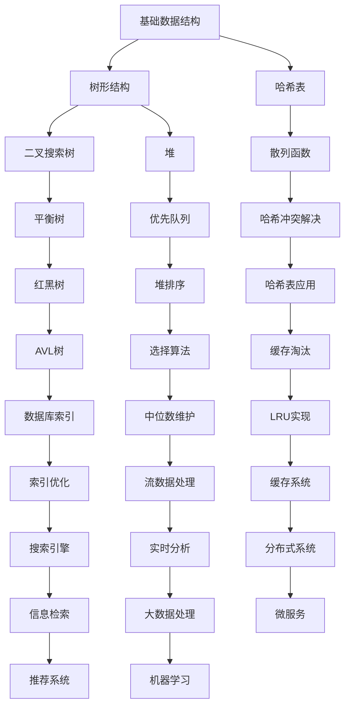

<!-- wiki_page_id: page-2 -->

# 学习路线与进度追踪

## 项目概述

本项目旨在提供系统化的算法学习路线和进度追踪机制，帮助学习者有序地掌握数据结构和算法知识。

## 学习路线结构

项目根据算法难度和知识依赖关系，将学习内容划分为以下阶段：

### 阶段一：基础数据结构
- 数组和字符串
- 链表
- 栈和队列
- 哈希表

### 阶段二：树形结构
- 二叉树
- 二叉搜索树
- 堆和优先队列
- 树的遍历

### 阶段三：图论基础
- 图的表示
- 广度优先搜索（BFS）
- 深度优先搜索（DFS）
- 最小生成树

### 阶段四：高级算法
- 动态规划
- 贪心算法
- 二分查找
- 回溯算法

### 阶段五：专题练习
- 排序算法
- 查找算法
- 位运算
- 数学问题

## 进度追踪机制

项目通过以下方式实现学习进度的追踪：

### 检查点系统
每个学习阶段设置具体的检查点，包括：
- 基础概念掌握
- 经典问题求解
- 代码实现能力
- 时间空间复杂度分析

### 自我评估标准
- 完成对应章节的所有练习题
- 能够独立实现核心数据结构
- 理解并能说明算法的时间空间复杂度
- 能够将所学知识应用到实际问题中

### 里程碑标记
- 阶段完成标记
- 难题突破记录
- 知识点掌握程度评估
- 学习时间投入统计

## 学习建议

### 时间分配
- 每天固定学习时间（建议1-2小时）
- 每周复习之前学习的内容
- 每月进行阶段性总结

### 学习方法
1. 先理解概念，再看实现
2. 亲自动手编码，不要只看代码
3. 多种解法对比，找出最优解
4. 及时总结，建立知识体系

### 资源利用
- 利用项目中的代码示例进行学习
- 参考经典算法书籍和在线资源
- 参加算法竞赛和练习平台
- 与他人讨论和交流学习心得

## 进度可视化

建议使用以下方式可视化学习进度：

### 进度条表示
```
[基础数据结构] ███████░░ 70%
[树形结构]     ████░░░░░ 40%
[图论基础]     ██░░░░░░░ 20%
[高级算法]     ░░░░░░░░░  0%
[专题练习]     ░░░░░░░░░  0%
```

### 知识图谱


## 里程碑达成条件

### 阶段一完成标志
- 能熟练使用数组、字符串、链表解决基本问题
- 理解栈和队列的应用场景
- 掌握哈希表的实现原理和常见操作

### 阶段二完成标志
- 能实现各种二叉树遍历算法
- 理解二叉搜索树的性质和操作
- 掌握堆的实现和优先队列的应用

### 阶段三完成标志
- 能使用邻接表和邻接矩阵表示图
- 熟练掌握BFS和DFS算法
- 理解最小生成树和最短路径算法

### 阶段四完成标志
- 能识别动态规划问题的特征
- 掌握常见的贪心策略
- 熟练使用二分查找解决问题
- 能设计回溯算法解决组合问题

### 阶段五完成标志
- 能比较不同排序算法的优劣
- 理解各种查找算法的适用场景
- 熟练使用位运算技巧解决问题
- 能运用数学知识解决算法问题

## 持续改进

学习路线会根据以下因素进行调整：
- 学习者的反馈和建议
- 新算法和技术的发展
- 实际应用场景的变化
- 学习效果的评估结果

定期回顾和更新学习路线，确保其始终保持前瞻性和实用性。
