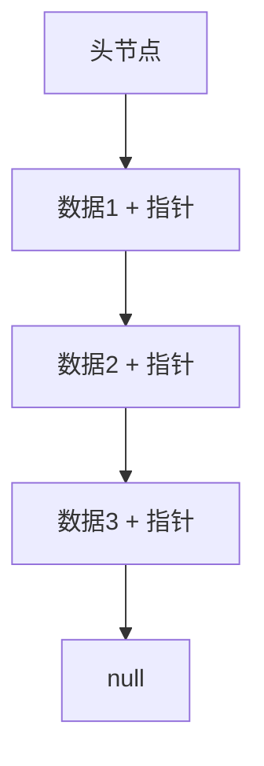
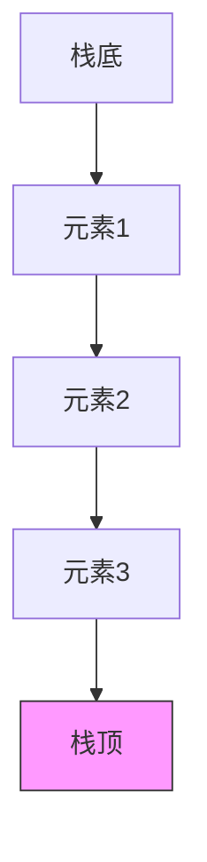
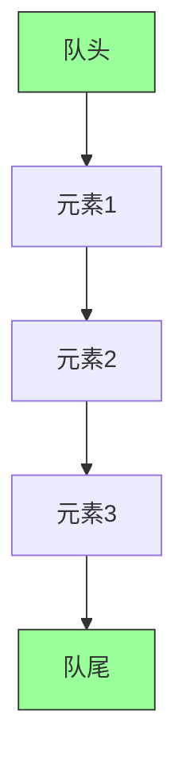
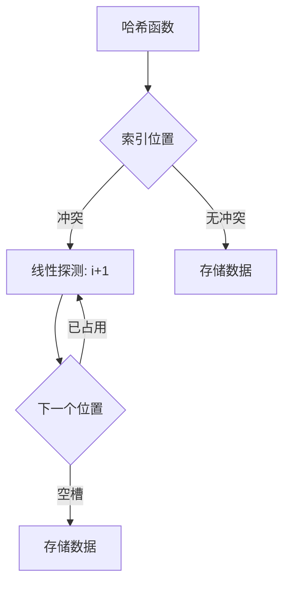

<!-- wiki_page_id: page-3 -->

# 线性数据结构

线性数据结构是计算机科学中最基础且重要的数据组织方式之一。在本项目中，我们实现了四种核心的线性数据结构：链表、栈、队列和哈希表。这些结构不仅是理解更复杂算法的基础，而且在实际软件开发中有着广泛的应用。

## 链表 (Linked List)

链表是一种通过指针将一系列节点连接起来的数据结构，每个节点包含数据域和指向下一个节点的指针。

### 特点
- 动态内存分配，长度可变
- 插入和删除操作在已知位置时时间复杂度为 O(1)
- 访问任意元素需要遍历，时间复杂度为 O(n)
- 不需要连续的内存空间

### 实现细节
在 `cpp/data_structures/linked_list/linked_list.cpp` 中，我们实现了单向链表，包含以下核心操作：
- 节点插入（头部、尾部、指定位置）
- 节点删除（根据值或位置）
- 节点查找
- 链表遍历
- 长度计算

### 时间复杂度
| 操作 | 平均情况 | 最坏情况 |
|------|----------|----------|
| 访问 | O(n)     | O(n)     |
| 搜索 | O(n)     | O(n)     |
| 插入 | O(1)*    | O(n)     |
| 删除 | O(1)*    | O(n)     |

*在已知位置的情况下

## 栈 (Stack)

栈是一种遵循后进先出（LIFO，Last In First Out）原则的线性数据结构。

- 只允许在一端（栈顶）进行插入和删除操作
- 常用操作：push（入栈）、pop（出栈）、peek（查看栈顶）
- 典型应用：函数调用栈、表达式求值、括号匹配、回溯算法

在 `cpp/data_structures/stack/stack.cpp` 中，我们使用数组实现了顺序栈，包含：
- 初始化指定容量的栈
- push 操作：在栈顶添加元素
- pop 操作：移除并返回栈顶元素
- peek 操作：返回栈顶元素但不移除
- 检查栈是否为空或已满
- 动态扩容（在需要时）

| 操作 | 时间复杂度 |
|------|------------|
| push | O(1)       |
| pop  | O(1)       |
| peek | O(1)       |
| isEmpty | O(1)    |

## 队列 (Queue)

队列是一种遵循先进先出（FIFO，First In First Out）原则的线性数据结构。

- 只允许在一端（队尾）插入元素，在另一端（队头）删除元素
- 常用操作：enqueue（入队）、dequeue（出队）、front（查看队头）
- 典型应用：任务调度、广度优先搜索（BFS）、缓冲区管理、打印队列

在 `cpp/data_structures/queue/queue.cpp` 中，我们实现了基于数组的循环队列，包含：
- 初始化指定容量的队列
- enqueue 操作：在队尾添加元素
- dequeue 操作：移除并返回队头元素
- front 操作：返回队头元素但不移除
- 检查队列是否为空或已满
- 循环利用数组空间，避免假溢出

| 操作 | 时间复杂度 |
|------|------------|
| enqueue | O(1)     |
| dequeue | O(1)     |
| front   | O(1)     |
| isEmpty | O(1)     |

## 哈希表 (Hash Table)

哈希表是一种根据关键码直接进行访问的数据结构，通过哈希函数将关键码映射到表中的一个位置来访问记录。

- 平均情况下具有 O(1) 的查找、插入和删除时间复杂度
- 通过哈希函数将键映射到数组索引
- 处理冲突的方法：开放地址法（线性探测、二次探测、再哈希）和链地址法
- 典型应用：数据库索引、缓存、符号表、去重

在 `cpp/data_structures/hash_table/hash_table.cpp` 中，我们实现了基于开放地址法的哈希表，使用线性探测解决冲突，包含：
- 哈希函数：简单的取余法
- 插入操作：通过哈希值定位位置，线性探测找到空槽
- 查找操作：根据哈希值定位，线性探测直到找到目标或空槽
- 删除操作：标记删除状态（避免破坏查找链）
- 动态重哈希：当负载因子超过阈值时，重新分配更大的表并重新插入所有元素

| 操作 | 平均情况 | 最坏情况 |
|------|----------|----------|
| 查找 | O(1)     | O(n)     |
| 插入 | O(1)     | O(n)     |
| 删除 | O(1)     | O(n)     |

*在哈希函数良好且负载因子适中的情况下

## 对比与选择指南

| 数据结构 | 最佳使用场景 | 优势 | 劣势 |
|----------|--------------|------|------|
| 链表 | 频繁插入/删除，未知数据规模 | 插入删除 O(1)，内存动态分配 | 访问慢 O(n)，额外指针开销 |
| 栈 | LIFO场景，递归实现，括号匹配 | 操作简单 O(1)，实现容易 | 只能访问栈顶 |
| 队列 | FIFO场景，任务调度，BFS | 操作简单 O(1)，实现容易 | 只能访问队头和队尾 |
| 哈希表 | 快速查找，关联数组，缓存 | 平均 O(1) 查找/插入/删除 | 最坏 O(n)，需要好哈希函数，空间开销 |

## 实现注意事项

1. **内存管理**：所有实现都采用了 RAII 原则，在析构函数中正确释放动态分配的内存
2. **错误处理**：通过返回特殊值或抛出异常处理边界情况（如空栈/队列的 pop 操作）
3. **模板化**：栈和队列实现使用了模板，支持多种数据类型
4. **效率考虑**：哈希表采用素数作为表大小以减少冲突，并实现了动态重哈希机制
5. **边界条件**：所有实现都充分考虑了空状态、满状态和单元素状态的处理

这些线性数据结构的实现为理解更复杂的数据结构和算法提供了坚实的基础，也是实际编程中解决问题的重要工具。通过掌握这些结构的特性和实现细节，开发者可以根据具体问题选择最合适的数据结构来优化程序性能。
