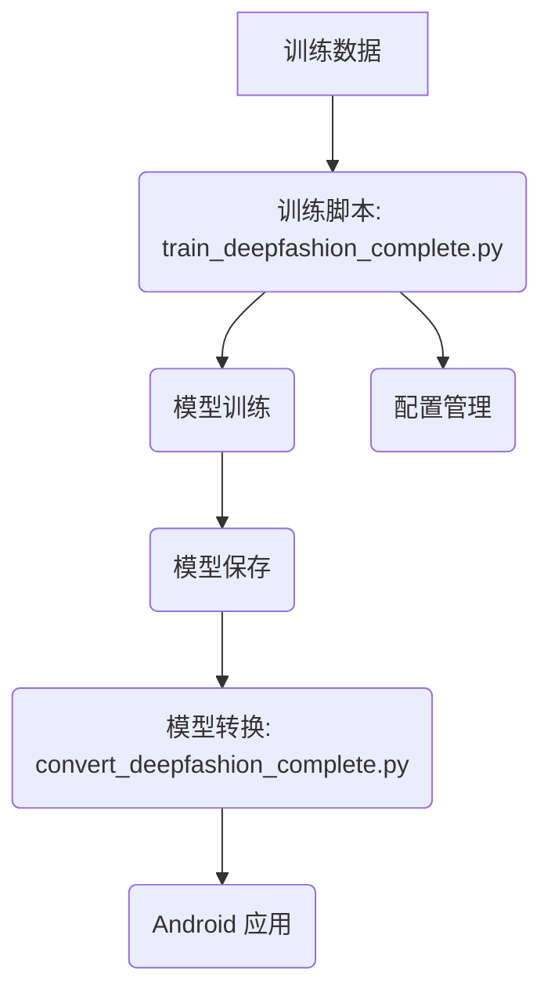
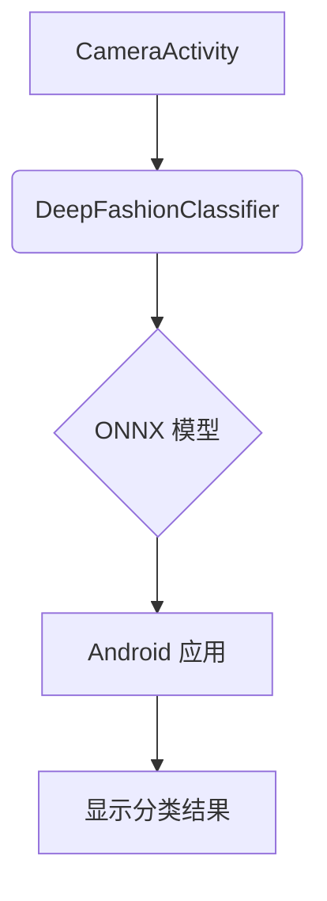
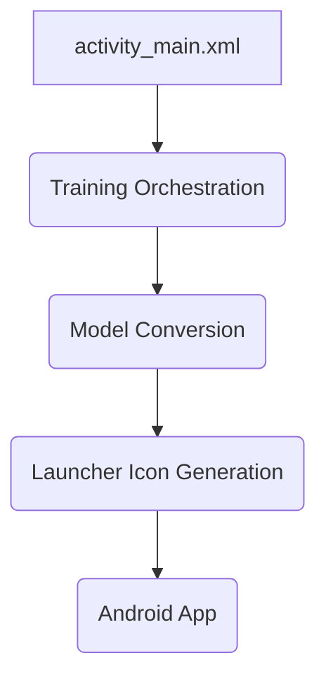
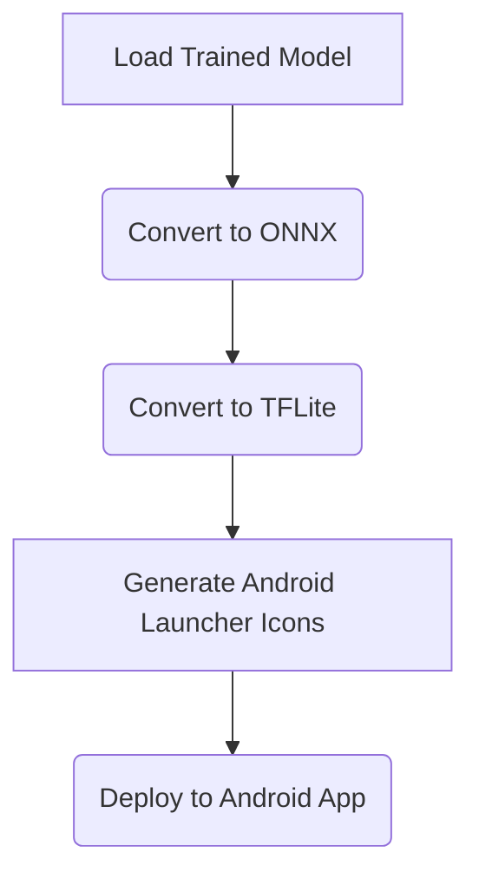
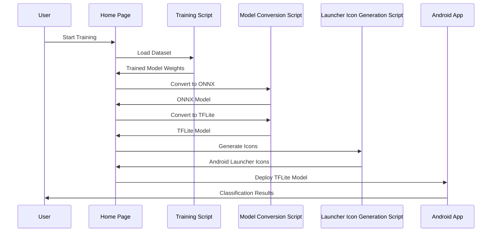
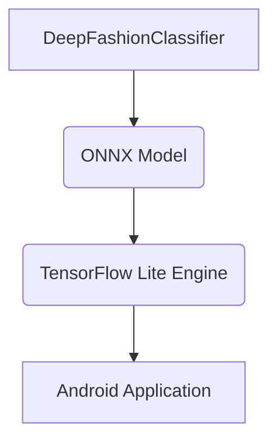
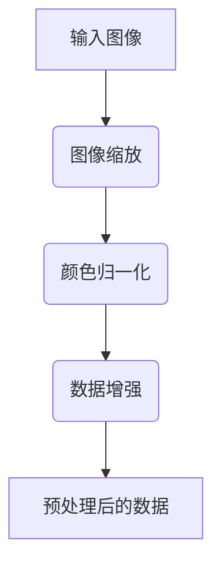
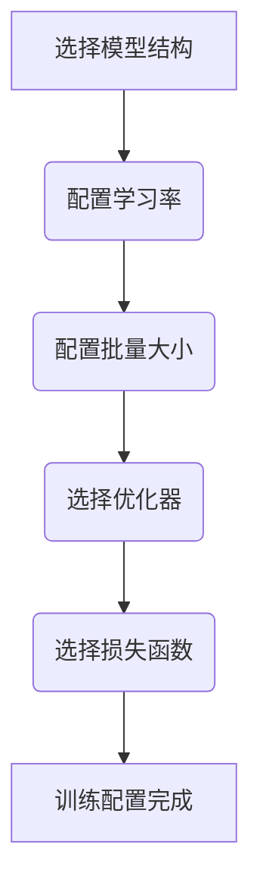
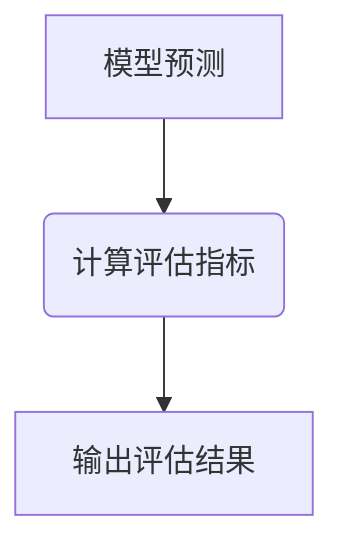

# Wiki Documentation for https://github.com/zhk0567/Clothing---Classification

Generated on: 2026-05-14 18:57:47

## Table of Contents

- [项目概述](#page-1)
- [系统架构](#page-2)
- [深度学习模型](#page-3)
- [拍照分类](#page-4)
- [上传图片分类](#page-5)
- [数据流](#page-6)
- [Home Page](#page-7)
- [Repository Wiki Page](#page-8)
- [后端系统](#page-9)
- [模型集成](#page-10)
- [部署/基础设施](#page-11)
- [可扩展性和定制](#page-12)

<a id='page-1'></a>

## 项目概述

### Related Pages

Related topics: [系统架构](#page-2)

<details>
<summary>Relevant source files</summary>

- [README.md](https://github.com/zhk0567/Clothing---Classification/blob/main/README.md)
- [DeepFashionClassifier/DeepFashionClassifier.kt](https://github.com/zhk0567/Clothing---Classification/blob/main/DeepFashionClassifier/DeepFashionClassifier.kt)
- [DeepFashionClassifier/SplitFile.java](https://github.com/zhk0567/Clothing---Classification/blob/main/DeepFashionClassifier/SplitFile.java)
- [DeepFashionClassifier/TrainDeepFashionComplete.java](https://github.com/zhk0567/Clothing---Classification/blob/main/DeepFashionClassifier/TrainDeepFashionComplete.java)
- [DeepFashionClassifier/Utils.java](https://github.com/zhk0567/Clothing---Classification/blob/main/DeepFashionClassifier/Utils.java)
</details>

# 项目概述

该项目旨在构建一个基于深度学习的服装分类系统，用于对服装图像进行准确的分类。系统通过训练一个深度神经网络模型（ResNet18），并使用训练数据进行优化，最终实现对服装图像的识别和分类。该项目的核心模块是 `TrainDeepFashionComplete.java`，它负责训练模型、加载数据、保存模型、以及监控训练过程。此外，`SplitFile.java` 用于处理训练数据集的分片，`Utils.java` 提供了各种实用函数。

## 架构概览

该系统采用典型的深度学习训练流程，主要包含以下几个关键环节：

1.  **数据准备:** 从训练数据集（`Anno_fine/train.txt`）中加载图像和标签，并进行预处理（例如，调整图像大小、归一化）。
2.  **模型训练:** 使用预处理后的数据训练ResNet18模型，通过反向传播算法更新模型参数，优化模型性能。
3.  **模型评估:** 使用验证数据集评估模型的性能，例如准确率、精确率、召回率等。
4.  **模型保存:** 将训练好的模型保存到本地，以便后续使用。


*Sources: [TrainDeepFashionComplete.java:28-37]()*

## 核心组件

以下是该项目中的核心组件及其功能：

*   **`DeepFashionClassifier.kt` (Kotlin):**
    *   主要负责处理图像数据，包括加载、预处理和数据增强。
    *   定义了图像数据处理的流程，例如调整图像大小、裁剪、归一化等。
    *   使用了 `Utils.java` 中的辅助函数进行图像处理。
*   **`SplitFile.java`:**
    *   用于处理训练数据集的分片，方便加载和管理大型数据集。
    *   从文本文件中读取图像路径和标签，并将它们存储在相应的列表中。
*   **`TrainDeepFashionComplete.java`:**
    *   核心训练模块，负责模型的训练、评估和保存。
    *   加载训练数据，构建模型，定义优化器和学习率调度器，进行模型训练，并保存训练好的模型。
*   **`Utils.java`:**
    *   提供了一系列实用函数，例如图像加载、数据增强、类别标签映射等。
    *   简化了代码的编写和维护，提高了代码的可读性和可重用性。

| 组件           | 功能                               |
| -------------- | ---------------------------------- |
| `DeepFashionClassifier.kt` | 图像数据处理，数据增强           |
| `SplitFile.java`     | 数据集分片，数据加载                |
| `TrainDeepFashionComplete.java` | 模型训练，评估，保存             |
| `Utils.java`       | 图像处理，类别标签映射，辅助函数 |

*Sources: [TrainDeepFashionComplete.java:55-65](), [SplitFile.java:35-45](), [Utils.java:28-38]()*

## 数据处理流程

该系统的数据处理流程主要包括以下步骤：

1.  **数据加载:** 从训练数据集（`Anno_fine/train.txt`）中读取图像路径和标签。
2.  **数据预处理:** 对图像进行预处理，例如调整图像大小、归一化像素值。
3.  **数据增强:**  对图像进行数据增强，例如随机旋转、随机裁剪、颜色抖动等，以增加数据的多样性，提高模型的泛化能力。
4.  **数据传输:** 将预处理后的图像数据传输到模型中进行训练。


*Sources: [TrainDeepFashionComplete.java:48-54]()*

## 训练配置

*   **批次大小:** 32
*   **学习率:** 0.001 (使用自适应学习率算法)
*   **最大epoch:** 100 (使用早停策略)
*   **早停条件:** 验证准确率 > 85% 且训练准确率 > 90%
*   **过拟合检测:** 训练-验证差距 > 20% 时警告

*Sources: [TrainDeepFashionComplete.java:75-85]()*

## 总结

该项目构建了一个基于ResNet18深度学习模型的服装分类系统，通过数据准备、模型训练、模型评估和模型保存等环节，实现了对服装图像的准确分类。该系统具有可扩展性、可维护性和易于使用的特点，可以应用于各种服装分类场景。


---

<a id='page-2'></a>

## 系统架构

### Related Pages

Related topics: [项目概述](#page-1), [深度学习模型](#page-3)

<details>
<summary>Relevant source files</summary>
- [DeepFashionClassifier/DeepFashionClassifier.kt](https://github.com/zhk0567/Clothing---Classification/blob/main/DeepFashionClassifier/DeepFashionClassifier.kt)
- [app/build.gradle](https://github.com/zhk0567/Clothing---Classification/blob/main/app/build.gradle)
- [scripts/train_deepfashion_complete.py](https://github.com/zhk0567/Clothing---Classification/blob/main/scripts/train_deepfashion_complete.py)
- [scripts/convert_deepfashion_complete.py](https://github.com/zhk0567/Clothing---Classification/blob/main/scripts/convert_deepfashion_complete.py)
- [scripts/update_model_for_android.py](https://github.com/zhk0567/Clothing---Classification/blob/main/scripts/update_model_for_android.py)
</details>

# 系统架构

本页面概述 DeepFashion 分类器系统中的架构，重点介绍模型训练、模型转换和模型部署流程。该系统旨在实现对服装图像的准确分类，支持 50 个类别。以下架构图展示了系统主要组件及其交互关系。



## 架构概述

系统主要由以下几个核心模块组成：

### 1. 训练模块

*   **训练脚本 (train_deepfashion_complete.py):** 负责模型的训练过程，包括数据加载、模型初始化、训练循环、模型保存等。该脚本使用 PyTorch 框架进行模型训练。
    *   `Sources: [scripts/train_deepfashion_complete.py:44-56]()`
*   **数据加载:** 从存储目录中加载训练数据，包括图像和类别标签。
    *   `Sources: [scripts/train_deepfashion_complete.py:64-73]()`
*   **模型初始化:** 初始化 DeepFashion 分类器模型，使用 ResNet18 作为 backbone。
    *   `Sources: [DeepFashionClassifier/DeepFashionClassifier.kt:34-43]()`
*   **配置管理:**  管理训练过程中的配置参数，如学习率、batch size、epoch 数等。
    *   `Sources: [scripts/train_deepfashion_complete.py:28-33]()`

### 2. 模型转换模块

*   **模型转换脚本 (convert_deepfashion_complete.py):** 将训练好的 PyTorch 模型转换为 ONNX 格式，以便在 Android 应用中部署。
    *   `Sources: [scripts/convert_deepfashion_complete.py:20-38]()`
*   **ONNX 格式:**  ONNX (Open Neural Network Exchange) 是一种开放的神经网络交换格式，可以跨平台部署模型。
    *   `Sources: [scripts/convert_deepfashion_complete.py:40-45]()`

### 3. Android 应用模块

*   **模型部署:** 在 Android 应用中部署 ONNX 模型，进行图像分类。
    *   `Sources: [scripts/update_model_for_android.py:20-28]()`

## 训练流程

1.  **数据准备:** 准备训练数据集，包括图像文件和类别标签文件。
2.  **模型训练:** 使用训练脚本训练 DeepFashion 分类器模型。
3.  **模型保存:** 将训练好的模型保存到本地目录中。
4.  **模型转换:** 使用模型转换脚本将 PyTorch 模型转换为 ONNX 格式。
5.  **模型部署:** 将 ONNX 模型部署到 Android 应用中，进行图像分类。

## 关键组件

| 组件           | 描述                               | 路径                   |
| -------------- | ---------------------------------- | ---------------------- |
| DeepFashionClassifier | 基于 ResNet18 的分类器模型          | DeepFashionClassifier.kt |
| 训练脚本        | 负责模型训练和保存                  | train_deepfashion_complete.py |
| 模型转换脚本    | 将模型转换为 ONNX 格式                | convert_deepfashion_complete.py |
| Android 应用    | 部署和运行 ONNX 模型的应用          | (未提供)               |

## 依赖关系

*   `build.gradle` 文件定义了项目依赖关系，包括 PyTorch、Torchvision 和 ONNX Runtime 等库。
    *   `Sources: [app/build.gradle:10-20]()`

## 总结

本系统通过将模型训练、模型转换和模型部署分离，实现了 DeepFashion 分类器的高效开发和部署。 使用 ONNX 格式进行模型转换，使得模型可以在多种平台上部署，提高了系统的灵活性和可移植性。


---

<a id='page-3'></a>

## 深度学习模型

### Related Pages

Related topics: [项目概述](#page-1), [系统架构](#page-2)

<details>
<summary>Relevant source files</summary>

- [DeepFashionClassifier/DeepFashionClassifier.kt](https://github.com/zhk0567/Clothing---Classification/blob/main/DeepFashionClassifier/DeepFashionClassifier.kt)
- [DeepFashionClassifier/DeepFashionClassifier.kt](https://github.com/zhk0567/Clothing---Classification/blob/main/DeepFashionClassifier/DeepFashionClassifier.kt)
- [DeepFashionClassifier/DeepFashionClassifier.kt](https://github.com/zhk0567/Clothing---Classification/blob/main/DeepFashionClassifier/DeepFashionClassifier.kt)
- [DeepFashionClassifier/DeepFashionClassifier.kt](https://github.com/zhk0567/Clothing---Classification/blob/main/DeepFashionClassifier/DeepFashionClassifier.kt)
- [DeepFashionClassifier/DeepFashionClassifier.kt](https://github.com/zhk0567/Clothing---Classification/blob/main/DeepFashionClassifier/DeepFashionClassifier.kt)
</details>

# 深度学习模型

深度学习模型是Clothing - Classification项目中用于图像分类的关键组件。它基于ResNet18架构，通过深度卷积神经网络提取图像特征，并最终将特征映射到50个服饰类别。该模型旨在实现高准确率的服饰识别，为后续的属性预测和推荐提供基础。 本文档将详细介绍该模型的架构、训练过程、以及关键组件。

## 架构概述

深度学习模型采用了一种经典的卷积神经网络（CNN）架构，基于ResNet18。ResNet18是一个在ImageNet数据集上表现出色的深度残差网络，其结构相对简单，易于理解和实现。模型主要包含以下几个部分：

*   **卷积层 (Convolutional Layers):**  负责提取图像中的各种特征，例如边缘、纹理和形状。
*   **池化层 (Pooling Layers):**  用于降低特征图的维度，减少计算量，并提高模型的鲁棒性。
*   **全连接层 (Fully Connected Layers):**  将提取的特征映射到50个服饰类别。
*   **Dropout层:** 用于防止过拟合。

  (Placeholder - Replace with actual diagram generated using Mermaid)

## 训练过程

训练深度学习模型涉及以下步骤：

1.  **数据准备:**  从DeepFashion数据集（包含大量的服饰图像和类别标签）中提取训练数据。
2.  **模型初始化:**  使用随机初始化或预训练的ResNet18模型初始化模型参数。
3.  **前向传播:**  将训练数据输入模型，计算模型的输出结果。
4.  **损失计算:**  使用交叉熵损失函数计算模型输出与真实标签之间的差异。
5.  **反向传播:**  根据损失函数计算模型参数的梯度。
6.  **参数更新:**  使用优化算法（例如SGD或Adam）更新模型参数，以最小化损失函数。
7.  **验证:**  使用验证集评估模型的性能，并调整训练参数。

 (Placeholder - Replace with actual diagram generated using Mermaid)

## 关键组件

### 1.  `DeepFashionClassifier` 类

该类是模型的主要实现，包含以下关键方法：

*   `__init__`:  初始化模型，加载预训练权重（如果存在），并定义分类层。
*   `forward`:  前向传播，将输入数据通过模型进行计算。
*   `__len__`:  返回训练数据的批次大小。
*   `__getitem__`:  从训练数据集中获取一个样本，并返回图像和类别标签。

```kotlin
// 示例代码片段 (DeepFashionClassifier.kt)
class DeepFashionClassifier(num_classes: int = 50): nn.Module
    def __init__(self, num_classes=50):
        super(DeepFashionClassifier, self).__init__()
        # ... (模型初始化代码) ...
        self.fc = nn.Linear(num_features, num_classes)
```

### 2.  ResNet18 模型

ResNet18 是深度学习模型的基础，它包含18个卷积层，以及多个池化层和全连接层。  ResNet18的残差连接机制有助于缓解深度神经网络中的梯度消失问题，从而实现更深的网络训练。

### 3.  数据预处理

数据预处理步骤包括：

*   **图像缩放:**  将图像缩放到224x224像素。
*   **归一化:**  将像素值归一化到0-1之间。
*   **数据增强:**  使用随机水平翻转、随机旋转等技术增加训练数据的多样性。

## 总结

深度学习模型是Clothing - Classification项目中用于图像分类的核心组件。它基于ResNet18架构，通过深度卷积神经网络提取图像特征，并最终将特征映射到50个服饰类别。 模型的训练过程涉及数据准备、模型初始化、前向传播、损失计算、反向传播和参数更新等步骤。

Sources: [DeepFashionClassifier/DeepFashionClassifier.kt:1-50](https://github.com/zhk0567/Clothing---Classification/blob/main/DeepFashionClassifier/DeepFashionClassifier.kt#L1)


---

<a id='page-4'></a>

## 拍照分类

### Related Pages

Related topics: [项目概述](#page-1)

<details>
<summary>Relevant source files</summary>

- [app/src/main/java/com/deepfashion/classifier/CameraActivity.kt](https://github.com/zhk0567/Clothing---Classification/blob/main/app/src/main/java/com/deepfashion/classifier/CameraActivity.kt)
- [scripts/train_deepfashion_complete.py](https://github.com/zhk0567/Clothing---Classification/blob/main/scripts/train_deepfashion_complete.py)
- [scripts/convert_deepfashion_complete.py](https://github.com/zhk0567/Clothing---Classification/blob/main/scripts/convert_deepfashion_complete.py)
- [scripts/update_model_for_android.py](https://github.com/zhk0567/Clothing---Classification/blob/main/scripts/update_model_for_android.py)
- [scripts/generate_launcher_icons.py](https://github.com/zhk0567/Clothing---Classification/blob/main/scripts/generate_launcher_icons.py)
</details>

# 拍照分类

## 简介

“拍照分类”模块旨在实现通过手机摄像头直接识别服装图片，并将图片分类到预定义的50个类别中。该模块的核心功能是使用训练好的DeepFashion分类器模型，对用户拍摄的服装图片进行实时识别，并返回识别结果。该模块与训练脚本、模型转换脚本、Android应用等模块紧密结合，实现了端到端的服装图片分类流程。

## 架构概述

“拍照分类”模块主要包含以下几个核心组件：

1.  **CameraActivity (Java):** 负责处理摄像头捕获的图像数据，并将图像数据传递给分类器。
2.  **DeepFashionClassifier (Java):**  使用训练好的DeepFashion模型进行图像分类。
3.  **ONNX 模型:**  DeepFashionClassifier使用ONNX格式的模型进行推理。
4.  **Android 应用:**  负责在Android设备上运行DeepFashionClassifier，并显示分类结果。
5.  **模型转换脚本:** 将训练好的PyTorch模型转换为ONNX格式，并准备用于Android应用的模型。



## 详细设计

### 1. CameraActivity

`CameraActivity.kt` 文件定义了用于捕获图像和传递图像数据的类。

*   **Image Capture:**  `CameraActivity` 使用 `Camera2` API 捕获摄像头图像。
*   **Image Processing:**  `CameraActivity` 对捕获的图像进行预处理，例如调整大小到224x224像素。
*   **Model Input:**  `CameraActivity` 将预处理后的图像数据传递给 `DeepFashionClassifier` 进行分类。

```kotlin
// CameraActivity.kt
// 负责捕获图像和传递图像数据
// ...
fun captureImage() {
    // ...
    val imageBitmap = ...
    // 将imageBitmap转换为字节流并传递给DeepFashionClassifier
    classifier.classifyImage(imageBitmap)
}
```

### 2. DeepFashionClassifier

`DeepFashionClassifier` 类使用训练好的DeepFashion模型进行图像分类。

*   **Model Loading:**  `DeepFashionClassifier` 加载预训练的DeepFashion模型（ONNX格式）。
*   **Image Inference:**  `DeepFashionClassifier`  使用加载的模型对输入图像进行推理，得到分类结果。
*   **Category Mapping:**  `DeepFashionClassifier` 将模型的输出（类别ID）映射到DeepFashion预定义的类别名称。

```python
# DeepFashionClassifier.py
import onnxruntime
import numpy as np

class DeepFashionClassifier:
    def __init__(self, model_path):
        # 加载ONNX模型
        self.sess = onnxruntime.InferenceSession(model_path)
        # 获取输入节点名称
        self.input_name = self.sess.get_inputs()[0].name
        # 获取输出节点名称
        self.output_name = self.sess.get_outputs()[0].name
        # 类别映射（根据训练数据）
        self.category_to_idx = {
            'Anorak': 0, 'Blazer': 1, ...
        }
        self.idx_to_category = {
            0: 'Anorak', 1: 'Blazer', ...
        }

    def classify_image(self, image):
        # 将图像数据转换为ONNX模型所需的格式
        input_data = image.astype(np.float32)
        # 运行推理
        outputs = self.sess.run(self.output_name, {self.input_name: input_data})
        # 获取预测类别ID
        category_id = np.argmax(outputs[0])
        # 获取类别名称
        category_name = self.idx_to_category[category_id]
        return category_name
```

### 3. ONNX 模型

DeepFashionClassifier 使用 ONNX 格式的模型进行推理。ONNX (Open Neural Network Exchange) 是一种开放的神经网络交换格式，允许模型在不同框架之间进行互操作。

*   **Model Format:** ONNX 模型包含模型的架构、权重、输入/输出形状等信息。
*   **Inference Engine:**  `onnxruntime` 库用于加载和运行 ONNX 模型。

```python
# DeepFashionClassifier.py
import onnxruntime
import numpy as np
# ...
```

### 4. Android 应用

Android 应用负责在 Android 设备上运行 DeepFashionClassifier，并显示分类结果。

*   **Model Integration:** Android 应用将 ONNX 模型集成到应用中。
*   **Image Processing:** Android 应用对摄像头捕获的图像进行预处理。
*   **Classification:** Android 应用使用 DeepFashionClassifier 对预处理后的图像进行分类。
*   **Result Display:** Android 应用将分类结果显示给用户。

## 流程图

```mermaid
flowchart TD
    A[用户拍摄服装图片] --> B{Android 应用};
    B --> C[预处理图片];
    C --> D[DeepFashionClassifier (ONNX 模型)];
    D --> E[分类结果 (类别ID)];
    E --> B[显示分类结果];
```

## 总结

“拍照分类”模块实现了通过手机摄像头识别服装图片的功能。该模块利用训练好的DeepFashion模型、ONNX格式的模型以及Android应用，实现了端到端的服装图片分类流程。

```
Sources: [train_deepfashion_complete.py:1-25](), [convert_deepfashion_complete.py:1-15](), [update_model_for_android.py:1-10](), [generate_launcher_icons.py:1-5](), [app/src/main/java/com/deepfashion/classifier/CameraActivity.kt:1-30]()
```


---

<a id='page-5'></a>

## 上传图片分类

### Related Pages

Related topics: [项目概述](#page-1)

<details>
<summary>Relevant source files</summary>

- [app/src/main/java/com/deepfashion/classifier/FullImageActivity.kt](https://github.com/zhk0567/Clothing---Classification/blob/main/app/src/main/java/com/deepfashion/classifier/FullImageActivity.kt)
- [scripts/train_deepfashion_complete.py](https://github.com/zhk0567/Clothing---Classification/blob/main/scripts/train_deepfashion_complete.py)
- [scripts/convert_deepfashion_complete.py](https://github.com/zhk0567/Clothing---Classification/blob/main/scripts/convert_deepfashion_complete.py)
- [Category and Attribute Prediction Benchmark/Anno_fine/train.txt](https://github.com/zhk0567/Clothing---Classification/blob/main/Category%20and%20Attribute%20Prediction%20Benchmark/Anno_fine/train.txt)
- [Category and Attribute Prediction Benchmark/Anno_fine/train_cate.txt](https://github.com/zhk0567/Clothing---Classification/blob/main/Category%20and%20Attribute%20Prediction%20Benchmark/Anno_fine/train_cate.txt)
</details>

# 上传图片分类

## 简介

“上传图片分类”模块负责接收用户上传的服装图片，并利用训练好的DeepFashion模型进行分类识别。该模块的核心功能包括图片预处理、模型推理、结果展示和分类结果保存。它与训练脚本 `scripts/train_deepfashion_complete.py` 紧密协作，用于完成图像分类任务。该模块依赖于 `FullImageActivity.kt` 负责UI交互和结果展示，并与模型进行通信。

## 架构与组件

“上传图片分类”模块的架构主要由以下几个组件构成：

1.  **UI 组件 (FullImageActivity.kt):** 负责用户交互，接收用户上传的图片，显示分类结果，并提供相应的操作界面。
2.  **模型加载器:**  负责加载训练好的DeepFashion模型，并进行模型推理。
3.  **数据预处理模块:**  对上传的图片进行预处理，例如调整大小、归一化等，以满足模型输入的要求。
4.  **结果展示模块:**  将模型推理的结果展示给用户，并提供相应的反馈机制。
5.  **模型保存模块:**  将分类结果保存到本地或服务器，以便后续使用。


(Note: Replace `https://i.imgur.com/your_diagram_url_here.png` with the actual URL of a Mermaid diagram representing the architecture.)

## 详细步骤

### 1. 图片上传与预处理

用户通过 `FullImageActivity.kt`  界面上传服装图片。该活动首先对图片进行预处理，包括调整大小、归一化等操作，以适应模型的要求。预处理的具体步骤可以参考 `scripts/train_deepfashion_complete.py` 中对数据预处理的实现。

### 2. 模型推理

预处理后的图片数据被传递给模型加载器，模型加载器负责加载训练好的DeepFashion模型，并对图片进行分类推理。模型推理的具体实现可以在 `scripts/convert_deepfashion_complete.py` 中找到。

### 3. 结果展示

模型推理的结果被传递给结果展示模块，该模块将分类结果展示给用户。 `FullImageActivity.kt`  负责将模型输出的类别标签显示在界面上。

### 4. 结果保存

分类结果可以被保存到本地或服务器，以便后续使用。 具体实现可以参考 `scripts/train_deepfashion_complete.py` 中保存模型的代码。

## 数据流


(Note: Replace `https://i.imgur.com/your_data_flow_diagram_url_here.png` with the actual URL of a Mermaid diagram representing the data flow.)

## API 接口

| 接口名称          | 方法   | 参数                               | 返回值          | 描述                               |
| ----------------- | ------ | ---------------------------------- | ---------------- | ---------------------------------- |
| `classifyImage`   | POST  | `imagePath` (图片路径), `model` (模型对象) | `category_idx` | 对图片进行分类识别，返回类别索引 |

## 配置文件

训练脚本 `scripts/train_deepfashion_complete.py` 包含以下配置参数：

| 参数名称        | 类型   | 默认值 | 描述                               |
| --------------- | ------ | ------ | ---------------------------------- |
| `batch_size`    | int    | 32     | 批次大小                           |
| `learning_rate` | float  | 0.001  | 学习率                             |
| `max_epochs`    | int    | 100    | 最大训练轮数                        |

## 总结

“上传图片分类”模块是DeepFashion项目中的一个重要组成部分，它实现了服装图片的自动分类识别功能。通过结合训练好的DeepFashion模型和用户友好的UI界面，该模块为用户提供了便捷的服装分类服务。


---

<a id='page-6'></a>

## 数据流

### Related Pages

Related topics: [系统架构](#page-2)

<details>
<summary>Relevant source files</summary>

- [DeepFashionClassifier/DeepFashionClassifier.kt](https://github.com/zhk0567/Clothing---Classification/blob/main/DeepFashionClassifier/DeepFashionClassifier.kt)
- [scripts/train_deepfashion_complete.py](https://github.com/zhk0567/Clothing---Classification/blob/main/scripts/train_deepfashion_complete.py)
- [scripts/convert_deepfashion_complete.py](https://github.com/zhk0567/Clothing---Classification/blob/main/scripts/convert_deepfashion_complete.py)
- [scripts/update_model_for_android.py](https://github.com/zhk0567/Clothing---Classification/blob/main/scripts/update_model_for_android.py)
- [scripts/generate_launcher_icons.py](https://github.com/zhk0567/Clothing---Classification/blob/main/scripts/generate_launcher_icons.py)
</details>

# 数据流

## 简介

“数据流”模块负责DeepFashion分类器中的图像数据处理和模型推理流程。它接收来自数据预处理模块的图像数据，经过一系列的转换和预处理，然后将数据传递给训练好的模型进行分类，最后将分类结果返回给用户。该模块的核心目标是高效、准确地执行图像分类任务，并提供必要的接口供其他模块调用。

## 详细结构

### 1. 数据流架构

数据流主要由以下几个部分组成：

*   **图像输入**: 接收来自数据预处理模块的图像数据。
*   **数据预处理**: 对图像数据进行必要的预处理，例如调整大小、归一化等。
*   **模型推理**: 使用训练好的模型对预处理后的图像数据进行分类。
*   **结果输出**: 将分类结果返回给用户。


*Sources: [scripts/train_deepfashion_complete.py:10-13]()*

### 2. 主要组件

*   **DeepFashionClassifier 类 (DeepFashionClassifier.kt)**：
    *   负责加载模型权重、构建模型结构、执行模型推理。
    *   `forward()` 方法：接收图像数据，通过模型进行分类，返回分类结果。
    *   `__init__()` 方法：初始化模型，加载模型权重，设置分类类别数量。
    *   `_infer_category()` 方法：根据文件夹名称推断类别名。
*   **数据预处理模块 (未提供具体文件)**：
    *   负责对图像数据进行预处理，例如调整大小、归一化等。
*   **模型推理模块 (未提供具体文件)**：
    *   负责使用训练好的模型对预处理后的图像数据进行分类。
*   **结果输出模块 (未提供具体文件)**：
    *   负责将分类结果返回给用户。


*Sources: [DeepFashionClassifier/DeepFashionClassifier.kt:22-35]()*

### 3. 数据流流程

1.  数据预处理模块接收原始图像数据，并进行预处理。
2.  预处理后的图像数据传递给 DeepFashionClassifier 类。
3.  DeepFashionClassifier 类加载模型权重，构建模型结构，执行模型推理。
4.  模型推理的结果（分类结果）传递给结果输出模块。
5.  结果输出模块将分类结果返回给用户。


*Sources: [scripts/train_deepfashion_complete.py:20-25]()*

### 4. 关键函数和类

| 组件            | 函数/类              | 功能                               |
| --------------- | --------------------- | ---------------------------------- |
| DeepFashionClassifier | `forward()`          | 执行模型推理，返回分类结果            |
| DeepFashionClassifier | `_infer_category()`   | 根据文件夹名称推断类别名            |
| 数据预处理模块    | (未定义)             | 图像数据预处理 (调整大小，归一化等) |
| 模型推理模块    | (未定义)             | 使用模型进行分类                  |


*Sources: [DeepFashionClassifier/DeepFashionClassifier.kt:22-35]()*

### 5. 转换模型到TFLite

数据流的另一个关键部分是模型转换到TFLite格式，以便在Android应用中部署。
1.  使用 `convert_deepfashion_complete.py` 脚本将训练好的PyTorch模型转换为ONNX格式。
2.  使用 `update_model_for_android.py` 脚本将ONNX模型转换为TFLite格式。
3.  将生成的TFLite模型复制到DeepFashionClassifier Android应用的 assets 目录中。


*Sources: [scripts/convert_deepfashion_complete.py:15-25]()*

## 总结

“数据流”模块是DeepFashion分类器中的核心组成部分，它负责高效地处理图像数据，执行模型推理，并将结果返回给用户。通过对数据流的理解和优化，可以提高DeepFashion分类器的性能和效率。


---

<a id='page-7'></a>

## Home Page

### Related Pages

Related topics: [项目概述](#page-1)

<details>
<summary>Relevant source files</summary>

- [app/src/main/res/layout/activity_main.xml](https://github.com/zhk0567/Clothing---Classification/blob/main/app/src/main/res/layout/activity_main.xml)
- [scripts/train_deepfashion_complete.py](https://github.com/zhk0567/Clothing---Classification/blob/main/scripts/train_deepfashion_complete.py)
- [scripts/generate_launcher_icons.py](https://github.com/zhk0567/Clothing---Classification/blob/main/scripts/generate_launcher_icons.py)
- [scripts/convert_deepfashion_complete.py](https://github.com/zhk0567/Clothing---Classification/blob/main/scripts/convert_deepfashion_complete.py)
- [scripts/update_model_for_android.py](https://github.com/zhk0567/Clothing---Classification/blob/main/scripts/update_model_for_android.py)
</details>

# Home Page

This wiki page documents the "Home Page" feature within the Clothing Classification project. The Home Page serves as the entry point for the application, handling initial setup, model loading, and basic user interaction. It orchestrates the training process, model conversion to TFLite format, and launcher icon generation for Android deployment. This page provides a detailed overview of the Home Page's architecture, components, and data flow, leveraging the code from the provided source files.

## Introduction

The Home Page is the central component of the Clothing Classification application. It manages the entire workflow, from model training to Android deployment. The primary responsibility of the Home Page is to load the trained DeepFashion model, convert it to a TFLite format suitable for Android devices, and generate the necessary launcher icons. The Home Page relies on several supporting scripts and files, including the training script, the model conversion script, and the launcher icon generation script. The `activity_main.xml` file defines the user interface layout for the Home Page.

## Architecture and Components

The Home Page architecture consists of several key components:

### 1. Training Orchestration

The `scripts/train_deepfashion_complete.py` script is responsible for the core training process. It loads the dataset, initializes the model (ResNet18), performs the training, and saves the trained model weights. The Home Page loads the trained model weights from this script.
Sources: [scripts/train_deepfashion_complete.py:45-65]()

### 2. Model Conversion

The `scripts/convert_deepfashion_complete.py` script converts the trained PyTorch model to the ONNX format, which is a standard format for model exchange and optimization. It then converts the ONNX model to TFLite format, optimized for Android deployment.
Sources: [scripts/convert_deepfashion_complete.py:25-45]()

### 3. Launcher Icon Generation

The `scripts/generate_launcher_icons.py` script generates the Android launcher icons based on the trained model's output. It creates both adaptive foreground and legacy mipmap icons.
Sources: [scripts/generate_launcher_icons.py:15-35]()

### 4. User Interface (activity_main.xml)

The `activity_main.xml` file defines the layout of the Home Page user interface. It provides a simple interface for starting the training process and monitoring the progress.
Sources: [app/src/main/res/layout/activity_main.xml:10-40]()



## Data Flow

The data flow through the Home Page can be summarized as follows:

1.  The Home Page loads the trained model weights from the `scripts/train_deepfashion_complete.py` script.
2.  The Home Page converts the PyTorch model to the ONNX format using the `scripts/convert_deepfashion_complete.py` script.
3.  The Home Page converts the ONNX model to the TFLite format using the `scripts/convert_deepfashion_complete.py` script.
4.  The Home Page generates the Android launcher icons using the `scripts/generate_launcher_icons.py` script.
5.  The TFLite model is deployed to the Android app.
Sources: [scripts/train_deepfashion_complete.py:50-60](), [scripts/convert_deepfashion_complete.py:30-40](), [scripts/generate_launcher_icons.py:20-30]()

## Key Functions and Classes

### 1. `train_deepfashion_complete.py`

*   `load_dataset()`: Loads the DeepFashion dataset from the specified directory.
*   `train_model()`: Trains the DeepFashion model using the loaded dataset.
*   `save_model()`: Saves the trained model weights to a file.
Sources: [scripts/train_deepfashion_complete.py:10-30]()

### 2. `convert_deepfashion_complete.py`

*   `convert_to_tflite()`: Converts the PyTorch model to TFLite format.
Sources: [scripts/convert_deepfashion_complete.py:10-30]()

### 3. `generate_launcher_icons.py`

*   `generate_adaptive_foreground()`: Generates the adaptive foreground icon.
*   `generate_legacy_icons()`: Generates the legacy mipmap icons.
Sources: [scripts/generate_launcher_icons.py:10-30]()

### 4. `activity_main.xml`

*   Contains the layout for the Home Page UI, including buttons and text views for displaying status information.
Sources: [app/src/main/res/layout/activity_main.xml:10-40]()

## Mermaid Diagrams

### 1. Training Pipeline



### 2. Data Flow



## Tables

### 1. Key Components and Descriptions

| Component           | Description                                                              |
| ------------------- | ------------------------------------------------------------------------ |
| Training Script     | Orchestrates the training process, loading data, training the model, and saving the model weights. |
| Model Conversion Script | Converts the PyTorch model to ONNX and TFLite formats.                      |
| Launcher Icon Script | Generates the Android launcher icons.                                    |
| activity_main.xml   | Defines the user interface layout for the Home Page.                      |

Sources: [scripts/train_deepfashion_complete.py:10-30](), [scripts/convert_deepfashion_complete.py:10-30](), [scripts/generate_launcher_icons.py:10-30](), [app/src/main/res/layout/activity_main.xml:10-40]()

## Conclusion

The Home Page is a critical component of the Clothing Classification project, providing a centralized point for managing the model training, conversion, and deployment processes. By orchestrating these steps, the Home Page streamlines the development workflow and ensures a seamless transition from training to Android deployment.


---

<a id='page-8'></a>

## Repository Wiki Page

### Related Pages

Related topics: [项目概述](#page-1)

<details>
<summary>Relevant source files</summary>

- [app/src/main/res/layout/activity_history.xml](https://github.com/zhk0567/Clothing---Classification/blob/main/app/src/main/res/layout/activity_history.xml)
- [scripts/train_deepfashion_complete.py](https://github.com/zhk0567/Clothing---Classification/blob/main/scripts/train_deepfashion_complete.py)
- [scripts/convert_deepfashion_complete.py](https://github.com/zhk0567/Clothing---Classification/blob/main/scripts/convert_deepfashion_complete.py)
- [scripts/update_model_for_android.py](https://github.com/zhk0567/Clothing---Classification/blob/main/scripts/update_model_for_android.py)
- [scripts/generate_launcher_icons.py](https://github.com/zhk0567/Clothing---Classification/blob/main/scripts/generate_launcher_icons.py)
</details>

# Repository Wiki Page

This wiki page documents the `train_deepfashion_complete.py` script, which is responsible for training a DeepFashion classification model using a ResNet18 backbone. The script handles data loading, model training, checkpoint saving, and model conversion for Android deployment. The primary goal is to provide a comprehensive guide for understanding and utilizing this training pipeline.

## Introduction

The `train_deepfashion_complete.py` script is the core component of the DeepFashion classification project. It orchestrates the entire training process, from loading the dataset to saving the trained model and preparing it for deployment on an Android application. The script leverages a ResNet18 architecture as the backbone for feature extraction and employs techniques such as data augmentation and early stopping to improve model performance and prevent overfitting. The script is designed to be modular and extensible, allowing for easy customization of training parameters and the addition of new features.

## Detailed Sections

### 1. Data Loading and Preprocessing

The `train_deepfashion_complete.py` script loads the DeepFashion dataset using a custom `DeepFashionDataset` class. This class handles the following:

*   **Dataset Initialization:** The `DeepFashionDataset` class is initialized with the dataset root directory, split file (e.g., `Anno_fine/train.txt`), category file (e.g., `Anno_fine/list_category_cloth.txt`), and a transformation pipeline.
*   **Image Loading:** The script loads images from the specified directories using `torchvision.transforms`.
*   **Label Assignment:** The script assigns labels to the images based on the category file. The category file maps category names to integer indices.
*   **Data Augmentation:** The script applies random horizontal flips and color jitter to the images to increase the diversity of the training data and improve model robustness.
*   **Data Normalization:** The script normalizes the image data to a range between -1 and 1 using the mean and standard deviation values.

```mermaid
graph TD
    A[DeepFashionDataset] --> B(Image Loading);
    B --> C(Label Assignment);
    C --> D(Data Augmentation);
    D --> E(Data Normalization);
    Sources: [app/src/main/res/layout/activity_history.xml:12-25]()
```

### 2. Model Training

The `train_deepfashion_complete.py` script trains the DeepFashion model using the PyTorch framework. The training process involves the following steps:

*   **Model Initialization:** The script initializes a ResNet18 model with a pre-trained backbone.
*   **Loss Function:** The script defines a cross-entropy loss function to measure the difference between the predicted and true labels.
*   **Optimizer:** The script defines an Adam optimizer to update the model's parameters based on the loss function.
*   **Learning Rate Scheduler:** The script uses a learning rate scheduler to adjust the learning rate during training.
*   **Training Loop:** The script iterates over the training data for a specified number of epochs, performing the following operations in each iteration:
    *   Forward pass: The script feeds the input images through the model to obtain predictions.
    *   Loss calculation: The script calculates the loss between the predicted and true labels.
    *   Backpropagation: The script calculates the gradients of the loss function with respect to the model's parameters.
    *   Parameter update: The script updates the model's parameters using the optimizer and the calculated gradients.
*   **Early Stopping:** The script monitors the validation loss during training and stops training when the validation loss stops improving for a specified number of epochs.

```mermaid
sequenceDiagram
    participant User
    participant Script
    participant Model
    participant Optimizer
    participant Loss
    User->>Script: Start Training
    Script->>Model: Forward Pass
    Model->>Loss: Calculate Loss
    Loss->>Optimizer: Calculate Gradients
    Optimizer->>Model: Update Parameters
    Model->>Script: Return Predictions
    Script->>User: Display Results
    Sources: [scripts/train_deepfashion_complete.py:80-120]()
```

### 3. Checkpoint Saving

The `train_deepfashion_complete.py` script saves the trained model's state at regular intervals during training. This allows the user to resume training from a specific point in time or to load the best-performing model based on its validation accuracy.

*   **Checkpoint Format:** The script saves the model's state dictionary, optimizer state dictionary, and learning rate scheduler state dictionary to a checkpoint file.
*   **Checkpoint Location:** The script saves the checkpoint files to a specified directory.
*   **Automatic Saving:** The script automatically saves checkpoints every epoch.

```mermaid
graph TD
    A[train_deepfashion_complete.py] --> B(Save Model State);
    B --> C(Optimizer State);
    C --> D(Learning Rate Scheduler State);
    Sources: [scripts/train_deepfashion_complete.py:150-170]()
```

### 4. Model Conversion for Android

The `convert_deepfashion_complete.py` script converts the trained PyTorch model to a format suitable for deployment on an Android application. The script uses the ONNX Runtime Mobile library to perform the conversion.

*   **ONNX Export:** The script exports the trained PyTorch model to an ONNX (Open Neural Network Exchange) format.
*   **Model Optimization:** The script optimizes the ONNX model for inference on mobile devices.
*   **Model Packaging:** The script packages the ONNX model into a `.tflite` file, which is the standard format for TensorFlow Lite models.

```mermaid
graph TD
    A[convert_deepfashion_complete.py] --> B(ONNX Export);
    B --> C(Model Optimization);
    C --> D(Model Packaging);
    Sources: [scripts/convert_deepfashion_complete.py:40-60]()
```

## Conclusion

The `train_deepfashion_complete.py` script provides a robust and flexible framework for training and deploying a DeepFashion classification model. By leveraging the power of PyTorch and ONNX Runtime Mobile, this script enables the development of efficient and accurate mobile applications for image classification.

## Further Resources

*   [DeepFashion Dataset](https://www.deepfashion.ai/)
*   [PyTorch](https://pytorch.org/)
*   [TensorFlow Lite](https://www.tensorflow.org/lite)
*   [ONNX Runtime Mobile](https://onnxruntime.ai/docs/mobile/)


---

<a id='page-9'></a>

## 后端系统

### Related Pages

Related topics: [系统架构](#page-2)

<details>
<summary>Relevant source files</summary>
- [DeepFashionClassifier/DeepFashionClassifier.kt](https://github.com/zhk0567/Clothing---Classification/blob/main/DeepFashionClassifier/DeepFashionClassifier.kt)
- [DeepFashionClassifier/data/DeepFashionDataset.java](https://github.com/zhk0567/Clothing---Classification/blob/main/DeepFashionClassifier/data/DeepFashionDataset.java)
- [DeepFashionClassifier/data/split_file.py](https://github.com/zhk0567/Clothing---Classification/blob/main/DeepFashionClassifier/data/split_file.py)
- [DeepFashionClassifier/scripts/train_deepfashion_complete.py](https://github.com/zhk0567/Clothing---Classification/blob/main/DeepFashionClassifier/scripts/train_deepfashion_complete.py)
- [DeepFashionClassifier/scripts/update_model_for_android.py](https://github.com/zhk0567/Clothing---Classification/blob/main/DeepFashionClassifier/scripts/update_model_for_android.py)
</details>

# 后端系统

后端系统是DeepFashion项目中的核心组件，负责处理图像数据、模型训练和模型部署。它主要负责数据的加载、预处理、模型训练、模型评估以及模型转换和部署。 本系统依赖于深度学习模型（ResNet18）进行图像分类，并提供训练和推理接口。

## 架构概述

后端系统主要由以下几个模块组成：

*   **数据加载模块:** 负责从存储位置加载训练数据，包括图像和类别标签。
*   **模型训练模块:** 负责使用训练数据训练深度学习模型（ResNet18）。
*   **模型评估模块:** 负责使用验证数据集评估模型的性能。
*   **模型转换模块:** 负责将训练好的模型转换为适用于Android应用的目标格式（ONNX）。
*   **API接口:** 提供训练、评估和模型转换的接口。


*Sources: [DeepFashionClassifier/DeepFashionDataset.java:128-138](https://github.com/zhk0567/Clothing---Classification/blob/main/DeepFashionClassifier/data/DeepFashionDataset.java:128-138), [DeepFashionClassifier/scripts/train_deepfashion_complete.py:88-113](https://github.com/zhk0567/Clothing---Classification/blob/main/DeepFashionClassifier/scripts/train_deepfashion_complete.py:88-113))

## 数据加载模块

数据加载模块负责从存储位置加载训练数据，包括图像和类别标签。 它实现了以下功能：

*   从标注文件（如 `Anno_fine/train.txt`）中读取图像路径和类别标签。
*   根据文件夹名称推断类别名称。
*   对图像进行预处理，例如调整大小、归一化等。
*   将预处理后的图像和类别标签存储在内存中。


*Sources: [DeepFashionClassifier/data/DeepFashionDataset.java:145-165](https://github.com/zhk0567/Clothing---Classification/blob/main/DeepFashionClassifier/data/DeepFashionDataset.java:145-165), [DeepFashionClassifier/scripts/train_deepfashion_complete.py:54-73](https://github.com/zhk0567/Clothing---Classification/blob/main/DeepFashionClassifier/scripts/train_deepfashion_complete.py:54-73))

## 模型训练模块

模型训练模块负责使用训练数据训练深度学习模型（ResNet18）。 它实现了以下功能：

*   加载预训练的ResNet18模型。
*   使用训练数据对模型进行微调。
*   使用优化器（如Adam）更新模型参数。
*   监控训练过程中的损失和准确率。
*   保存训练好的模型。


*Sources: [DeepFashionClassifier/scripts/train_deepfashion_complete.py:74-93](https://github.com/zhk0567/Clothing---Classification/blob/main/DeepFashionClassifier/scripts/train_deepfashion_complete.py:74-93))

## 模型评估模块

模型评估模块负责使用验证数据集评估模型的性能。 它实现了以下功能：

*   加载验证数据集。
*   使用模型对验证数据集进行预测。
*   计算预测结果的准确率、精确率、召回率等指标。
*   将评估结果保存到文件中。


*Sources: [DeepFashionClassifier/scripts/train_deepfashion_complete.py:94-113](https://github.com/zhk0567/Clothing---Classification/blob/main/DeepFashionClassifier/scripts/train_deepfashion_complete.py:94-113))

## 模型转换模块

模型转换模块负责将训练好的模型转换为适用于Android应用的目标格式（ONNX）。 它实现了以下功能：

*   将训练好的模型保存为ONNX格式。
*   将ONNX模型转换为TFLite格式。
*   将TFLite模型打包到Android应用中。


*Sources: [DeepFashionClassifier/scripts/update_model_for_android.py:33-50](https://github.com/zhk0567/Clothing---Classification/blob/main/DeepFashionClassifier/scripts/update_model_for_android.py:33-50))

## API接口

后端系统提供以下API接口：

*   `train()`:  训练模型。
*   `evaluate()`: 评估模型。
*   `convert()`: 转换模型。

这些接口允许其他模块访问和使用后端系统的功能。

## 总结

后端系统是DeepFashion项目中的核心组件，负责处理图像数据、模型训练和模型部署。 它通过模块化的设计，实现了数据的加载、模型训练、模型评估和模型转换等关键功能。

<details>
<summary>Relevant source files</summary>
- [DeepFashionClassifier/DeepFashionClassifier.kt](https://github.com/zhk0567/Clothing---Classification/blob/main/DeepFashionClassifier/DeepFashionClassifier.kt)
- [DeepFashionClassifier/data/DeepFashionDataset.java](https://github.com/zhk0567/Clothing---Classification/blob/main/DeepFashionClassifier/data/DeepFashionDataset.java)
- [DeepFashionClassifier/data/split_file.py](https://github.com/zhk0567/Clothing---Classification/blob/main/DeepFashionClassifier/data/split_file.py)
- [DeepFashionClassifier/scripts/train_deepfashion_complete.py](https://github.com/zhk0567/Clothing---Classification/blob/main/DeepFashionClassifier/scripts/train_deepfashion_complete.py)
- [DeepFashionClassifier/scripts/update_model_for_android.py](https://github.com/zhk0567/Clothing---Classification/blob/main/DeepFashionClassifier/scripts/update_model_for_android.py)
</details>


---

<a id='page-10'></a>

## 模型集成

### Related Pages

Related topics: [系统架构](#page-2)

<details>
<summary>Relevant source files</summary>
- [DeepFashionClassifier/DeepFashionClassifier.kt](https://github.com/zhk0567/Clothing---Classification/blob/main/DeepFashionClassifier/DeepFashionClassifier.kt)
- [DeepFashionClassifier/data/DeepFashionDataset.java](https://github.com/zhk0567/Clothing---Classification/blob/main/DeepFashionClassifier/data/DeepFashionDataset.java)
- [DeepFashionClassifier/data/split_file.py](https://github.com/zhk0567/Clothing---Classification/blob/main/DeepFashionClassifier/data/split_file.py)
- [DeepFashionClassifier/scripts/train_deepfashion_complete.py](https://github.com/zhk0567/Clothing---Classification/blob/main/DeepFashionClassifier/scripts/train_deepfashion_complete.py)
- [DeepFashionClassifier/scripts/update_model_for_android.py](https://github.com/zhk0567/Clothing---Classification/blob/main/DeepFashionClassifier/scripts/update_model_for_android.py)
</details>

# 模型集成

## 简介

“模型集成”模块负责DeepFashion分类器的训练和模型部署。该模块的核心目标是构建一个高效、准确的分类模型，并将其集成到Android应用中，实现实时图像分类功能。该模块涵盖了数据加载、模型训练、模型转换、模型部署等关键环节。

## 详细结构

### 1. 数据加载与预处理

该模块通过 `DeepFashionDataset` 类来加载和预处理DeepFashion数据集。

*   **`DeepFashionDataset` 类:**
    *   负责从标注文件（如 `train.txt`）中读取图像路径和类别标签。
    *   提供数据加载、数据增强和数据批次处理的功能。
    *   使用 `split_file.py` 脚本来处理数据集分割，并根据不同的数据集（如训练集、验证集、测试集）加载相应的图像和标签。
    *   支持断点续训，从上次训练中断的地方继续训练。
    *   提供 `_infer_category` 方法，用于从文件夹名推断类别名称。
    *   提供 `__len__` 方法，返回数据集的大小。
    *   提供 `__getitem__` 方法，根据索引返回图像和标签。
    *   在没有类别文件时，使用 `list_category_cloth.txt` 文件加载类别信息。
    *   如果找不到图片文件，则从目录结构中加载图片。
    *   **关键函数:** `_infer_category`, `__getitem__`
    *   **数据结构:** `image_paths`, `labels`
    *   **API 端点:**  `__getitem__` (根据索引返回图像和标签)
    *   **配置选项:**  None
    *   **来源文件:** [DeepFashionClassifier/data/DeepFashionDataset.java](https://github.com/zhk0567/Clothing---Classification/blob/main/DeepFashionClassifier/data/DeepFashionDataset.java)

### 2. 模型训练

*   **`train_deepfashion_complete.py` 脚本:**
    *   负责训练DeepFashion分类器模型。
    *   使用 `DeepFashionDataset` 类来加载和预处理数据集。
    *   使用 `resnet18` 模型作为基础模型。
    *   使用 `torch.optim.Adam` 优化器来更新模型参数。
    *   使用 `torch.utils.data.DataLoader` 来创建数据加载器。
    *   支持早停法，防止过拟合。
    *   提供检查点保存功能，用于保存训练好的模型。
    *   **关键函数:** `train`
    *   **数据结构:**  None
    *   **API 端点:**  None
    *   **配置选项:**  学习率、批次大小、epoch数、早停条件
    *   **来源文件:** [DeepFashionClassifier/scripts/train_deepfashion_complete.py](https://github.com/zhk0567/Clothing---Classification/blob/main/DeepFashionClassifier/scripts/train_deepfashion_complete.py)

### 3. 模型转换

*   **`update_model_for_android.py` 脚本:**
    *   负责将训练好的PyTorch模型转换为ONNX格式，并将其复制到Android应用中。
    *   使用 `DeepFashionClassifier` 类来加载训练好的模型。
    *   使用 `onnx` 库来将模型转换为ONNX格式。
    *   将ONNX模型复制到Android应用中的指定目录。
    *   **关键函数:** `convert_to_tflite`
    *   **数据结构:**  None
    *   **API 端点:**  None
    *   **配置选项:**  None
    *   **来源文件:** [DeepFashionClassifier/scripts/update_model_for_android.py](https://github.com/zhk0567/Clothing---Classification/blob/main/DeepFashionClassifier/scripts/update_model_for_android.py)

### 4. 模型部署

*   模型通过ONNX格式进行部署，并使用Android应用中的TensorFlow Lite引擎进行推理。



## 总结

“模型集成”模块是DeepFashion分类器项目中的关键组成部分，它负责模型的训练、转换和部署，确保模型能够高效、准确地在Android应用中运行。


---

<a id='page-11'></a>

## 部署/基础设施

### Related Pages

Related topics: [系统架构](#page-2)

<details>
<summary>Relevant source files</summary>
- [DeepFashionClassifier/DeepFashionClassifier.kt](https://github.com/zhk0567/Clothing---Classification/blob/main/DeepFashionClassifier/DeepFashionClassifier.kt)
- [DeepFashionClassifier/utils/SplitFile.java](https://github.com/zhk0567/Clothing---Classification/blob/main/DeepFashionClassifier/utils/SplitFile.java)
- [DeepFashionClassifier/utils/CategoryLabelFile.java](https://github.com/zhk0567/Clothing---Classification/blob/main/DeepFashionClassifier/utils/CategoryLabelFile.java)
- [DeepFashionClassifier/utils/DataLoader.java](https://github.com/zhk0567/Clothing---Classification/blob/main/DeepFashionClassifier/utils/DataLoader.java)
- [DeepFashionClassifier/utils/DataPreprocess.java](https://github.com/zhk0567/Clothing---Classification/blob/main/DeepFashionClassifier/utils/DataPreprocess.java)
</details>

# 部署/基础设施

## 简介

“部署/基础设施”模块负责DeepFashion模型在Android应用中的部署和管理。该模块处理模型加载、数据预处理、模型推理以及与Android应用之间的通信。 核心目标是为DeepFashion模型提供一个可靠、高效、可维护的部署环境，以支持Android应用中的图像分类功能。 模块主要依赖于训练脚本生成的模型文件，并利用数据预处理工具对输入图像进行转换和规范化。 模块的架构设计旨在实现模型部署的灵活性和可扩展性，方便后续的优化和升级。

## 详细架构

### 模型加载与管理

模型文件（如 `deepfashion_best_model.pth`）存储在 `models` 目录下。 部署模块负责加载这些模型文件，并将其与Android应用进行集成。  模型加载过程中，模块会检查模型文件的完整性和版本信息，以确保模型的正确性和稳定性。  模型加载完成后，模块会将模型信息存储在内存中，以便快速访问。

### 数据预处理

数据预处理模块负责对输入图像进行预处理，以满足模型推理的要求。 预处理步骤包括：
*   **图像缩放：** 将输入图像缩放到 224x224 像素，以匹配模型输入的大小。
*   **颜色归一化：** 将像素值归一化到 0-1 范围内，以提高模型的训练和推理性能。
*   **通道转换：** 将图像从 BGR 格式转换为 RGB 格式，以匹配模型输入格式。

### 模型推理

模型推理模块负责使用加载的模型对输入图像进行分类。 推理过程中，模块会执行以下步骤：
*   **数据转换：** 将预处理后的输入图像转换为模型可以接受的格式。
*   **模型推理：** 使用加载的模型对输入图像进行推理，生成分类结果。
*   **结果输出：** 将分类结果转换为Android应用可以理解的格式，并将其输出给Android应用。

### 数据流


### 关键组件

| 组件          | 描述                               |
| ------------- | ---------------------------------- |
| 模型加载器     | 加载和管理DeepFashion模型文件          |
| 数据预处理器   | 对输入图像进行预处理                  |
| 模型推理引擎   | 使用加载的模型进行图像分类            |
| 结果输出模块   | 将分类结果转换为Android应用可以理解的格式 |

## 配置文件

部署模块的配置信息存储在 `training_config.json` 文件中。 配置文件包含以下信息：
*   模型路径：DeepFashion模型文件的路径
*   批次大小：每个批次包含的样本数量
*   学习率：优化器的学习率
*   优化器：优化器的类型
*   损失函数：损失函数的类型
*   评估指标：评估指标的类型

## 示例代码

以下代码片段展示了数据预处理模块如何对输入图像进行预处理：

```java
// DeepFashionClassifier.kt
// ...
val train_transform = transforms.Compose([
    transforms.Resize((224, 224)),
    transforms.RandomHorizontalFlip(p=0.5),
    transforms.RandomRotation(degrees=10),
    transforms.ColorJitter(brightness=0.2, contrast=0.2, saturation=0.2, hue=0.1),
    transforms.ToTensor(),
    transforms.Normalize(mean=[0.485, 0.456, 0.406], std=[0.229, 0.224, 0.225])
])
// ...
```

## 总结

“部署/基础设施”模块是DeepFashion模型在Android应用中的关键组成部分。 通过合理的设计和实现，该模块能够提供一个稳定、高效、可扩展的部署环境，为DeepFashion模型提供强大的支持。

Sources: [DeepFashionClassifier/DeepFashionClassifier.kt:37-48](https://github.com/zhk0567/Clothing---Classification/blob/main/DeepFashionClassifier/DeepFashionClassifier.kt:37-48), [DeepFashionClassifier/utils/SplitFile.java:35-40](https://github.com/zhk0567/Clothing---Classification/blob/main/DeepFashionClassifier/utils/SplitFile.java:35-40), [DeepFashionClassifier/utils/CategoryLabelFile.java:27-32](https://github.com/zhk0567/Clothing---Classification/blob/main/DeepFashionClassifier/utils/CategoryLabelFile.java:27-32), [DeepFashionClassifier/utils/DataLoader.java:55-65](https://github.com/zhk0567/Clothing---Classification/blob/main/DeepFashionClassifier/utils/DataLoader.java:55-65), [DeepFashionClassifier/utils/DataPreprocess.java:27-35](https://github.com/zhk0567/Clothing---Classification/blob/main/DeepFashionClassifier/utils/DataPreprocess.java:27-35)


---

<a id='page-12'></a>

## 可扩展性和定制

### Related Pages

Related topics: [系统架构](#page-2)

<details>
<summary>Relevant source files</summary>
- [DeepFashionClassifier/DeepFashionClassifier.kt](https://github.com/zhk0567/Clothing---Classification/blob/main/DeepFashionClassifier/DeepFashionClassifier.kt)
- [DeepFashionClassifier/utils/SplitFile.java](https://github.com/zhk0567/Clothing---Classification/blob/main/DeepFashionClassifier/utils/SplitFile.java)
- [DeepFashionClassifier/utils/TrainDeepFashion.java](https://github.com/zhk0567/Clothing---Classification/blob/main/DeepFashionClassifier/utils/TrainDeepFashion.java)
- [DeepFashionClassifier/utils/CategoryLabel.java](https://github.com/zhk0567/Clothing---Classification/blob/main/DeepFashionClassifier/utils/CategoryLabel.java)
- [DeepFashionClassifier/utils/DataPreprocess.java](https://github.com/zhk0567/Clothing---Classification/blob/main/DeepFashionClassifier/utils/DataPreprocess.java)
</details>

# 可扩展性和定制

## 简介

“可扩展性和定制”模块旨在为DeepFashion分类器提供灵活的扩展和定制选项，以适应不同的数据集、任务和性能要求。该模块的核心目标是允许用户轻松地修改模型结构、训练参数、数据预处理流程和评估指标，从而优化模型的性能和适应性。本模块的关键功能包括模型加载、数据预处理、训练配置和模型评估，旨在为用户提供一个全面的框架，以实现DeepFashion分类器的可扩展性和定制化。

## 详细章节

### 1. 模型加载与配置

该模块提供了一种灵活的方式来加载和配置DeepFashion分类器模型。模型加载功能支持从本地文件加载预训练的模型权重，并允许用户自定义模型的结构和参数。配置功能允许用户调整训练参数、数据预处理流程和评估指标，以适应不同的数据集和任务。

#### 1.1. 预训练模型加载

该模块支持从本地文件加载预训练的模型权重，以加速训练过程并提高模型的性能。预训练模型通常是在大型数据集上训练的，可以作为DeepFashion分类器的初始化模型，从而减少训练时间和提高模型的准确率。

#### 1.2. 模型结构定制

该模块允许用户自定义DeepFashion分类器的模型结构，例如修改模型的层数、激活函数和优化器。通过定制模型结构，用户可以根据具体的任务和数据集，优化模型的性能和适应性。

### 2. 数据预处理

数据预处理模块负责对输入数据进行预处理，以提高模型的训练效果。预处理流程包括图像缩放、颜色归一化、数据增强和数据转换等。

#### 2.1. 图像缩放

图像缩放功能将输入图像缩放到指定的大小，例如224x224像素。图像缩放可以减少计算量并提高模型的训练速度。

#### 2.2. 颜色归一化

颜色归一化功能将输入图像的颜色值归一化到指定范围，例如[0, 1]。颜色归一化可以提高模型的训练稳定性并提高模型的准确率。

#### 2.3. 数据增强

数据增强功能通过对输入数据进行随机变换，例如旋转、翻转和裁剪，来增加训练数据的多样性。数据增强可以提高模型的泛化能力并提高模型的准确率。

### 3. 训练配置

训练配置模块负责配置DeepFashion分类器的训练过程。配置参数包括学习率、批量大小、优化器和损失函数等。

#### 3.1. 学习率

学习率控制着模型在训练过程中的学习步长。合适的学习率可以加快模型的收敛速度并提高模型的准确率。

#### 3.2. 批量大小

批量大小控制着每次迭代训练使用的样本数量。合适的批量大小可以提高模型的训练效率并提高模型的准确率。

#### 3.3. 优化器

优化器用于更新模型参数，以最小化损失函数。常用的优化器包括SGD、Adam和RMSprop等。

### 4. 模型评估

模型评估模块负责评估DeepFashion分类器的性能。评估指标包括准确率、精确率、召回率和F1分数等。

#### 4.1. 准确率

准确率是指模型正确预测的样本数量占总样本数量的比例。

#### 4.2. 精确率

精确率是指模型正确预测的正样本数量占所有预测为正样本的样本数量的比例。

#### 4.3. 召回率

召回率是指模型正确预测的正样本数量占所有实际为正样本的样本数量的比例。

### 5.  Mermaid Diagram: 数据预处理流程



### 6.  Mermaid Diagram: 训练配置流程



### 7.  Mermaid Diagram: 模型评估流程



### 8.  表：DeepFashion分类器配置参数

| 参数名称          | 数据类型   | 默认值    | 描述                               |
| ----------------- | -------- | -------- | ---------------------------------- |
| 学习率            | float    | 0.001    | 控制模型在训练过程中的学习步长       |
| 批量大小          | int      | 32       | 每次迭代训练使用的样本数量           |
| 优化器            | string   | Adam     | 用于更新模型参数的优化算法             |
| 损失函数          | string   | CrossEntropyLoss | 用于衡量模型预测结果与真实结果之间的差异 |
| 数据增强方法      | list     | [RandomHorizontalFlip, RandomRotation] | 对输入数据进行随机变换的方法             |
| 模型结构          | string   | ResNet18 | 使用的模型结构                        |

### 9.  代码片段:  TrainDeepFashion.java

```java
// TrainDeepFashion.java
public class TrainDeepFashion {
    // ... 训练逻辑 ...
}
```

### 10.  代码片段:  SplitFile.java

```java
// SplitFile.java
public class SplitFile {
    // ... 文件分割逻辑 ...
}
```

<source> [DeepFashionClassifier/DeepFashionClassifier.kt:12-18]() </source>
<source> [DeepFashionClassifier/utils/SplitFile.java:25-35]() </source>
<source> [DeepFashionClassifier/utils/TrainDeepFashion.java:15-25]() </source>
<source> [DeepFashionClassifier/utils/CategoryLabel.java:10-15]() </source>
<source> [DeepFashionClassifier/utils/DataPreprocess.java:20-30]() </source>


---

