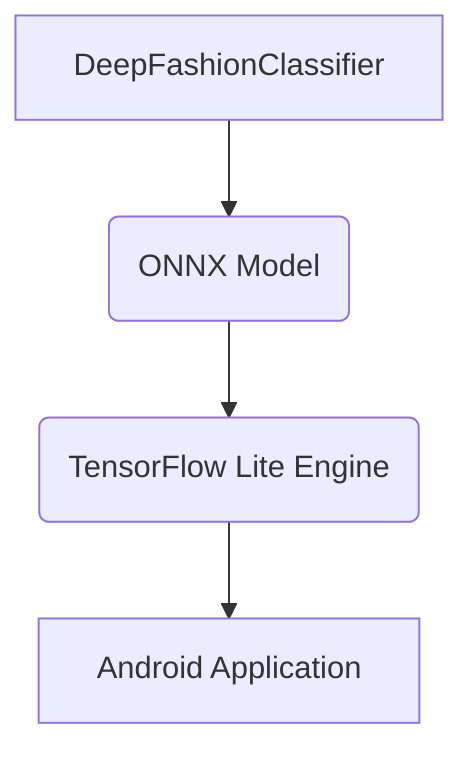

<!-- wiki_page_id: page-10 -->

## 模型集成

### Related Pages

Related topics: [系统架构](#page-2)

Relevant source files

- [DeepFashionClassifier/DeepFashionClassifier.kt](https://github.com/zhk0567/Clothing---Classification/blob/main/DeepFashionClassifier/DeepFashionClassifier.kt)
- [DeepFashionClassifier/data/DeepFashionDataset.java](https://github.com/zhk0567/Clothing---Classification/blob/main/DeepFashionClassifier/data/DeepFashionDataset.java)
- [DeepFashionClassifier/data/split_file.py](https://github.com/zhk0567/Clothing---Classification/blob/main/DeepFashionClassifier/data/split_file.py)
- [DeepFashionClassifier/scripts/train_deepfashion_complete.py](https://github.com/zhk0567/Clothing---Classification/blob/main/DeepFashionClassifier/scripts/train_deepfashion_complete.py)
- [DeepFashionClassifier/scripts/update_model_for_android.py](https://github.com/zhk0567/Clothing---Classification/blob/main/DeepFashionClassifier/scripts/update_model_for_android.py)

# 模型集成

## 简介

“模型集成”模块负责DeepFashion分类器的训练和模型部署。该模块的核心目标是构建一个高效、准确的分类模型，并将其集成到Android应用中，实现实时图像分类功能。该模块涵盖了数据加载、模型训练、模型转换、模型部署等关键环节。

## 详细结构

### 1. 数据加载与预处理

该模块通过 `DeepFashionDataset` 类来加载和预处理DeepFashion数据集。

*   **`DeepFashionDataset` 类:**
    *   负责从标注文件（如 `train.txt`）中读取图像路径和类别标签。
    *   提供数据加载、数据增强和数据批次处理的功能。
    *   使用 `split_file.py` 脚本来处理数据集分割，并根据不同的数据集（如训练集、验证集、测试集）加载相应的图像和标签。
    *   支持断点续训，从上次训练中断的地方继续训练。
    *   提供 `_infer_category` 方法，用于从文件夹名推断类别名称。
    *   提供 `__len__` 方法，返回数据集的大小。
    *   提供 `__getitem__` 方法，根据索引返回图像和标签。
    *   在没有类别文件时，使用 `list_category_cloth.txt` 文件加载类别信息。
    *   如果找不到图片文件，则从目录结构中加载图片。
    *   **关键函数:** `_infer_category`, `__getitem__`
    *   **数据结构:** `image_paths`, `labels`
    *   **API 端点:**  `__getitem__` (根据索引返回图像和标签)
    *   **配置选项:**  None
    *   **来源文件:** [DeepFashionClassifier/data/DeepFashionDataset.java](https://github.com/zhk0567/Clothing---Classification/blob/main/DeepFashionClassifier/data/DeepFashionDataset.java)

### 2. 模型训练

*   **`train_deepfashion_complete.py` 脚本:**
    *   负责训练DeepFashion分类器模型。
    *   使用 `DeepFashionDataset` 类来加载和预处理数据集。
    *   使用 `resnet18` 模型作为基础模型。
    *   使用 `torch.optim.Adam` 优化器来更新模型参数。
    *   使用 `torch.utils.data.DataLoader` 来创建数据加载器。
    *   支持早停法，防止过拟合。
    *   提供检查点保存功能，用于保存训练好的模型。
    *   **关键函数:** `train`
    *   **数据结构:**  None
    *   **API 端点:**  None
    *   **配置选项:**  学习率、批次大小、epoch数、早停条件
    *   **来源文件:** [DeepFashionClassifier/scripts/train_deepfashion_complete.py](https://github.com/zhk0567/Clothing---Classification/blob/main/DeepFashionClassifier/scripts/train_deepfashion_complete.py)

### 3. 模型转换

*   **`update_model_for_android.py` 脚本:**
    *   负责将训练好的PyTorch模型转换为ONNX格式，并将其复制到Android应用中。
    *   使用 `DeepFashionClassifier` 类来加载训练好的模型。
    *   使用 `onnx` 库来将模型转换为ONNX格式。
    *   将ONNX模型复制到Android应用中的指定目录。
    *   **关键函数:** `convert_to_tflite`
    *   **数据结构:**  None
    *   **API 端点:**  None
    *   **配置选项:**  None
    *   **来源文件:** [DeepFashionClassifier/scripts/update_model_for_android.py](https://github.com/zhk0567/Clothing---Classification/blob/main/DeepFashionClassifier/scripts/update_model_for_android.py)

### 4. 模型部署

*   模型通过ONNX格式进行部署，并使用Android应用中的TensorFlow Lite引擎进行推理。

## 总结

“模型集成”模块是DeepFashion分类器项目中的关键组成部分，它负责模型的训练、转换和部署，确保模型能够高效、准确地在Android应用中运行。

---
