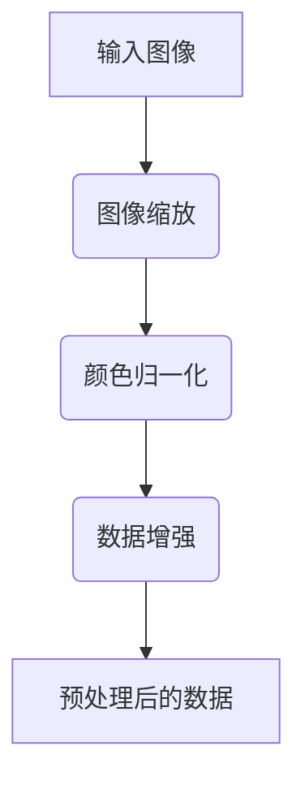
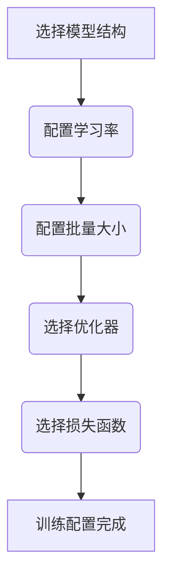
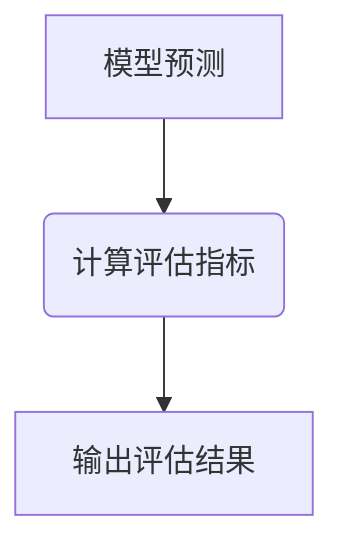

<!-- wiki_page_id: page-12 -->

## 可扩展性和定制

### Related Pages

Related topics: [系统架构](#page-2)

# 可扩展性和定制

## 简介

“可扩展性和定制”模块旨在为DeepFashion分类器提供灵活的扩展和定制选项，以适应不同的数据集、任务和性能要求。该模块的核心目标是允许用户轻松地修改模型结构、训练参数、数据预处理流程和评估指标，从而优化模型的性能和适应性。本模块的关键功能包括模型加载、数据预处理、训练配置和模型评估，旨在为用户提供一个全面的框架，以实现DeepFashion分类器的可扩展性和定制化。

## 详细章节

### 1. 模型加载与配置

该模块提供了一种灵活的方式来加载和配置DeepFashion分类器模型。模型加载功能支持从本地文件加载预训练的模型权重，并允许用户自定义模型的结构和参数。配置功能允许用户调整训练参数、数据预处理流程和评估指标，以适应不同的数据集和任务。

#### 1.1. 预训练模型加载

该模块支持从本地文件加载预训练的模型权重，以加速训练过程并提高模型的性能。预训练模型通常是在大型数据集上训练的，可以作为DeepFashion分类器的初始化模型，从而减少训练时间和提高模型的准确率。

#### 1.2. 模型结构定制

该模块允许用户自定义DeepFashion分类器的模型结构，例如修改模型的层数、激活函数和优化器。通过定制模型结构，用户可以根据具体的任务和数据集，优化模型的性能和适应性。

### 2. 数据预处理

数据预处理模块负责对输入数据进行预处理，以提高模型的训练效果。预处理流程包括图像缩放、颜色归一化、数据增强和数据转换等。

#### 2.1. 图像缩放

图像缩放功能将输入图像缩放到指定的大小，例如224x224像素。图像缩放可以减少计算量并提高模型的训练速度。

#### 2.2. 颜色归一化

颜色归一化功能将输入图像的颜色值归一化到指定范围，例如[0, 1]。颜色归一化可以提高模型的训练稳定性并提高模型的准确率。

#### 2.3. 数据增强

数据增强功能通过对输入数据进行随机变换，例如旋转、翻转和裁剪，来增加训练数据的多样性。数据增强可以提高模型的泛化能力并提高模型的准确率。

### 3. 训练配置

训练配置模块负责配置DeepFashion分类器的训练过程。配置参数包括学习率、批量大小、优化器和损失函数等。

#### 3.1. 学习率

学习率控制着模型在训练过程中的学习步长。合适的学习率可以加快模型的收敛速度并提高模型的准确率。

#### 3.2. 批量大小

批量大小控制着每次迭代训练使用的样本数量。合适的批量大小可以提高模型的训练效率并提高模型的准确率。

#### 3.3. 优化器

优化器用于更新模型参数，以最小化损失函数。常用的优化器包括SGD、Adam和RMSprop等。

### 4. 模型评估

模型评估模块负责评估DeepFashion分类器的性能。评估指标包括准确率、精确率、召回率和F1分数等。

#### 4.1. 准确率

准确率是指模型正确预测的样本数量占总样本数量的比例。

#### 4.2. 精确率

精确率是指模型正确预测的正样本数量占所有预测为正样本的样本数量的比例。

#### 4.3. 召回率

召回率是指模型正确预测的正样本数量占所有实际为正样本的样本数量的比例。

### 5.  Mermaid Diagram: 数据预处理流程



### 6.  Mermaid Diagram: 训练配置流程



### 7.  Mermaid Diagram: 模型评估流程



### 8.  表：DeepFashion分类器配置参数

| 参数名称          | 数据类型   | 默认值    | 描述                               |
| ----------------- | -------- | -------- | ---------------------------------- |
| 学习率            | float    | 0.001    | 控制模型在训练过程中的学习步长       |
| 批量大小          | int      | 32       | 每次迭代训练使用的样本数量           |
| 优化器            | string   | Adam     | 用于更新模型参数的优化算法             |
| 损失函数          | string   | CrossEntropyLoss | 用于衡量模型预测结果与真实结果之间的差异 |
| 数据增强方法      | list     | [RandomHorizontalFlip, RandomRotation] | 对输入数据进行随机变换的方法             |
| 模型结构          | string   | ResNet18 | 使用的模型结构                        |

### 9.  代码片段:  TrainDeepFashion.java

```java
// TrainDeepFashion.java
public class TrainDeepFashion {
    // ... 训练逻辑 ...
}
```

### 10.  代码片段:  SplitFile.java

```java
// SplitFile.java
public class SplitFile {
    // ... 文件分割逻辑 ...
}
```

<source> [DeepFashionClassifier/DeepFashionClassifier.kt:12-18]() </source>
<source> [DeepFashionClassifier/utils/SplitFile.java:25-35]() </source>
<source> [DeepFashionClassifier/utils/TrainDeepFashion.java:15-25]() </source>
<source> [DeepFashionClassifier/utils/CategoryLabel.java:10-15]() </source>
<source> [DeepFashionClassifier/utils/DataPreprocess.java:20-30]() </source>


---
