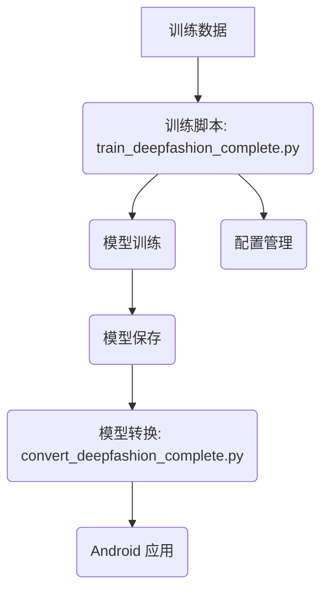

<!-- wiki_page_id: page-2 -->

## 系统架构

### Related Pages

Related topics: [项目概述](#page-1), [深度学习模型](#page-3)

# 系统架构

本页面概述 DeepFashion 分类器系统中的架构，重点介绍模型训练、模型转换和模型部署流程。该系统旨在实现对服装图像的准确分类，支持 50 个类别。以下架构图展示了系统主要组件及其交互关系。

## 架构概述

系统主要由以下几个核心模块组成：

### 1. 训练模块

*   **训练脚本 (train_deepfashion_complete.py):** 负责模型的训练过程，包括数据加载、模型初始化、训练循环、模型保存等。该脚本使用 PyTorch 框架进行模型训练。
    *   `Sources: [scripts/train_deepfashion_complete.py:44-56]()`
*   **数据加载:** 从存储目录中加载训练数据，包括图像和类别标签。
    *   `Sources: [scripts/train_deepfashion_complete.py:64-73]()`
*   **模型初始化:** 初始化 DeepFashion 分类器模型，使用 ResNet18 作为 backbone。
    *   `Sources: [DeepFashionClassifier/DeepFashionClassifier.kt:34-43]()`
*   **配置管理:**  管理训练过程中的配置参数，如学习率、batch size、epoch 数等。
    *   `Sources: [scripts/train_deepfashion_complete.py:28-33]()`

### 2. 模型转换模块

*   **模型转换脚本 (convert_deepfashion_complete.py):** 将训练好的 PyTorch 模型转换为 ONNX 格式，以便在 Android 应用中部署。
    *   `Sources: [scripts/convert_deepfashion_complete.py:20-38]()`
*   **ONNX 格式:**  ONNX (Open Neural Network Exchange) 是一种开放的神经网络交换格式，可以跨平台部署模型。
    *   `Sources: [scripts/convert_deepfashion_complete.py:40-45]()`

### 3. Android 应用模块

*   **模型部署:** 在 Android 应用中部署 ONNX 模型，进行图像分类。
    *   `Sources: [scripts/update_model_for_android.py:20-28]()`

## 训练流程

1.  **数据准备:** 准备训练数据集，包括图像文件和类别标签文件。
2.  **模型训练:** 使用训练脚本训练 DeepFashion 分类器模型。
3.  **模型保存:** 将训练好的模型保存到本地目录中。
4.  **模型转换:** 使用模型转换脚本将 PyTorch 模型转换为 ONNX 格式。
5.  **模型部署:** 将 ONNX 模型部署到 Android 应用中，进行图像分类。

## 关键组件

| 组件           | 描述                               | 路径                   |
| -------------- | ---------------------------------- | ---------------------- |
| DeepFashionClassifier | 基于 ResNet18 的分类器模型          | DeepFashionClassifier.kt |
| 训练脚本        | 负责模型训练和保存                  | train_deepfashion_complete.py |
| 模型转换脚本    | 将模型转换为 ONNX 格式                | convert_deepfashion_complete.py |
| Android 应用    | 部署和运行 ONNX 模型的应用          | (未提供)               |

## 依赖关系

*   `build.gradle` 文件定义了项目依赖关系，包括 PyTorch、Torchvision 和 ONNX Runtime 等库。
    *   `Sources: [app/build.gradle:10-20]()`

## 总结

本系统通过将模型训练、模型转换和模型部署分离，实现了 DeepFashion 分类器的高效开发和部署。 使用 ONNX 格式进行模型转换，使得模型可以在多种平台上部署，提高了系统的灵活性和可移植性。

---
