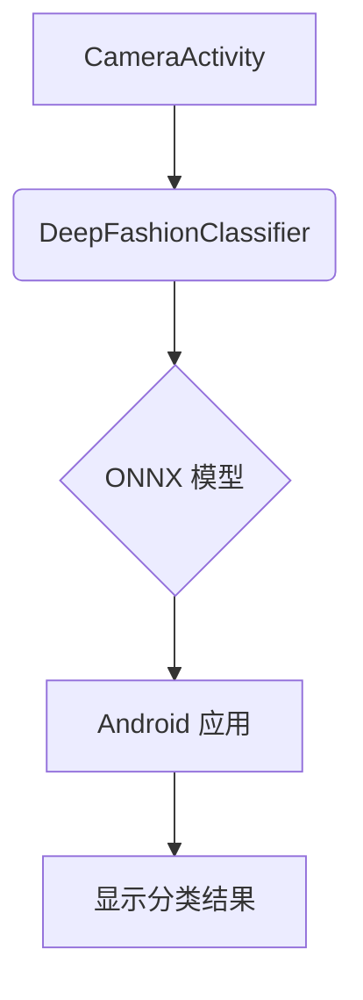

<!-- wiki_page_id: page-4 -->

## 拍照分类

### Related Pages

Related topics: [项目概述](#page-1)

# 拍照分类

## 简介

“拍照分类”模块旨在实现通过手机摄像头直接识别服装图片，并将图片分类到预定义的50个类别中。该模块的核心功能是使用训练好的DeepFashion分类器模型，对用户拍摄的服装图片进行实时识别，并返回识别结果。该模块与训练脚本、模型转换脚本、Android应用等模块紧密结合，实现了端到端的服装图片分类流程。

## 架构概述

“拍照分类”模块主要包含以下几个核心组件：

1.  **CameraActivity (Java):** 负责处理摄像头捕获的图像数据，并将图像数据传递给分类器。
2.  **DeepFashionClassifier (Java):**  使用训练好的DeepFashion模型进行图像分类。
3.  **ONNX 模型:**  DeepFashionClassifier使用ONNX格式的模型进行推理。
4.  **Android 应用:**  负责在Android设备上运行DeepFashionClassifier，并显示分类结果。
5.  **模型转换脚本:** 将训练好的PyTorch模型转换为ONNX格式，并准备用于Android应用的模型。



## 详细设计

### 1. CameraActivity

`CameraActivity.kt` 文件定义了用于捕获图像和传递图像数据的类。

*   **Image Capture:**  `CameraActivity` 使用 `Camera2` API 捕获摄像头图像。
*   **Image Processing:**  `CameraActivity` 对捕获的图像进行预处理，例如调整大小到224x224像素。
*   **Model Input:**  `CameraActivity` 将预处理后的图像数据传递给 `DeepFashionClassifier` 进行分类。

```kotlin
// CameraActivity.kt
// 负责捕获图像和传递图像数据
// ...
fun captureImage() {
    // ...
    val imageBitmap = ...
    // 将imageBitmap转换为字节流并传递给DeepFashionClassifier
    classifier.classifyImage(imageBitmap)
}
```

### 2. DeepFashionClassifier

`DeepFashionClassifier` 类使用训练好的DeepFashion模型进行图像分类。

*   **Model Loading:**  `DeepFashionClassifier` 加载预训练的DeepFashion模型（ONNX格式）。
*   **Image Inference:**  `DeepFashionClassifier`  使用加载的模型对输入图像进行推理，得到分类结果。
*   **Category Mapping:**  `DeepFashionClassifier` 将模型的输出（类别ID）映射到DeepFashion预定义的类别名称。

```python
# DeepFashionClassifier.py
import onnxruntime
import numpy as np

class DeepFashionClassifier:
    def __init__(self, model_path):
        # 加载ONNX模型
        self.sess = onnxruntime.InferenceSession(model_path)
        # 获取输入节点名称
        self.input_name = self.sess.get_inputs()[0].name
        # 获取输出节点名称
        self.output_name = self.sess.get_outputs()[0].name
        # 类别映射（根据训练数据）
        self.category_to_idx = {
            'Anorak': 0, 'Blazer': 1, ...
        }
        self.idx_to_category = {
            0: 'Anorak', 1: 'Blazer', ...
        }

    def classify_image(self, image):
        # 将图像数据转换为ONNX模型所需的格式
        input_data = image.astype(np.float32)
        # 运行推理
        outputs = self.sess.run(self.output_name, {self.input_name: input_data})
        # 获取预测类别ID
        category_id = np.argmax(outputs[0])
        # 获取类别名称
        category_name = self.idx_to_category[category_id]
        return category_name
```

### 3. ONNX 模型

DeepFashionClassifier 使用 ONNX 格式的模型进行推理。ONNX (Open Neural Network Exchange) 是一种开放的神经网络交换格式，允许模型在不同框架之间进行互操作。

*   **Model Format:** ONNX 模型包含模型的架构、权重、输入/输出形状等信息。
*   **Inference Engine:**  `onnxruntime` 库用于加载和运行 ONNX 模型。

```python
import onnxruntime
import numpy as np
# ...
```

### 4. Android 应用

Android 应用负责在 Android 设备上运行 DeepFashionClassifier，并显示分类结果。

*   **Model Integration:** Android 应用将 ONNX 模型集成到应用中。
*   **Image Processing:** Android 应用对摄像头捕获的图像进行预处理。
*   **Classification:** Android 应用使用 DeepFashionClassifier 对预处理后的图像进行分类。
*   **Result Display:** Android 应用将分类结果显示给用户。

## 流程图

```mermaid
flowchart TD
    A[用户拍摄服装图片] --> B{Android 应用};
    B --> C[预处理图片];
    C --> D[DeepFashionClassifier (ONNX 模型)];
    D --> E[分类结果 (类别ID)];
    E --> B[显示分类结果];
```

## 总结

“拍照分类”模块实现了通过手机摄像头识别服装图片的功能。该模块利用训练好的DeepFashion模型、ONNX格式的模型以及Android应用，实现了端到端的服装图片分类流程。

```
Sources: [train_deepfashion_complete.py:1-25](), [convert_deepfashion_complete.py:1-15](), [update_model_for_android.py:1-10](), [generate_launcher_icons.py:1-5](), [app/src/main/java/com/deepfashion/classifier/CameraActivity.kt:1-30]()
```


---
