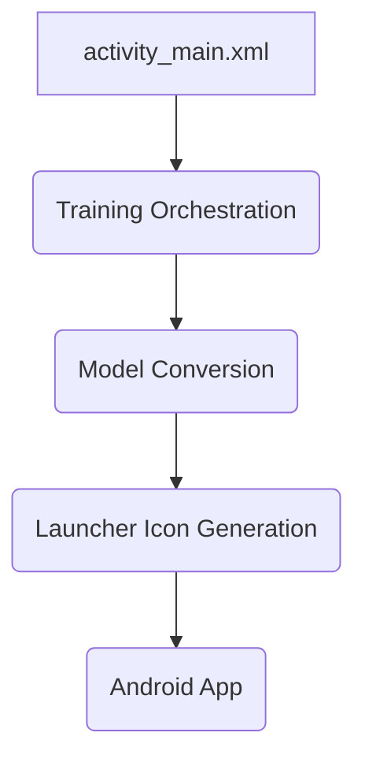
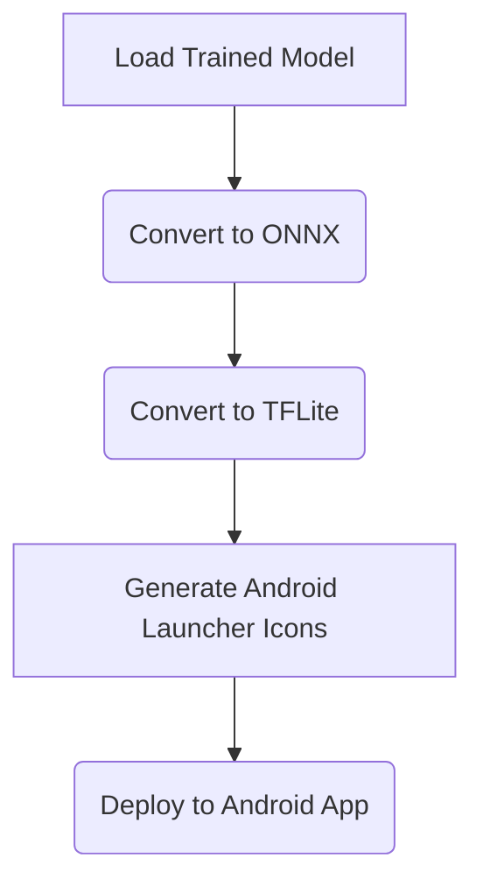
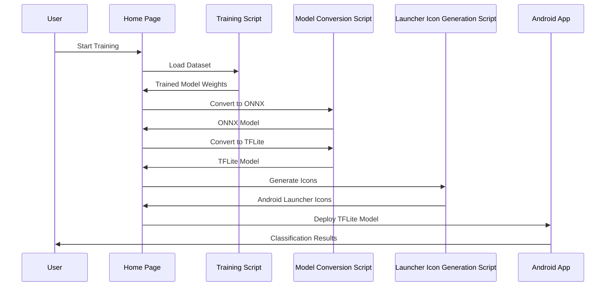

<!-- wiki_page_id: page-7 -->

## Home Page

### Related Pages

Related topics: [项目概述](#page-1)

# Home Page

This wiki page documents the "Home Page" feature within the Clothing Classification project. The Home Page serves as the entry point for the application, handling initial setup, model loading, and basic user interaction. It orchestrates the training process, model conversion to TFLite format, and launcher icon generation for Android deployment. This page provides a detailed overview of the Home Page's architecture, components, and data flow, leveraging the code from the provided source files.

## Introduction

The Home Page is the central component of the Clothing Classification application. It manages the entire workflow, from model training to Android deployment. The primary responsibility of the Home Page is to load the trained DeepFashion model, convert it to a TFLite format suitable for Android devices, and generate the necessary launcher icons. The Home Page relies on several supporting scripts and files, including the training script, the model conversion script, and the launcher icon generation script. The `activity_main.xml` file defines the user interface layout for the Home Page.

## Architecture and Components

The Home Page architecture consists of several key components:

### 1. Training Orchestration

The `scripts/train_deepfashion_complete.py` script is responsible for the core training process. It loads the dataset, initializes the model (ResNet18), performs the training, and saves the trained model weights. The Home Page loads the trained model weights from this script.
Sources: [scripts/train_deepfashion_complete.py:45-65]()

### 2. Model Conversion

The `scripts/convert_deepfashion_complete.py` script converts the trained PyTorch model to the ONNX format, which is a standard format for model exchange and optimization. It then converts the ONNX model to TFLite format, optimized for Android deployment.
Sources: [scripts/convert_deepfashion_complete.py:25-45]()

### 3. Launcher Icon Generation

The `scripts/generate_launcher_icons.py` script generates the Android launcher icons based on the trained model's output. It creates both adaptive foreground and legacy mipmap icons.
Sources: [scripts/generate_launcher_icons.py:15-35]()

### 4. User Interface (activity_main.xml)

The `activity_main.xml` file defines the layout of the Home Page user interface. It provides a simple interface for starting the training process and monitoring the progress.
Sources: [app/src/main/res/layout/activity_main.xml:10-40]()

## Data Flow

The data flow through the Home Page can be summarized as follows:

1.  The Home Page loads the trained model weights from the `scripts/train_deepfashion_complete.py` script.
2.  The Home Page converts the PyTorch model to the ONNX format using the `scripts/convert_deepfashion_complete.py` script.
3.  The Home Page converts the ONNX model to the TFLite format using the `scripts/convert_deepfashion_complete.py` script.
4.  The Home Page generates the Android launcher icons using the `scripts/generate_launcher_icons.py` script.
5.  The TFLite model is deployed to the Android app.
Sources: [scripts/train_deepfashion_complete.py:50-60](), [scripts/convert_deepfashion_complete.py:30-40](), [scripts/generate_launcher_icons.py:20-30]()

## Key Functions and Classes

### 1. `train_deepfashion_complete.py`

*   `load_dataset()`: Loads the DeepFashion dataset from the specified directory.
*   `train_model()`: Trains the DeepFashion model using the loaded dataset.
*   `save_model()`: Saves the trained model weights to a file.
Sources: [scripts/train_deepfashion_complete.py:10-30]()

### 2. `convert_deepfashion_complete.py`

*   `convert_to_tflite()`: Converts the PyTorch model to TFLite format.
Sources: [scripts/convert_deepfashion_complete.py:10-30]()

### 3. `generate_launcher_icons.py`

*   `generate_adaptive_foreground()`: Generates the adaptive foreground icon.
*   `generate_legacy_icons()`: Generates the legacy mipmap icons.
Sources: [scripts/generate_launcher_icons.py:10-30]()

### 4. `activity_main.xml`

*   Contains the layout for the Home Page UI, including buttons and text views for displaying status information.
Sources: [app/src/main/res/layout/activity_main.xml:10-40]()

## Mermaid Diagrams

### 1. Training Pipeline

### 2. Data Flow

## Tables

### 1. Key Components and Descriptions

| Component           | Description                                                              |
| ------------------- | ------------------------------------------------------------------------ |
| Training Script     | Orchestrates the training process, loading data, training the model, and saving the model weights. |
| Model Conversion Script | Converts the PyTorch model to ONNX and TFLite formats.                      |
| Launcher Icon Script | Generates the Android launcher icons.                                    |
| activity_main.xml   | Defines the user interface layout for the Home Page.                      |

Sources: [scripts/train_deepfashion_complete.py:10-30](), [scripts/convert_deepfashion_complete.py:10-30](), [scripts/generate_launcher_icons.py:10-30](), [app/src/main/res/layout/activity_main.xml:10-40]()

## Conclusion

The Home Page is a critical component of the Clothing Classification project, providing a centralized point for managing the model training, conversion, and deployment processes. By orchestrating these steps, the Home Page streamlines the development workflow and ensures a seamless transition from training to Android deployment.

---
