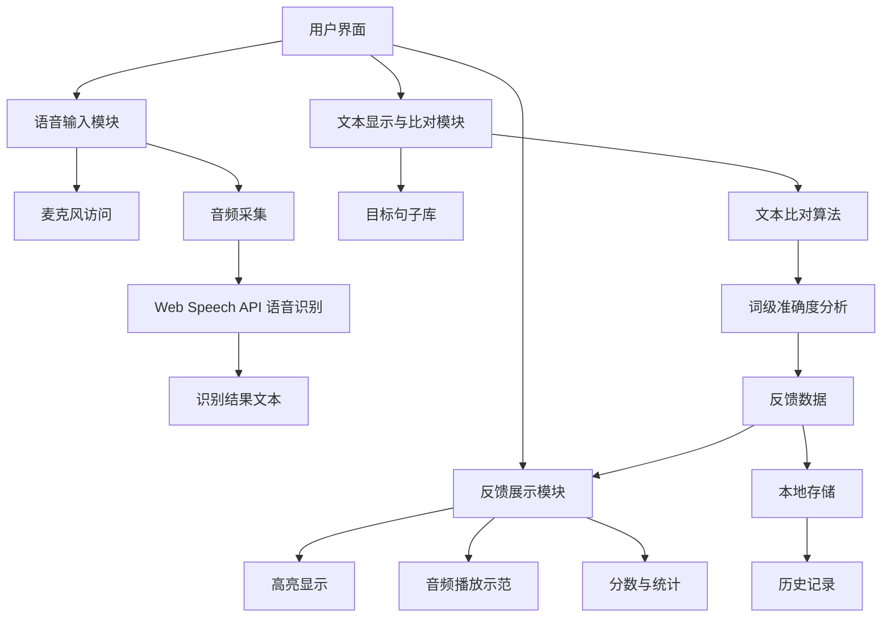

<!-- wiki_page_id: page-1 -->

# 项目简介

English-Speaking-Trainer 是一个基于网页的英语口语训练工具，旨在通过语音识别和实时反馈帮助用户提升英语发音和口语表达能力。该项目采用现代前端技术栈构建，支持浏览器直接运行，无需后端服务即可完成核心功能。

## 核心功能

- **语音输入捕获**：使用 Web Speech API 或类似技术捕获用户的麦克风输入
- **发音评估**：通过语音识别将用户语音转换为文本，并与目标句子进行比对
- **实时反馈**：提供词级别的发音准确度反馈，标记正确、错误或需改进的发音
- **练习模式**：支持跟读、影子跟读和自由表达等多种练习方式
- **进度追踪**：记录用户练习历史和发音准确度趋势

## 技术实现

项目主要依赖以下前端技术实现核心功能：

- **HTML5**：提供语音输入和音频处理的基础能力
- **JavaScript (ES6+)**：实现语音识别、文本比对和用户交互逻辑
- **CSS3**：构建响应式界面和交互反馈效果
- **Web Speech API**：浏览器原生语音识别接口（主要用于Chrome）
- **本地存储**：使用 localStorage 保存用户练习历史和设置

## 系统架构

## 关键实现细节

### 语音识别流程
1. 用户点击开始按钮触发 `SpeechRecognition` 对象初始化
2. 请求麦克风权限并开始持续监听音频输入
3. 语音识别结果通过 `onresult` 事件返回临时和最终文本
4. 最终识别文本与目标句子进行逐词比对
5. 基于编辑距离或相似度算法计算每个词的匹配度
6. 将比对结果传递给 UI 层进行可视化反馈

### 反馈机制
- **正确发音**：绿色高亮显示
- **近似发音**：黄色提示，给出改进建议
- **错误发音**：红色标注，显示正确发音示例
- **遗漏词汇**：灰色虚线框标示未检测到的词汇
- **多余词汇**：橙色标注，提示用户注意冗余表达

### 性能考虑
- 采用结果平滑算法减少语音识别抖动影响
- 设置合理的识别超时和静默检测避免无效循环
- 使用 requestAnimationFrame 优化 UI 更新频率
- 在不影响准确度的前提下降低音频采样率以减轻计算负担

## 使用场景

- 英语学习者日常发音练习
- 语言考试口语部分备考（如雅思、托福）
- 外教辅助教学工具
- 自我纠音和口语流畅度提升
- 特定场景句型强化训练（如商务面试、旅行对话）

## 本地化与扩展性

当前实现主要针对英语美音进行优化，但架构支持：
- 通过更换语言模型扩展至其他语言（需浏览器支持）
- 自定义句子库导入功能
- 调整反馈敏感度和评分标准
- 添加声调、语速和停顿等韵律维度评估（需更高级语音处理）

## 依赖与兼容性

- **浏览器要求**：支持 Web Speech API 的现代浏览器（Chrome、Edge 等）
- **移动端支持**：部分移动浏览器支持语音识别，但受限于系统权限和API实现差异
- **无外部依赖**：核心功能仅依赖浏览器原生API，无需第三方库或后端服务
- **离线能力**：语音识别依赖联网服务（Google Web Speech API），但界面和逻辑可离线运行

## 开发与贡献

项目遵循以下开发原则：
- 保持代码简洁和模块化，便于维护和功能扩展
- 优先使用浏览器原生能力减少依赖
- 注重可访问性（ARIA标签、键盘导航支持）
- 通过清晰的注释和结构化目录促进协作开发

如需查看具体实现细节，请参考项目源码中的主要HTML、CSS和JavaScript文件。
