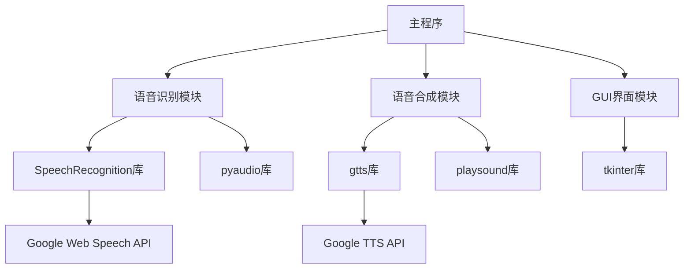

<!-- wiki_page_id: page-10 -->

# 开发环境与依赖

## 系统要求

English-Speaking-Trainer 项目运行需要以下系统环境：

- Python 3.8 或更高版本
- 支持的操作系统：Windows, macOS, Linux
- 最低内存要求：4GB RAM
- 磁盘空间：至少 2GB 可用空间（用于模型和依赖）

## 依赖管理

项目使用 `pip` 进行依赖管理，核心依赖分为两类：

### 主要依赖

从 `requirements_transcriber.txt` 文件中提取的关键依赖包括：

| 依赖包 | 版本 | 用途 |
|--------|------|------|
| SpeechRecognition | 3.8.1 | 语音识别核心库 |
| pyaudio | 0.2.11 | 音频输入输出处理 |
| gtts | 2.2.3 | Google 文本转语音 |
| playsound | 1.3.0 | 音频播放 |
| tkinter | 内置 | GUI 界面构建 |

### 安装方式

```bash
# 克隆仓库
git clone https://github.com/zhk0567/English-Speaking-Trainer.git
cd English-Speaking-Trainer

# 安装依赖
pip install -r requirements_transcriber.txt
```

## 开发环境配置

### 虚拟环境推荐配置

```bash
# 创建虚拟环境
python -m venv venv

# 激活虚拟环境
# Windows:
venv\Scripts\activate
# macOS/Linux:
source venv/bin/activate

pip install -r requirements_transcriber.txt
```

### IDE 配置建议

- 推荐使用 VS Code 或 PyCharm
- 配置 Python 解释器指向虚拟环境
- 启用代码格式化（推荐使用 black 或 autopep8）
- 配置 pylint 或 flake8 进行代码检查

## 模块依赖关系



## 常见问题解决

### 依赖安装失败

如果遇到 pyaudio 安装问题：
- Windows: 确保已安装 Visual C++ 构建工具
- macOS: `brew install portaudio` 后重试
- Linux: `sudo apt-get install portaudio19-dev python3-pyaudio`

### 语音识别不可用

检查：
1. 麦克风权限是否已授予
2. 网络连接是否正常（依赖 Google Web Speech API）
3. 语音包是否正确安装

### 音频播放问题

确保：
1. 系统音频设备正常工作
2. 没有其他程序独占音频设备
3. playsound 库与系统音频后端兼容

## 版本兼容性说明

- SpeechRecognition 3.8.1 与 Python 3.8-3.11 完全兼容
- pyaudio 0.2.11 需要与系统 PortAudio 库匹配
- 所有依赖均采用语义化版本控制，建议使用指定版本避免破坏性更新

## 贡献指南

开发新功能时：
1. 在虚拟环境中进行开发和测试
2. 新增依赖请更新 `requirements_transcriber.txt`
3. 保持依赖版本的精确性以确保可重现性
4. 提交前运行完整测试套件验证功能

</details>
