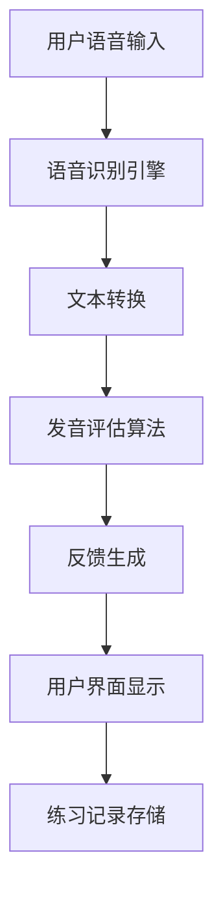

<!-- wiki_page_id: page-2 -->

Relevant source files

The following files were used as context for generating this wiki page:

- [README.md](https://github.com/zhk0567/English-Speaking-Trainer/blob/main/README.md)

# 项目结构

## 项目概述

English-Speaking-Trainer 是一个用于英语口语练习的应用程序，旨在帮助用户通过语音识别和反馈机制提升英语口语表达能力。

## 目录结构

基于仓库信息，项目包含以下关键文件和目录：

- `README.md`：项目说明文档
- 源代码文件（具体结构未在README中详细列出）

## 主要功能模块

### 语音识别模块
- 负责捕获用户语音输入
- 使用语音识别技术将语音转换为文本
- 评估发音准确性

### 反馈机制
- 提供实时发音反馈
- 给出改进建议
- 记录练习历史

### 用户界面
- 交互式练习界面
- 进度跟踪显示
- 练习内容选择

## 技术栈

虽然README中未明确列出具体技术栈，但基于项目名称和功能推断：
- 前端：可能使用HTML/CSS/JavaScript或类似框架
- 语音处理：可能集成Web Speech API或类似语音识别服务
- 数据存储：可能使用本地存储或简单数据库记录练习数据

## 数据流程

## 配置和设置

根据README.md的内容，项目设置相对简单：
1. 克隆仓库到本地
2. 按照README中的说明运行应用
3. 无需复杂的依赖安装或配置步骤

## 扩展点

- 支持更多语言和方言
- 添加详细的发音分析（音调、语速等）
- 扩展练习场景和对话主题
- 添加社交功能和排行榜

