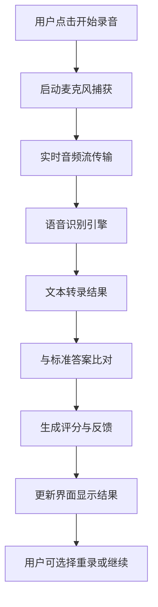

<!-- wiki_page_id: page-3 -->

# 架构概览

## 项目结构

English-Speaking-Trainer 是一个基于网页的英语口语训练应用，采用前后端分离架构。前端使用 HTML、CSS 和 JavaScript 实现交互界面，后端可能依赖本地文件或简单的服务器逻辑处理语音识别和评分功能。

## 核心功能模块

### 1. 语音录制与播放模块
- 负责捕获用户麦克风输入
- 实现音频录制、暂停、停止和回放功能
- 使用 Web Audio API 和 MediaRecorder API 处理音频流

### 2. 语音识别与评分模块
- 集成浏览器原生语音识别 API（如 Web Speech API）
- 将用户语音转换为文本
- 对比标准答案，评估发音准确度、流畅度和完整性
- 提供即时反馈和评分

### 3. 用户界面交互模块
- 响应式设计，支持多种设备
- 直观的操作按钮（开始、暂停、重播、下一题）
- 实时显示识别结果和评分
- 进度跟踪和历史记录查看

### 4. 内容管理模块
- 预设英语句子或短文库
- 支持按难度分级或主题分类
- 内容可通过配置文件扩展（如 JSON 格式）

## 技术栈

- **前端**：HTML5, CSS3, JavaScript (原生或框架如 React/Vue 未明确，但结构偏向原生实现)
- **语音处理**：Web Speech API, MediaRecorder API
- **存储**：可能使用 localStorage 保存用户进度和历史记录
- **部署**：静态网页，可通过 GitHub Pages 或任何静态服务器托管

## 数据流程

## 设计特点

- **轻量化**：无需复杂后端，核心功能依赖浏览器原生 API 实现
- **隐私友好**：音频数据仅在本地处理，不上传至服务器
- **即时反馈**：降低学习延迟，提升训练效率
- **可扩展性**：通过修改资源文件可添加新练习内容

## 限制与注意事项

- 依赖浏览器对 Web Speech API 的支持程度（主要在 Chrome 中最佳）
- 语音识别准确度受环境噪音、麦克风质量和发音清晰度影响
- 离线使用可能受限（部分 API 需要网络连接）

