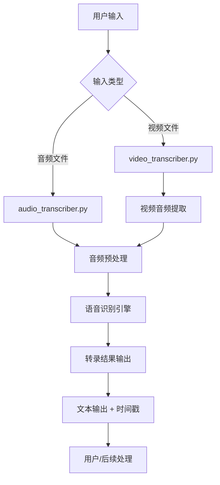

<!-- wiki_page_id: page-4 -->

# 数据流说明

## 系统概述

English-Speaking-Trainer 是一个用于英语口语训练的系统，核心功能包括音频和视频的转录处理。系统通过两个主要模块处理数据流：`audio_transcriber.py` 负责音频文件的转录，`video_transcriber.py` 负责视频文件的音频提取及转录。

## 数据流模块

### 音频转录数据流 (`audio_transcriber.py`)

音频转录模块的数据流如下：

1. **输入**：用户提供的音频文件（支持常见格式如 WAV、MP3 等）
2. **预处理**：
   - 音频文件读取
   - 必要的格式转换和采样率调整
3. **转录处理**：
   - 使用语音识别引擎（如 Whisper 或其他 STT 模型）进行语音到文本的转换
   - 实时或批处理模式下的文本生成
4. **输出**：
   - 转录后的文本结果
   - 可选的时间戳信息（如果引擎支持）
   - 错误处理和日志记录

### 视频转录数据流 (`video_transcriber.py`)

视频转录模块的数据流如下：

1. **输入**：用户提供的视频文件（支持常见格式如 MP4、AVI 等）
2. **音频提取**：
   - 使用 FFmpeg 或类似工具从视频中提取音轨
   - 音频格式转换为适合转录的格式（如 WAV、16kHz 单声道）
3. **音频转录**：
   - 将提取的音频传递给音频转录模块（复用 `audio_transcriber.py` 的逻辑）
   - 执行语音识别过程
4. **输出**：
   - 视频中语音内容的转录文本
   - 时间戳对应信息（视频时间线）
   - 中间产物清理（临时音频文件）

## 数据流图

## 关键数据点

- **音频流**：原始音频 → 预处理音频 → 识别引擎输入 → 文本输出
- **视频流**：原始视频 → 音频轨道提取 → 预处理音频 → 识别引擎输入 → 文本输出
- **共享组件**：两个流程在音频预处理和语音识别阶段共享核心逻辑，实现代码复用
- **错误处理**：每个阶段都包含异常捕获和日志记录，确保系统鲁棒性

## 输出格式

转录结果通常以以下格式输出：
- 纯文本转录
- 带时间戳的段落（可选，依赖于底层引擎能力）
- 输出可直接用于后续的语言分析、纠错反馈或学习报告生成

此数据流设计确保了模块化、可维护性和对不同输入类型的统一处理。
