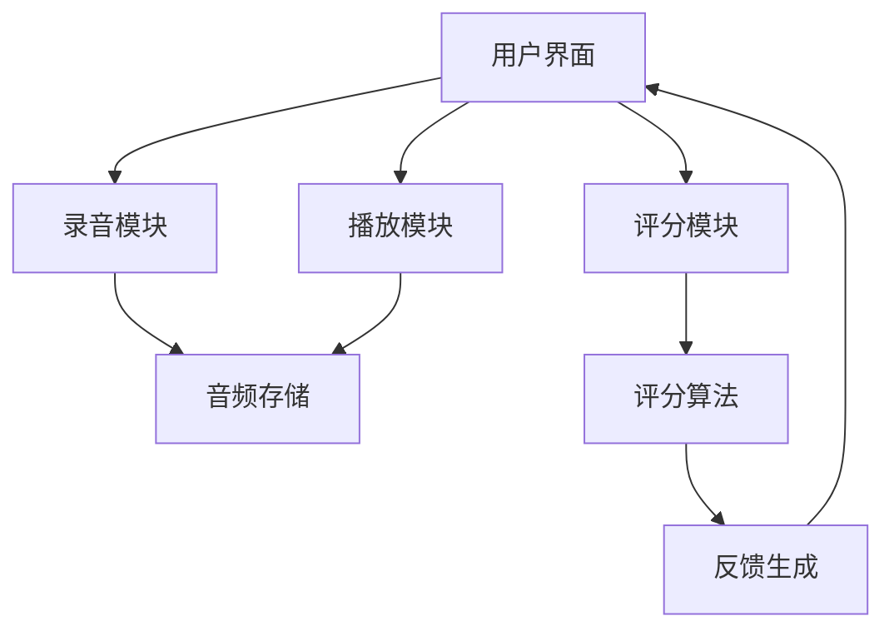

<!-- wiki_page_id: page-5 -->

# 组件关系图

## 项目概述

English-Speaking-Trainer 是一个用于英语口语练习的应用程序，旨在帮助用户通过录音、播放和评分功能提升英语口语表达能力。

## 主要组件

根据 README.md 文档，该项目包含以下核心功能模块：

### 1. 录音模块
- 负责捕获用户的语音输入
- 提供开始/停止录音控制
- 存储录音文件供后续处理

### 2. 播放模块
- 支持播放用户录音
- 提供音频控制（播放/暂停/停止）
- 可调节播放速度和音量

### 3. 评分模块
- 分析用户发音准确性
- 提供语音评分反馈
- 可能包含流畅度、音调和韵律评估

### 4. 用户界面
- 交互式操作界面
- 显示录音波形或进度条
- 展示评分结果和练习历史

## 组件关系

基于项目功能描述，可以推断出以下组件关系：

## 数据流

1. 用户通过界面启动录音
2. 录音模块捕获音频并存储
3. 用户可通过播放模块回放录音
4. 评分模块分析存储的音频数据
5. 评分结果反馈给用户界面展示

## 技术栈推断

虽然 README.md 未明确列出技术栈，但基于功能特点可以推断：
- 前端：可能使用 HTML/CSS/JavaScript 或类似框架
- 音频处理：可能使用 Web Audio API 或类似库
- 存储：可能使用本地存储或 IndexedDB 保存录音

> 注意：由于仅提供了 README.md 文件，部分组件细节和技术实现基于功能描述进行合理推断。实际实现可能有所不同。
