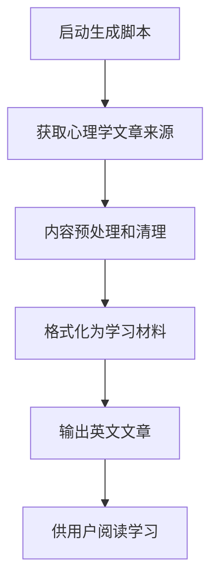

<!-- wiki_page_id: page-6 -->

# 文章阅读功能

## 功能概述

文章阅读功能是English-Speaking-Trainer项目的核心组成部分，用于为用户提供英文文章学习资源。该功能通过自动生成和展示心理学相关的英文文章，帮助用户在阅读中提升英语水平，特别是心理学术语和表达方式。

## 核心组件

### 生成脚本

文章阅读功能的主要实现基于`generate_psych2go_articles.py`脚本。该脚本负责：

- 从心理学相关来源获取文章内容
- 处理和格式化英文文章
- 生成适合语言学习的文章材料

### 内容来源

根据README.md描述，文章内容主要来源于心理学领域的材料，特别关注Psych2Go等心理学科普内容的英文版本。

## 工作流程

## 使用方法

1. 运行`generate_psych2go_articles.py`脚本生成文章内容
2. 生成的文章将用于英文阅读练习
3. 用户可以阅读这些文章来提升英语阅读能力，特别是心理学领域的专业词汇

## 特点

- 内容专注于心理学领域，提供专业且有趣的阅读材料
- 自动化生成流程减少了手动收集和整理文章的工作量
- 生成的文章适合作为英语学习材料使用

## 注意事项

- 该功能依赖于外部心理学内容来源的可访问性
- 生成的文章质量取决于源材料和处理逻辑
- 如需更新文章来源或调整生成逻辑，需要修改`generate_psych2go_articles.py`脚本

