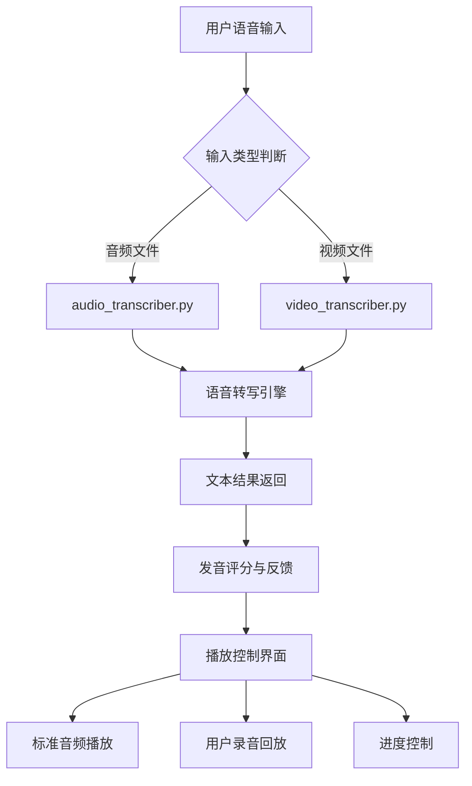

<!-- wiki_page_id: page-7 -->

# 语音模仿与播放控制

## 功能概述

语音模仿与播放控制模块是 English-Speaking-Trainer 系统的核心组件，负责处理用户的语音输入、进行语音转写、比对标准发音、并控制音频/视频的播放与交互。该模块通过集成音频转写和视频转写功能，实现对用户口语表达的实时评估与反馈。

## 系统架构

## 核心组件

### audio_transcriber.py

该文件负责处理纯音频输入的语音转写任务。主要功能包括：

- 使用语音识别引擎将音频文件转换为文本
- 支持多种音频格式（如 WAV, MP3）
- 提供错误处理机制，处理无法识别的音频
- 返回转写结果及置信度分数

### video_transcriber.py

该文件扩展了音频转写功能以支持视频输入。其工作流程为：

1. 从视频文件中提取音频轨道
2. 调用音频转写引擎处理提取的音频
3. 将转写结果与视频时间戳对齐（如适用）
4. 返回完整的转写输出

## 播放控制机制

系统通过以下方式实现播放控制：

- **标准音频播放**：播放参考发音供用户模仿
- **用户录音回放**：允许用户聆听自身录音以进行自我评估
- **同步播放控制**：在评估过程中实现参考音频与用户录音的对齐播放
- **进度条与时间控制**：支持暂停、继续、跳转等操作

## 数据流程

1. 用户上传音频或视频文件
2. 系统根据文件类型路由至相应的转写器（audio_transcriber.py 或 video_transcriber.py）
3. 转写器处理输入并返回文本转写结果
4. 系统将转写结果与预设的标准文本进行比对
5. 生成发音评分和详细反馈
6. 播放控制界面展示结果并提供音频交互功能

## 错误处理

- 音频/视频文件损坏时返回明确错误信息
- 语音识别失败时提供替代方案或提示用户重新录制
- 网络依赖服务不可用时启用离线降级方案（如适用）

## 与其他模块的集成

语音模仿与播放控制模块通过以下方式与系统其他部分集成：

- 接收来自用户界面的输入文件
- 将转写结果发送至评分模块
- 接收评分结果以在界面上展示反馈
- 控制媒体播放组件以实现音频交互

## 性能考量

- 转写过程采用异步处理以避免阻塞用户界面
- 大文件通过分块处理降低内存占用
- 缓存常用参考音频以加快播放响应速度
- 优化音频提取和转写管道以减少延迟

## 未来改进方向

- 添加实时语音转写功能以支持即时反馈
- 引入高级发音评估指标（如音调、节奏、重音）
- 支持多种英语方言和口音的适应性评估
- 集成唇部动作分析以增强视频输入的评估准确性
</response>
