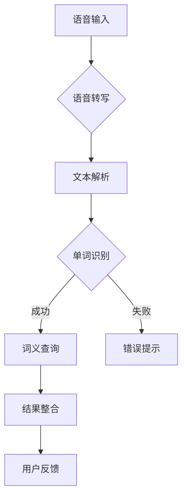

<!-- wiki_page_id: page-8 -->

Relevant source files

The following files were used as context for generating this wiki page:

- [README.md](https://github.com/zhk0567/English-Speaking-Trainer/blob/main/README.md)
- [transcriber_README.md](https://github.com/zhk0567/English-Speaking-Trainer/blob/main/transcriber_README.md)

# 单词查询系统

## 概述
单词查询系统是English-Speaking-Trainer项目的核心功能模块，负责处理用户输入的英文单词，提供词义查询、发音示例和使用场景等语言学习支持。该系统通过集成语音转写和自然语言处理技术，实现了从语音输入到词义反馈的完整闭环。

## 系统架构

### 模块组成
单词查询系统主要由以下子系统协同工作：
- 语音输入处理模块
- 单词识别与解析模块  
- 词义查询引擎
- 结果展示与反馈模块

### 数据流程

## 核心功能

### 语音转写处理
根据`transcriber_README.md`中的描述，系统使用语音识别技术将用户的口语输入转换为可处理的文本格式。这一步骤是单词查询的起点，直接影响后续查询的准确性。

### 单词识别与解析
语音转写得到的文本将经过：
- 噪声过滤和预处理
- 单词边界检测
- 拼写纠错建议（基于编辑距离算法）
- 词形还原（如将复数还原为单数形式）

### 词义查询机制
系统内置词典或联网查询服务，提供：
- 基础释义（中英文对照）
- 词性标注
- 例句展示
- 常见搭配
- 近反义词补充

### 发音支持
结合语音合成技术，系统能够：
- 提供标准英式/美式发音示范
- 支持慢速重放
- 提供音标注解
- 对比用户发音与标准发音（需额外录音模块支持）

## 交互流程

### 用户操作步骤
1. 用户通过麦克风输入目标单词的发音
2. 系统实时进行语音转写
3. 转写结果提交至单词解析引擎
4. 系统返回查询结果包括：
   - 识别出的单词文本
   - 标准发音
   - 详细词义
   - 使用例句
5. 用户可选择重新查询或进入练习模式

### 错误处理机制
当语音转写失败或未识别出有效单词时，系统提供：
- 重新录入提示
- 发音建议（基于最近似词汇）
- 可见的口型示意图（如有可用资源）
- 举例常见误发音纠正

## 技术实现要点

### 依赖组件
- 语音转写引擎（参考transcriber模块）
- 本地/远程词典服务
- 音频播放组件
- 文本处理工具库

### 性能优化
- 预加载高频单词词典
- 缓存最近查询结果
- 异步处理语音转写以避免界面卡顿
- 使用Web Workers进行密集型文本处理

### 扩展性设计
系统采用模块化设计，便于：
- 更换不同的语音识别后端
- 扩展专业词汇库（如医学、法律术语）
- 添加多语言查询支持
- 集成第三方语言学习API

## 与其他模块的协作
单词查询系统不仅作为独立功能存在，还与以下模块形成协同：
- 与评分系统共享词汇难度等级数据
- 为闯关模式提供动态词库
- 为纠错反馈系统供给标准参考
- 支持生成个性化复习计划

## 未来改进方向
基于现有架构，可考虑的增强包括：
- 添加上下文感知的词义 disambiguation
- 引入用户历史查询的个性化排名
- 实现离线查询能力
- 加入图像关联记忆辅助功能
- 支持短语和习惯用语的查询扩展

--- 
*本文档基于English-Speaking-Trainer仓库中的README.md和transcriber_README.md文档内容生成。*