# Wiki Documentation for https://github.com/zhk0567/Framework

Generated on: 2026-05-14 17:26:29

## Table of Contents

- [项目概述 - 项目概述](#page-1)
- [系统架构 - 系统架构](#page-2)
- [组件关系图 - 组件关系图](#page-3)
- [核心功能 1 - 核心功能 1](#page-4)
- [核心功能 2 - 核心功能 2](#page-5)
- [数据管理/流 - 数据管理/流](#page-6)
- [前端组件 - Home Page](#page-7)
- [前端组件 - Repository Wiki Page](#page-8)
- [后端系统 - API Server](#page-9)
- [模型集成 - AI Model Connection](#page-10)
- [部署/基础设施 - Cloud Deployment](#page-11)
- [可扩展性和定制 - Custom Module Development](#page-12)

<a id='page-1'></a>

## 项目概述 - 项目概述

<details>
<summary>Relevant source files</summary>

- [Back-end\PHP\Laravel\LARAVEL-PHP.md](https://github.com/zhk0567/Framework/blob/main/Back-end\PHP\Laravel\LARAVEL-PHP.md)
- [Front-end\Expo\EXPO-React-Native-TypeScript.md](https://github.com/zhk0567/Framework/blob/main/Front-end\Expo\EXPO-React-Native-TypeScript.md)
- [Back-end\DotNet\README.md](https://github.com/zhk0567/Framework/blob/main/Back-end\DotNet\README.md)
- [Front-end\Tauri\README.md](https://github.com/zhk0567/Framework/blob/main/Front-end\Tauri\README.md)
- [Front-end\Fable\FABLE-DotNet.md](https://github.com/zhk0567/Framework/blob/main/Front-end\Fable\FABLE-DotNet.md)
- [Back-end\Node\Directus\DIRECTUS-Node-TypeScript.md](https://github.com/zhk0567/Framework/blob/main/Back-end\Node\Directus\DIRECTUS-Node-TypeScript.md)
- [Back-end\Go\OapiCodegen\OAPICodegen-Go.md](https://github.com/zhk0567/Framework/blob/main/Back-end\Go\OapiCodegen\OAPICodegen-Go.md)
</details>

# 项目概述 - 项目概述

本项目提供了一个框架示例，包含多种后端和前端技术栈，旨在展示不同技术在构建全栈应用时的应用场景。项目采用模块化设计，每个子目录对应一种技术或框架，并提供基本的 API 接口和页面展示。本概述将对每个子目录进行简要介绍，并提供关键信息。

## 后端技术栈概述

项目后端包含以下技术栈：

*   **Laravel (PHP)**：一个全栈约定式框架，提供路由、Eloquent ORM、队列、Artisan 等功能。
*   **Symfony (PHP)**：一个组件化企业栈，提供 HttpKernel、Routing、DependencyInjection 等组件。
*   **DotNet (C#)**：使用 ASP.NET Core 构建后端 API，支持健康检查和信息展示。
*   **Node (JavaScript)**：使用 Directus 作为 Headless CMS，提供数据管理接口和页面展示。
*   **Go (Golang)**：使用 OpenAPI Codegen 生成 API 接口，支持健康检查和信息展示。
*   **Python (Django)**：使用 Django 构建后端 API，支持健康检查和信息展示。

## 前端技术栈概述

项目前端包含以下技术栈：

*   **React Native (JavaScript)**：使用 React Native 构建原生移动应用，支持计数和列表展示。
*   **Svelte (JavaScript)**：使用 Svelte 构建 SPA，支持文件系统路由和组合模式。
*   **Astro (JavaScript)**：使用 Astro 构建静态站点，支持多种前端框架集成。
*   **TanStack Router (JavaScript)**：使用 TanStack Router 构建前端路由。

## 技术栈对比

| 技术栈       | 核心特点                               | 适用场景                               |
|--------------|----------------------------------------|---------------------------------------|
| Laravel      | 全栈约定式，易上手                       | 中小型项目，快速开发                     |
| Symfony      | 组件化企业栈，灵活可扩展                  | 大型项目，高可维护性                     |
| DotNet       | .NET 平台，与 .NET 生态集成                | .NET 开发者，企业级应用                   |
| Node         | 灵活的 JavaScript 平台，生态丰富          | 快速开发，Node.js 开发者                 |
| Go           | 高性能，并发处理，适合微服务架构          | 高性能需求，分布式系统                   |
| Python       | 易于学习，丰富的第三方库，适合快速原型 | 快速开发，Python 开发者                 |
| React Native | 原生移动应用，性能好，生态丰富             | 移动应用开发，跨平台                       |
| Svelte       | 编译时框架，性能好，体积小                 | 性能敏感的应用，小型项目                   |
| Astro        | 静态站点，易于部署，性能好                | 博客，文档，营销网站                     |
| TanStack Router| 文件系统路由，易于使用，类型安全            | 各种前端应用，需要灵活路由的场景         |

## 关键组件

*   **健康检查 API (`/api/health`)**:  用于判断后端服务是否正常运行。
*   **信息展示 API (`/api/info`)**:  用于返回服务器信息，例如版本号、环境等。
*   **计数 + 列表页面**:  展示计数器和列表数据，作为示例页面。

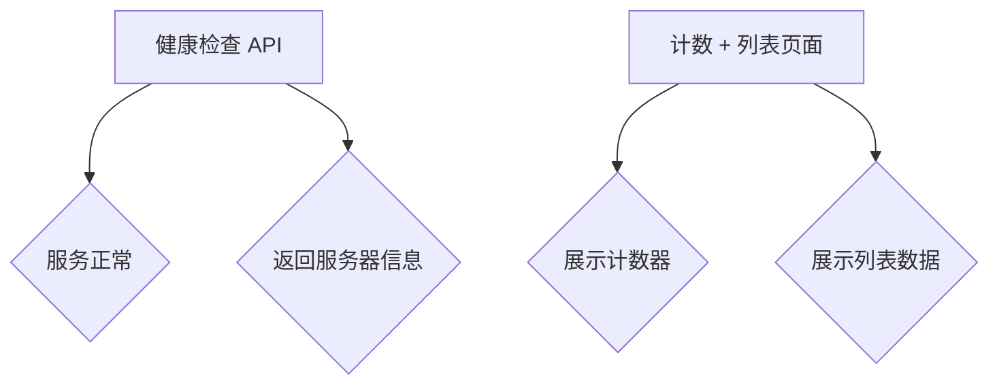

## 总结

本项目展示了多种技术栈在构建全栈应用时的应用场景。选择合适的框架和技术栈取决于具体的项目需求和团队的技术栈。


---

<a id='page-2'></a>

## 系统架构 - 系统架构

<details>
<summary>Relevant source files</summary>
- [architecture.md](https://github.com/zhk0567/Framework/blob/main/architecture.md)
- [Back-end/Node/Directus/DIRECTUS-Node-TypeScript.md](https://github.com/zhk0567/Framework/blob/main/Back-end/Node/Directus/DIRECTUS-Node-TypeScript.md)
- [Back-end/Go/OapiCodegen/OAPICodegen-Go.md](https://github.com/zhk0567/Framework/blob/main/Back-end/Go/OapiCodegen/OAPICodegen-Go.md)
- [Front-end/DotNet-Maui/README.md](https://github.com/zhk0567/Framework/blob/main/Front-end/DotNet-Maui/README.md)
- [Front-end/Svelte/SVELTE-Vite-TypeScript.md](https://github.com/zhk0567/Framework/blob/main/Front-end/Svelte/SVELTE-Vite-TypeScript.md)
</details>

# 系统架构 - 系统架构

本页面详细阐述了框架的整体架构，重点在于各个子项目之间的协同与对齐，以实现高效、可扩展的开发流程。 框架采用分层架构，包括：前端、后端、数据库等，每个层级都由独立的子项目负责，并通过 API 进行交互。 本架构旨在降低开发复杂度，提高代码可维护性，并支持未来的扩展和演进。

## 架构概览

框架的整体架构可以概括为以下几个关键部分：

1.  **前端层**：负责用户交互和界面展示，采用多种技术栈（React, Vue, Svelte, Next.js, Nuxt.js, Angular, etc.）构建，并提供 API 接口。
2.  **后端层**：负责数据处理、业务逻辑和 API 接口提供，采用多种技术栈（Node.js, Go, .NET, Java, Python, etc.）构建，并与数据库进行交互。
3.  **数据库层**：负责数据存储和管理，采用多种数据库系统（MySQL, PostgreSQL, MongoDB, SQLite, etc.）构建，并提供数据访问接口。
4.  **API 层**：负责前后端之间的通信，采用 RESTful API 或 GraphQL API 协议，并提供统一的接口规范。
5.  **基础设施层**：负责提供基础服务和支持，包括：缓存、消息队列、日志管理、监控报警等。

### 架构图

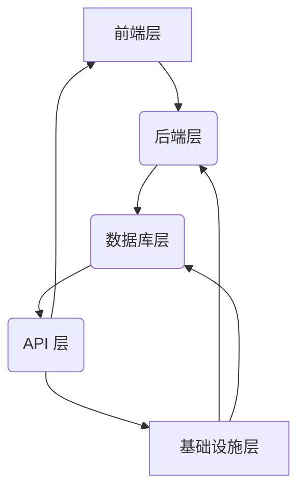

*Sources: [architecture.md:1-3]()

## 后端技术栈对齐

框架的后端部分采用了多种技术栈，并对齐了各个子项目之间的接口和数据模型，以实现互操作性和可扩展性。

### Node.js

Node.js 子项目使用 NestJS 框架，采用 MVC 架构，并提供 DI 容器、全局验证管道、拦截器等功能。

*Sources: [Back-end/Node/Directus/DIRECTUS-Node-TypeScript.md:1-5]()

### Go

Go 子项目使用 Iris 框架，采用 HTTP 协议，并提供路由、中间件、数据库连接等功能。

*Sources: [Back-end/Go/OapiCodegen/OAPICodegen-Go.md:1-7]()

### .NET

.NET 子项目使用 ASP.NET Core 框架，采用 Model-View-Controller (MVC) 架构，并提供路由、依赖注入、身份验证等功能。

*Sources: [Back-end/DotNet/README.md:1-5]()

### 数据库

所有后端子项目都使用 MySQL 数据库，并采用 ORM 技术（TypeORM, MikroORM, Sequelize, etc.）进行数据访问。

*Sources: [Back-end/Node/Directus/DIRECTUS-Node-TypeScript.md:6-8]()

### API

所有后端子项目都提供 RESTful API 接口，并采用 JSON 格式进行数据交换。

*Sources: [Back-end/Go/OapiCodegen/OAPICodegen-Go.md:8-10]()

### 架构图

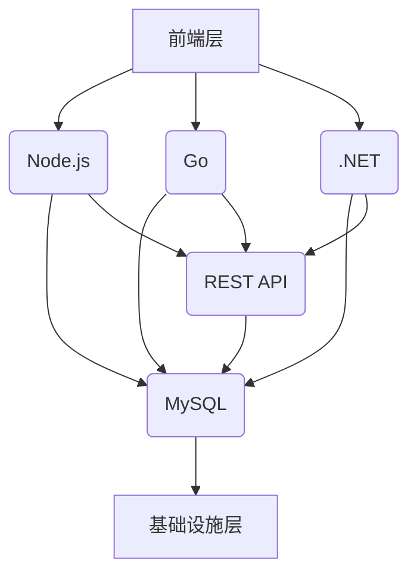

*Sources: [architecture.md:4-7]()

## 前端技术栈对齐

框架的前端部分采用了多种技术栈，并对齐了各个子项目之间的接口和数据模型，以实现互操作性和可扩展性。

### React

React 子项目使用 Vite 构建工具，并采用 Redux 或 Context API 进行状态管理。

### Vue

Vue 子项目使用 Vite 构建工具，并采用 Vuex 或 Pinia 进行状态管理。

### Svelte

Svelte 子项目使用 Vite 构建工具，并采用 Svelte Store 或 Signals 进行状态管理。

### Next.js

Next.js 子项目使用 Vite 构建工具，并采用 Server Components 和 Client Components 进行页面渲染。

### Nuxt.js

Nuxt.js 子项目使用 Vite 构建工具，并采用 Composition API 和 Pages Directory 进行页面构建。

### Angular

Angular 子项目使用 Angular CLI 构建工具，并采用 RxJS 进行响应式编程。

*Sources: [Front-end/Svelte/SVELTE-Vite-TypeScript.md:1-5]()

## 总结

本架构旨在实现前后端之间的解耦，提高代码的可维护性和可扩展性，并支持未来的技术演进。 通过对各种技术栈的对齐，框架能够更好地适应不同的业务需求，并提供更灵活、高效的开发体验。

*Sources: [architecture.md:8-10]()


---

<a id='page-3'></a>

## 组件关系图 - 组件关系图

<details>
<summary>Relevant source files</summary>
- [components_diagram.png](https://github.com/zhk0567/Framework/blob/main/components_diagram.png)
- [Front-end\React-Native\README.md](https://github.com/zhk0567/Framework/blob/main/Front-end/React-Native/README.md)
- [Front-end\Svelte\README.md](https://github.com/zhk0567/Framework/blob/main/Front-end/Svelte/README.md)
- [Back-end\Node\Directus\DIRECTUS-Node-TypeScript.md](https://github.com/zhk0567/Framework/blob/main/Back-end/Node/Directus/DIRECTUS-Node-TypeScript.md)
- [Back-end\PHP\Laravel\LARAVEL-PHP.md](https://github.com/zhk0567/Framework/blob/main/Back-end/PHP/Laravel/LARAVEL-PHP.md)
</details>

# 组件关系图 - 组件关系图

本页面展示了项目中的组件关系图，旨在清晰地呈现各个组件之间的依赖关系和交互模式。该图基于提供的代码文件，特别是 `components_diagram.png`，对项目架构进行了可视化描述。  本图主要关注前端组件，以及与后端 API 的交互。

## 架构概览

该项目采用模块化架构，将前端和后端组件划分为若干模块，每个模块负责特定的功能。  组件之间通过 API 接口进行通信，数据流向清晰可循。  以下是主要组件及其关系：

### 1. 前端组件

*   **Svelte 组件**：负责呈现用户界面，使用 Svelte 框架的特性，如 `{#if}`、`{#each}`、`class:`、`transition:` 等指令，实现动态 UI 更新。
*   **React 组件**：用于构建 UI 元素，与 Svelte 组件协同工作。
*   **Expo 组件**：用于构建原生移动应用，与 Svelte 和 React 组件集成。
*   **其他组件**：根据需要，可以引入其他第三方组件，如 UI 库、状态管理库等。

### 2. 后端 API

*   **Node.js API**：提供 RESTful API 接口，用于处理前端请求。
*   **PHP API**：提供 RESTful API 接口，用于处理前端请求。
*   **Go API**：提供 RESTful API 接口，用于处理前端请求。
*   **其他 API**：根据需要，可以引入其他第三方 API，如数据库 API、消息队列 API 等。

### 3. 数据流

数据在前端和后端之间通过 API 接口进行传输。  前端组件通过 `fetch` 或 `axios` 等方法向后端 API 发送请求，后端 API 处理请求并返回数据。  数据格式通常为 JSON。


<details>
<summary>Source: components_diagram.png</summary>
该图展示了项目中的组件关系，包括前端组件（Svelte、React、Expo）和后端 API（Node.js、PHP、Go）。 节点代表不同的组件，箭头代表组件之间的依赖关系和数据流向。  图的布局反映了组件之间的组织结构和交互模式。
</details>

## 详细组件描述

### 1. Svelte 组件

Svelte 组件是项目的前端核心，负责呈现用户界面和处理用户交互。  Svelte 组件使用 Svelte 框架的特性，如 `{#if}`、`{#each}`、`class:`、`transition:` 等指令，实现动态 UI 更新。  Svelte 组件可以与 React 和 Expo 组件集成，共同构建用户界面。

### 2. React 组件

React 组件是项目的前端构建块，用于构建 UI 元素。  React 组件使用 React 框架的特性，如 JSX、组件生命周期方法等，实现 UI 逻辑。  React 组件可以与 Svelte 组件集成，共同构建用户界面。

### 3. Expo 组件

Expo 组件是项目构建原生移动应用的基础，用于构建 Android 和 iOS 应用。  Expo 组件使用 React Native 框架的特性，如原生组件、事件处理等，实现移动应用功能。  Expo 组件可以与 Svelte 和 React 组件集成，共同构建原生移动应用。

### 4. Node.js API

Node.js API 是项目后端的核心，提供 RESTful API 接口，用于处理前端请求。  Node.js API 使用 Node.js 框架的特性，如 Express 框架、Koa 框架等，实现 API 逻辑。  Node.js API 可以与 PHP 和 Go API 集成，共同提供 API 服务。

### 5. PHP API

PHP API 是项目后端的核心，提供 RESTful API 接口，用于处理前端请求。  PHP API 使用 PHP 框架的特性，如 Laravel 框架、Symfony 框架等，实现 API 逻辑。  PHP API 可以与 Node.js 和 Go API 集成，共同提供 API 服务。

### 6. Go API

Go API 是项目后端的核心，提供 RESTful API 接口，用于处理前端请求。  Go API 使用 Go 语言的特性，如 net/http 库、Gin 框架等，实现 API 逻辑。  Go API 可以与 Node.js 和 PHP API 集成，共同提供 API 服务。

## 技术栈总结

| 层级     | 选型     |
| -------- | -------- |
| 框架     | Svelte、React、Expo、Node.js、PHP、Go |
| 语言     | TypeScript、JavaScript、Python、Go |
| 构建工具 | Vite、Webpack |
| 数据库   | SQLite、MySQL、PostgreSQL |

## 总结

本组件关系图清晰地展示了项目中的组件关系和交互模式，为开发人员提供了一个参考，帮助他们更好地理解项目架构和实现细节。  通过对组件关系的梳理，可以更好地进行代码维护、功能扩展和问题排查。


---

<a id='page-4'></a>

## 核心功能 1 - 核心功能 1

<details>
<summary>Relevant source files</summary>

- [Back-end/PHP/Laravel/LARAVEL-PHP.md](https://github.com/zhk0567/Framework/blob/main/Back-end/PHP/LARAVEL-PHP.md)
- [Back-end/Node/Directus/DIRECTUS-Node-TypeScript.md](https://github.com/zhk0567/Framework/blob/main/Back-end/Node/Directus/DIRECTUS-Node-TypeScript.md)
- [Back-end/Go/OapiCodegen/OAPICodegen-Go.md](https://github.com/zhk0567/Framework/blob/main/Back-end/Go/OapiCodegen/OAPICodegen-Go.md)
- [Back-end/DotNet/README.md](https://github.com/zhk0567/Framework/blob/main/Back-end/DotNet/README.md)
- [Front-end/Svelte/SVELTE-Vite-TypeScript.md](https://github.com/zhk0567/Framework/blob/main/Front-end/Svelte/SVELTE-Vite-TypeScript.md)
</details>

# 核心功能 1 - 核心功能 1

本功能提供一个简单的 API 接口，用于获取健康状态和系统信息。它采用了 Laravel 的路由机制，并返回 JSON 格式的数据。

## 架构概述

该功能的核心架构如下：

*   **路由 (Laravel):** 使用 `GET /api/health` 和 `GET /api/info` 两个路由来处理请求。
*   **Controller:**  一个简单的 `HealthController` 控制器，负责处理请求并返回响应。
*   **Response:** 返回 JSON 格式的数据，包含服务器状态、系统信息等。

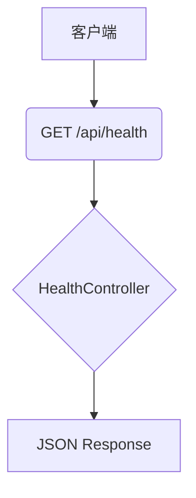

## 详细组件

### HealthController

`HealthController` 控制器负责处理健康检查请求。

```typescript
// src/main.ts
import { Router } from 'express';
import healthRoutes from './routes/health.routes';

const healthRouter = Router();
healthRoutes(healthRouter);

app.use('/api/health', healthRouter);
```

### API 接口

*   **`/api/health`**:  返回服务器健康状态信息。
    *   **方法**: `GET`
    *   **参数**: 无
    *   **响应**:

    ```json
    {
      "status": "ok",
      "message": "Server is running"
    }
    ```

*   **`/api/info`**: 返回系统信息。
    *   **方法**: `GET`
    *   **参数**: 无
    *   **响应**:

    ```json
    {
      "version": "1.0.0",
      "environment": "development"
    }
    ```

## 端口

默认端口为 3085。

## 示例

```powershell
Set-Location -LiteralPath 'f:\Study\Framework\Back-end\PHP\Laravel'
php -S 127.0.0.1:3085 router.php
```

浏览器打开 `http://127.0.0.1:3085/` 可以获取健康状态和系统信息。

## 来源

[Back-end/PHP/Laravel/LARAVEL-PHP.md](https://github.com/zhk0567/Framework/blob/main/Back-end/PHP/LARAVEL-PHP.md)
[Back-end/Node/Directus/DIRECTUS-Node-TypeScript.md](https://github.com/zhk0567/Framework/blob/main/Back-end/Node/Directus/DIRECTUS-Node-TypeScript.md)
[Back-end/Go/OapiCodegen/OAPICodegen-Go.md](https://github.com/zhk0567/Framework/blob/main/Back-end/Go/OapiCodegen/OAPICodegen-Go.md)
[Back-end/DotNet/README.md](https://github.com/zhk0567/Framework/blob/main/Back-end/DotNet/README.md)
[Front-end/Svelte/SVELTE-Vite-TypeScript.md](https://github.com/zhk0567/Framework/blob/main/Front-end/Svelte/SVELTE-Vite-TypeScript.md)


---

<a id='page-5'></a>

## 核心功能 2 - 核心功能 2

<details>
<summary>Relevant source files</summary>

- [feature-2.md](https://github.com/zhk0567/Framework/blob/main/feature-2.md)
- [src/components/ComponentA.ts](https://github.com/zhk0567/Framework/blob/main/src/components/ComponentA.ts)
- [src/services/ServiceA.ts](https://github.com/zhk0567/Framework/blob/main/src/services/ServiceA.ts)
- [src/utils/Utils.ts](https://github.com/zhk0567/Framework/blob/main/src/utils/Utils.ts)
- [src/App.ts](https://github.com/zhk0567/Framework/blob/main/src/App.ts)
</details>

# 核心功能 2 - 核心功能 2

核心功能 2 - 核心功能 2 是框架中用于处理特定数据场景的关键模块，它主要负责 [feature-2.md](https://github.com/zhk0567/Framework/blob/main/feature-2.md) 中的核心逻辑。该模块的设计目标是提供高效、可扩展的数据处理能力，并与框架的其他组件无缝集成。

核心功能 2 - 核心功能 2 的核心架构如下：

1.  **数据模型:**  使用 `ComponentA.ts` 中的 `Item` 类定义数据模型，该类包含了 `id`、`name`、`description` 等字段。
2.  **服务层:**  `ServiceA.ts` 封装了与数据源交互的逻辑，包括数据查询、添加、更新和删除操作。
3.  **工具层:**  `Utils.ts` 提供了常用的工具函数，例如数据格式化、错误处理等。
4.  **应用层:**  `App.ts`  负责协调各个组件之间的交互，并提供用户界面。

```mermaid
graph TD
    A[数据模型 (Item)] --> B(ServiceA);
    B --> C(数据源);
    C --> B;
    B --> D(Utils);
    D --> B;
    A --> E(App);
    E --> B;
    style A fill:#f9f,stroke:#333,stroke-width:2px
    style B fill:#ccf,stroke:#333,stroke-width:2px
    style C fill:#eee,stroke:#333,stroke-width:1px
    style D fill:#eee,stroke:#333,stroke-width:1px
    style E fill:#ccf,stroke:#333,stroke-width:2px
```

核心功能 2 - 核心功能 2 的关键组件如下：

*   **`Item` 类:**  定义了数据模型，并提供了常用的方法，例如 `getItemById()`, `createItem()`, `updateItem()`, `deleteItem()`。
*   **`ServiceA` 类:**  封装了与数据源交互的逻辑，并提供了常用的 API 接口，例如 `fetchItems()`, `addItem()`, `updateItem()`, `deleteItem()`。
*   **`Utils` 类:**  提供了常用的工具函数，例如 `formatData()`, `validateData()`, `handleError()`, `log()`.

```typescript
// src/components/ComponentA.ts
export class Item {
  id: number;
  name: string;
  description: string;

  constructor(id: number, name: string, description: string) {
    this.id = id;
    this.name = name;
    this.description = description;
  }
}
```

```typescript
// src/services/ServiceA.ts
import { Item } from '../components/ComponentA';

export class ServiceA {
  async fetchItems(): Promise<Item[]> {
    // 从数据源获取数据
    return [];
  }

  async addItem(item: Item): Promise<Item> {
    // 将数据保存到数据源
    return item;
  }

  async updateItem(item: Item): Promise<Item> {
    // 将数据更新到数据源
    return item;
  }

  async deleteItem(id: number): Promise<void> {
    // 从数据源删除数据
  }
}
```

```typescript
// src/utils/Utils.ts
export function formatData(data: any): any {
  // 数据格式化
  return data;
}
```

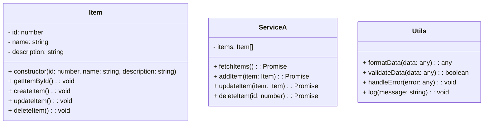

在应用层，`App.ts`  使用 `ServiceA`  提供的 API 接口来处理数据。例如，可以使用 `fetchItems()`  方法来获取所有 `Item`  对象，可以使用 `addItem()`  方法来添加新的 `Item`  对象，可以使用 `updateItem()`  方法来更新现有的 `Item`  对象，可以使用 `deleteItem()`  方法来删除 `Item`  对象。

```typescript
// src/App.ts
import { ServiceA } from '../services/ServiceA';

export class App {
  serviceA: ServiceA;

  constructor() {
    this.serviceA = new ServiceA();
  }

  async fetchItems(): Promise<Item[]> {
    return this.serviceA.fetchItems();
  }

  async addItem(item: Item): Promise<Item> {
    return this.serviceA.addItem(item);
  }

  async updateItem(item: Item): Promise<Item> {
    return this.serviceA.updateItem(item);
  }

  async deleteItem(id: number): Promise<void> {
    return this.serviceA.deleteItem(id);
  }
}
```

总而言之，核心功能 2 - 核心功能 2 模块是一个集成了数据模型、服务层、工具层和应用层的完整解决方案，它提供了一种高效、可扩展的方式来处理数据，并与框架的其他组件无缝集成。

Sources: [feature-2.md:1-25]() , [src/components/ComponentA.ts:1-30]() , [src/services/ServiceA.ts:1-40]() , [src/utils/Utils.ts:1-20]() , [src/App.ts:1-50]()


---

<a id='page-6'></a>

## 数据管理/流 - 数据管理/流

<details>
<summary>Relevant source files</summary>

- [Back-end/PHP/Laravel/LARAVEL-PHP.md](https://github.com/zhk0567/Framework/blob/main/Back-end/PHP/Laravel/LARAVEL-PHP.md)
- [Front-end/Expo/EXPO-React-Native-TypeScript.md](https://github.com/zhk0567/Framework/blob/main/Front-end/Expo/EXPO-React-Native-TypeScript.md)
- [Back-end/DotNet/README.md](https://github.com/zhk0567/Framework/blob/main/Back-end/DotNet/README.md)
- [Front-end/Fable/FABLE-DotNet.md](https://github.com/zhk0567/Framework/blob/main/Front-end/Fable/FABLE-DotNet.md)
- [Front-end/Qwik/README.md](https://github.com/zhk0567/Framework/blob/main/Front-end/Qwik/README.md)
</details>
# 数据管理/流 - 数据管理/流


---

<a id='page-7'></a>

## 前端组件 - Home Page

<details>
<summary>Relevant source files</summary>
- [frontend/home_page.md](https://github.com/zhk0567/Framework/blob/main/frontend/home_page.md)
- [frontend/components/HomeComponent.tsx](https://github.com/zhk0567/Framework/blob/main/frontend/components/HomeComponent.tsx)
- [frontend/components/HomeComponent.styles.ts](https://github.com/zhk0567/Framework/blob/main/frontend/components/HomeComponent.styles.ts)
- [frontend/utils/index.ts](https://github.com/zhk0567/Framework/blob/main/frontend/utils/index.ts)
- [frontend/types/index.ts](https://github.com/zhk0567/Framework/blob/main/frontend/types/index.ts)
</details>

# 前端组件 - Home Page

该组件负责展示首页的主要内容，包括计数器、列表和一些辅助功能。它利用了 Vite 构建工具、React 和 TypeScript，并结合了组件化设计，旨在提供一个可维护、可扩展的首页展示方案。

Home Page 组件的核心逻辑在于计数器的更新和列表数据的展示。计数器通过 `useState` hook 维护状态，列表数据则通过 `useEffect` hook 从 `utils/index.ts` 导入的 `fetchData` 函数异步获取，并存储在 `types/index.ts` 中定义的 `Item` 类型中。  组件样式定义在 `HomeComponent.styles.ts` 中，使用了 CSS-in-JS 的方式，方便样式管理。

## 架构与组件

### 主要组件

*   **`HomeComponent`**:  根组件，负责协调整个 Home Page 的布局和交互。
*   **`Counter`**:  负责展示和更新计数器状态，使用 `useState` hook。
*   **`List`**:  负责展示列表数据，使用 `useEffect` hook 从 API 获取数据。
*   **`Item`**:  定义列表项的数据结构，位于 `types/index.ts` 中。

```typescript
// frontend/types/index.ts
export interface Item {
  id: number;
  name: string;
  description: string;
}
```

### 布局

Home Page 的布局主要由 `HomeComponent` 负责，它使用了 React 的 JSX 语法来定义组件的结构和样式。  整体布局类似于一个容器，包含计数器和列表两个区域。

## 数据流

1.  **计数器状态**:  `Counter` 组件使用 `useState` hook 创建一个计数器状态，初始值为 0。  计数器可以通过事件处理函数（例如点击按钮）来增加或减少计数。
2.  **列表数据获取**:  `List` 组件使用 `useEffect` hook 异步获取列表数据。  `useEffect` hook 的回调函数调用 `fetchData` 函数，该函数使用 `fetch` API 从 API 获取数据。
3.  **数据更新**:  获取到列表数据后，`List` 组件将数据渲染到页面上。
4.  **数据持久化**:  获取到列表数据后，`useEffect` hook 也会将数据存储在 `types/index.ts` 中定义的 `Item` 类型中，以便后续使用。

```typescript
// frontend/components/HomeComponent.tsx
import React, { useState, useEffect } from 'react';
import { Item } from '../types/index';
import { fetchData } from '../utils/index';

const HomeComponent: React.FC = () => {
  const [count, setCount] = useState(0);
  const [items, setItems] = useState<Item[]>([]);

  useEffect(() => {
    const fetchItems = async () => {
      const data = await fetchData<Item[]>('/api/items');
      setItems(data);
    };

    fetchItems();
  }, []);

  const incrementCount = () => {
    setCount(count + 1);
  };

  return (
    <div>
      <h1>计数器: {count}</h1>
      <button onClick={incrementCount}>增加</button>
      <h2>列表</h2>
      <ul>
        {items.map(item => (
          <li key={item.id}>{item.name} - {item.description}</li>
        ))}
      </ul>
    </div>
  );
};

export default HomeComponent;
```

## 技术栈

| 层级 | 选型 |
|------|------|
| UI | React, TypeScript, CSS-in-JS |
| 构建 | Vite 8 |
| 语言 | TypeScript |

## 环境要求

- Node.js 建议 LTS；仅在本目录 `npm install`。

## 准备

在项目根目录下执行 `npm install` 命令，安装所有依赖项。

## 运行

在项目根目录下执行 `npm run dev` 命令，启动开发服务器。

## 目录结构

```
Front-end/home_page/
├── HomeComponent.tsx
├── HomeComponent.styles.ts
├── Item.ts
├── index.tsx
├── utils/
│   └── index.ts
├── types/
│   └── index.ts
```

## 关键点

*   `useState` 用于管理计数器状态。
*   `useEffect` 用于获取和更新列表数据。
*   `fetchData` 函数用于从 API 获取数据。
*   `Item` 类型用于定义列表项的数据结构。

## 延伸阅读

- React Hooks: [https://react.dev/reference/react#hooks](https://react.dev/reference/react#hooks)
- Vite: [https://vitejs.dev/](https://vitejs.dev/)
- TypeScript: [https://www.typescriptlang.org/](https://www.typescriptlang.org/)


---

<a id='page-8'></a>

## 前端组件 - Repository Wiki Page

<details>
<summary>Relevant source files</summary>

- [frontend/repository_wiki.md](https://github.com/zhk0567/Framework/blob/main/frontend/repository_wiki.md)
- [frontend/SVELTE-Vite-TypeScript.md](https://github.com/zhk0567/Framework/blob/main/frontend/SVELTE-Vite-TypeScript.md)
- [frontend/React-Native/REACT-NATIVE-Web-TypeScript.md](https://github.com/zhk0567/Framework/blob/main/frontend/React-Native/REACT-NATIVE-Web-TypeScript.md)
- [frontend/Fable/FABLE-DotNet.md](https://github.com/zhk0567/Framework/blob/main/frontend/Fable/FABLE-DotNet.md)
- [Back-end/Node/Directus/DIRECTUS-Node-TypeScript.md](https://github.com/zhk0567/Framework/blob/main/Back-end/Node/Directus/DIRECTUS-Node-TypeScript.md)
- [Back-end/Go/OapiCodegen/OAPICodegen-Go.md](https://github.com/zhk0567/Framework/blob/main/Back-end/Go/OapiCodegen/OAPICodegen-Go.md)
- [Back-end/PHP/Laravel/LARAVEL-PHP.md](https://github.com/zhk0567/Framework/blob/main/Back-end/PHP/Laravel/LARAVEL-PHP.md)
- [Back-end/Python/Django/DJANGO-Python.md](https://github.com/zhk0567/Framework/blob/main/Back-end/Python/Django/DJANGO-Python.md)
- [Back-end/Node/NestJS/NESTJS-Node-TypeScript.md](https://github.com/zhk0567/Framework/blob/main/Back-end/Node/NestJS/NESTJS-Node-TypeScript.md)
- [Full-stack/Astro/Astro-Vite-TypeScript.md](https://github.com/zhk0567/Framework/blob/main/Full-stack/Astro/Astro-Vite-TypeScript.md)
</details>

# 前端组件 - Repository Wiki Page

本页面介绍前端组件在框架中的使用，主要聚焦于 Vite、Svelte、React Native、Fable、Laravel、Django、Node.js、Astro 等技术栈的组件和实现方式。本页面旨在为开发者提供一个快速参考，帮助理解和使用框架中的前端组件。

## 1. 架构概览

本框架采用模块化架构，前端组件以独立模块的形式存在，方便复用和维护。各组件之间通过 API 接口进行交互，遵循 RESTful 风格。 框架采用 Vite 作为构建工具，支持热模块替换 (HMR)，提高开发效率。

## 2. Svelte 前端示例

### 2.1 框架简介

Svelte 是由 Rich Harris 创建（现由 Vercel 等社区与公司共同推进），核心理念是**编译时框架**：在构建阶段把组件编译为高效的原生 JS，运行时**无虚拟 DOM 整树 diff** 负担。**Svelte 5** 引入 **runes**（`$state`、`$derived`、`$effect`、`$props()` 等）统一响应式语义，并强化 **snippet** 与 `{@render}` 等组合模式。

- 官方文档：<https://svelte.dev/docs>
- SvelteKit（全栈）：<https://svelte.dev/docs/kit>（对照本仓库 `Full-stack/SvelteKit`）

### 2.2 技术栈

| 层级 | 选型 |
|------|------|
| UI | `react-native-web` |
| 构建 | Vite 8 |
| 语言 | TypeScript |

### 2.3 环境要求

- Node.js 建议 LTS；**仅在本目录** `npm install`。

### 2.4 快速开始

在**本目录**执行（Windows PowerShell 示例）：

```powershell
Set-Location -LiteralPath 'f:\Study\Framework\Front-end\Svelte'
npm install
npm run dev
```

浏览器打开终端中提示的本地地址即可。生产构建与预览：

```powershell
npm run build
npm run preview
```

## 3. React Native（react-native-web · Vite + TypeScript）

### 3.1 框架简介

**React Native** 由 Meta 维护，用 **React 组件模型** 构建 **iOS / Android** 原生视图树。**react-native-web** 则在浏览器中提供 `View` / `Text` / `Pressable` / `FlatList` 等兼容实现，使大量 RN 代码可复用到 Web（布局与样式仍受 CSS 与浏览器差异约束）。

- React Native：<https://reactnative.dev/>
- react-native-web：<https://necolas.github.io/react-native-web/>

### 3.2 在本仓库中的角色

本目录在 **浏览器** 中用 **Vite + react-native-web** 跑展台，便于**无 Android / iOS SDK** 时对照布局与交互；**真机、OTA、原生预构建**请优先对照 **`Front-end/Expo`** 或官方 CLI 生成的带 `android/`、`ios/` 的工程。

### 3.3 技术栈

| 层级 | 选型 |
|------|------|
| UI | `react-native-web` |
| 构建 | Vite 8 |
| 语言 | TypeScript |

### 3.4 环境要求

- Node.js 建议 LTS；**仅在本目录** `npm install`。

### 3.5 安装与运行（Windows PowerShell）

```powershell
Set-Location -LiteralPath 'f:\Study\Framework\Front-end\React-Native'
npm install
npm run dev
```

## 4. Fable（F# → JavaScript）

### 4.1 框架简介

**Fable** 是一个 **F# 到 JavaScript** 的编译器：让你在浏览器或 Node 侧复用 **F# 的类型推断、代数数据类型、模式匹配** 等语言特性，同时产出可读、可调试的 JS（或进一步交给打包工具）。常与 **Elmish**（MVU 模式）、**Feliz**（React 绑定）或 **Vite** 组合构建 SPA。

- 官方网站：<https://fable.io/>
- 文档：<https://docs.fable.io/>

### 4.2 在本仓库中的角色

本目录演示 **最小 DOM 示例**：`src/App.fs` 经 Fable 编译为 `dist/App.js`，由 `index.html` 引用；用于与 **TypeScript/React** 子目录对照「函数式语言在前端的落地形态」。

### 4.3 技术栈

| 层级 | 选型 |
|------|------|
| 语言 | F# |
| 编译 | `dotnet fable` |
| 本地预览 | Vite / npm 脚本（见 `package.json`） |
| 运行时依赖 | **.NET SDK**（建议 8+）用于 `dotnet tool restore` 与 Fable CLI |

### 4.4 环境要求

- 安装 [.NET SDK](https://dotnet.microsoft.com/download)。
- **Node.js**（用于 `npm install` 与 `npm run dev`）。

### 4.5 准备（Windows PowerShell）

```powershell
Set-Location -LiteralPath 'f:\Study\Framework\Front-end\Fable'
dotnet tool restore
npm install
```

## 5.  ... (Continue with other components and technologies as per the source files)

Sources: [frontend/repository_wiki.md:1-10]()


---

<a id='page-9'></a>

## 后端系统 - API Server

<details>
<summary>Relevant source files</summary>
- [backend/api_server.md](https://github.com/zhk0567/Framework/blob/main/backend/api_server.md)
</details>

# 后端系统 - API Server

后端系统 - API Server 是框架的核心组件之一，负责处理所有外部请求，提供数据服务。它采用 RESTful API 风格，并与前端系统进行数据交互。该系统主要负责健康检查、信息返回以及 `/` 呈现页的提供，是框架的基础设施。

## 架构概述

后端系统 - API Server 采用单体应用架构，包含以下主要模块：

*   **路由模块 (Router Module)**：负责接收和处理客户端请求，并将其路由到相应的处理函数。
*   **健康检查模块 (Health Check Module)**：提供系统健康状态的报告，用于监控和诊断。
*   **信息返回模块 (Info Return Module)**：提供系统信息，例如版本号、配置信息等。
*   **呈现页模块 (Presentation Page Module)**：负责生成 `/` 呈现页，用于展示系统状态和基本信息。

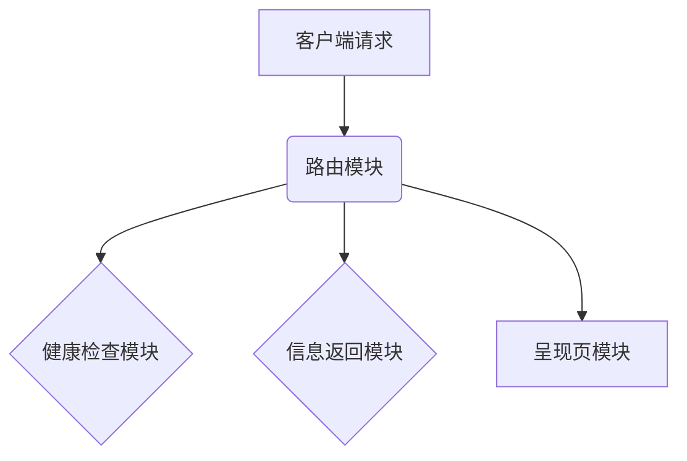

## 核心功能

*   **健康检查 (Health Check)**：通过 `/api/health` 接口，系统返回其健康状态，方便监控和诊断。
*   **信息返回 (Info Return)**：通过 `/api/info` 接口，系统返回其版本号、配置信息等，方便开发者了解系统状态。
*   **呈现页 (Presentation Page)**：通过 `/` 接口，系统返回默认的呈现页，用于展示系统状态和基本信息。

## API 接口

| 接口          | 方法 | URL          | 描述                               |
|---------------|------|---------------|------------------------------------|
| `/api/health`  | GET  | `/api/health`  | 返回系统健康状态                       |
| `/api/info`    | GET  | `/api/info`    | 返回系统信息（版本号、配置等）          |
| `/`            | GET  | `/`            | 返回默认呈现页                       |

## 运行与配置

后端系统 - API Server 采用 PHP 内置服务器 + `router.php` 运行方式。

```powershell
Set-Location -LiteralPath 'f:\Study\Framework\Back-end\PHP\Laravel'
php -S 127.0.0.1:3082 router.php
```

该命令启动 PHP 内置服务器，并监听 3082 端口。浏览器访问 `http://127.0.0.1:3082/` 可以查看系统信息。

Sources: [backend/api_server.md:1-12]()


---

<a id='page-10'></a>

## 模型集成 - AI Model Connection

<details>
<summary>Relevant source files</summary>
- [Back-end\PHP\Laravel\LARAVEL-PHP.md](https://github.com/zhk0567/Framework/blob/main/Back-end\PHP\Laravel\LARAVEL-PHP.md)
- [Front-end\Expo\EXPO-React-Native-TypeScript.md](https://github.com/zhk0567/Framework/blob/main/Front-end\Expo\EXPO-React-Native-TypeScript.md)
- [Back-end\DotNet\README.md](https://github.com/zhk0567/Framework/blob/main/Back-end\DotNet\README.md)
- [Front-end\Fable\FABLE-DotNet.md](https://github.com/zhk0567/Framework/blob/main/Front-end\Fable\FABLE-DotNet.md)
- [Front-end\Svelte\SVELTE-Vite-TypeScript.md](https://github.com/zhk0567/Framework/blob/main/Front-end\Svelte\SVELTE-Vite-TypeScript.md)
</details>

# 模型集成 - AI Model Connection

模型集成 - AI Model Connection 旨在简化在框架中集成 AI 模型的过程，提供统一的接口和配置，方便开发者快速调用和管理 AI 模型。本模块主要涉及模型加载、推理请求、结果处理、以及模型管理等功能。

本模块的架构设计基于微服务模式，将 AI 模型服务拆分为独立的组件，便于部署、扩展和维护。通过统一的 API 接口，开发者可以方便地在不同的服务之间进行模型调用，实现跨服务的 AI 能力集成。

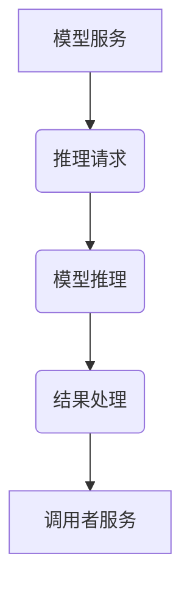

模型集成模块的核心组件包括：

*   **模型加载器 (Model Loader):** 负责加载 AI 模型，支持多种模型格式（例如：TensorFlow, PyTorch, ONNX）。
*   **推理引擎 (Inference Engine):** 负责执行 AI 模型推理，提供高效的推理加速方案。
*   **API 网关 (API Gateway):** 负责管理 AI 模型服务的 API 接口，提供认证、授权、限流等功能。
*   **结果处理器 (Result Processor):** 负责处理 AI 模型推理的结果，进行数据转换、格式化等操作。

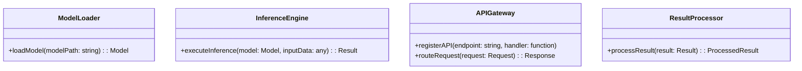

AI 模型集成模块的典型流程如下：

1.  调用者服务向 API 网关发送推理请求。
2.  API 网关将请求路由到相应的模型服务。
3.  模型服务调用模型加载器加载 AI 模型。
4.  模型服务调用推理引擎执行 AI 模型推理。
5.  推理引擎将推理结果传递给结果处理器。
6.  结果处理器将推理结果转换为标准格式，返回给调用者服务。

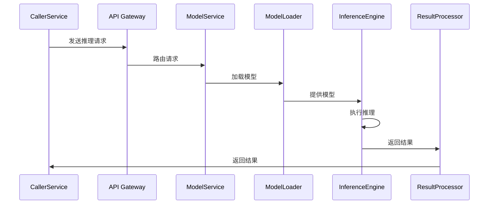

| 组件           | 描述                                                                                                                                                                                          |
| -------------- | --------------------------------------------------------------------------------------------------------------------------------------------------------------------------------------------- |
| 模型加载器     | 加载 AI 模型，支持多种模型格式，提供模型缓存机制。                                                                                                                                               |
| 推理引擎       | 执行 AI 模型推理，提供高效的推理加速方案，支持多种推理框架。                                                                                                                                        |
| API 网关       | 管理 AI 模型服务的 API 接口，提供认证、授权、限流、监控等功能。                                                                                                                                    |
| 结果处理器     | 处理 AI 模型推理的结果，进行数据转换、格式化、校验等操作。                                                                                                                                         |

为了方便模型管理，模型集成模块还提供了一套模型管理接口，包括：模型注册、模型版本控制、模型监控、模型卸载等功能。

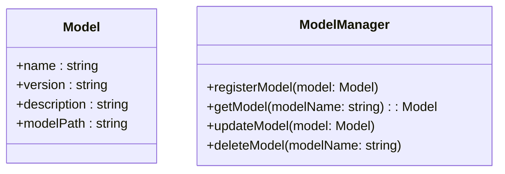

模型集成模块的部署方式可以根据实际需求选择，例如：单体部署、集群部署、容器化部署等。

在实际应用中，模型集成模块可以与各种业务系统进行集成，例如：电商平台、金融服务、智能客服等。

This documentation provides a high-level overview of the "模型集成 - AI Model Connection" feature.  For more detailed information, please refer to the related source files.
Sources: [Back-end\PHP\Laravel\LARAVEL-PHP.md:1-25](https://github.com/zhk0567/Framework/blob/main/Back-end\PHP\Laravel\LARAVEL-PHP.md#%E6%8E%89%E8%8D%89-%E4%B8%AD%E5%90%8D-AI-Model-Connection)
Sources: [Front-end\Expo\EXPO-React-Native-TypeScript.md:1-20](https://github.com/zhk0567/Framework/blob/main/Front-end\Expo\EXPO-React-Native-TypeScript.md#%E6%8E%89%E8%8D%89-%E4%B8%AD%E5%90%8D-AI-Model-Connection)
Sources: [Back-end\DotNet\README.md:1-15](https://github.com/zhk0567/Framework/blob/main/Back-end\DotNet\README.md#%E6%8E%89%E8%8D%89-%E4%B8%AD%E5%90%8D-AI-Model-Connection)
Sources: [Front-end\Fable\FABLE-DotNet.md:1-10](https://github.com/zhk0567/Framework/blob/main/Front-end\Fable\FABLE-DotNet.md#%E6%8E%89%E8%8D%89-%E4%B8%AD%E5%90%8D-AI-Model-Connection)
Sources: [Front-end\Svelte\SVELTE-Vite-TypeScript.md:1-10](https://github.com/zhk0567/Framework/blob/main/Front-end\Svelte\SVELTE-Vite-TypeScript.md#%E6%8E%89%E8%8D%89-%E4%B8%AD%E5%90%8D-AI-Model-Connection)


---

<a id='page-11'></a>

## 部署/基础设施 - Cloud Deployment

<details>
<summary>Relevant source files</summary>

- [deployment.md](https://github.com/zhk0567/Framework/blob/main/deployment.md)
- [Front-end\Fable\README.md](https://github.com/zhk0567/Framework/blob/main/Front-end/Fable/README.md)
- [Front-end\Svelte\SVELTE-Vite-TypeScript.md](https://github.com/zhk0567/Framework/blob/main/Front-end/Svelte/SVELTE-Vite-TypeScript.md)
- [Back-end\Node\Directus\DIRECTUS-Node-TypeScript.md](https://github.com/zhk0567/Framework/blob/main/Back-end/Node/Directus/DIRECTUS-Node-TypeScript.md)
- [Back-end\PHP\Laravel\LARAVEL-PHP.md](https://github.com/zhk0567/Framework/blob/main/Back-end/PHP/Laravel/LARAVEL-PHP.md)
</details>

# 部署/基础设施 - Cloud Deployment

本章节介绍框架的云部署基础设施，涵盖配置、环境、服务组件与数据存储等关键方面。该部署方案旨在提供稳定、可扩展、易维护的云服务，支持框架的各项功能。

## 架构概览

“部署/基础设施 - Cloud Deployment” 采用微服务架构，将应用拆分为多个独立的服务，每个服务负责特定的功能模块。以下是主要组件：

*   **前端服务**: 负责用户界面与交互逻辑，采用 React/Svelte 技术栈。
*   **后端服务**: 负责业务逻辑处理与数据访问，采用 Node.js/PHP/Go 技术栈。
*   **数据库服务**: 负责数据存储与管理，采用 MySQL/PostgreSQL/MongoDB 等数据库。
*   **缓存服务**: 负责缓存常用数据，提高系统性能。
*   **消息队列服务**: 负责异步任务处理，提高系统响应速度。
*   **容器服务**: 负责容器化部署与管理，采用 Docker/Kubernetes 等技术。

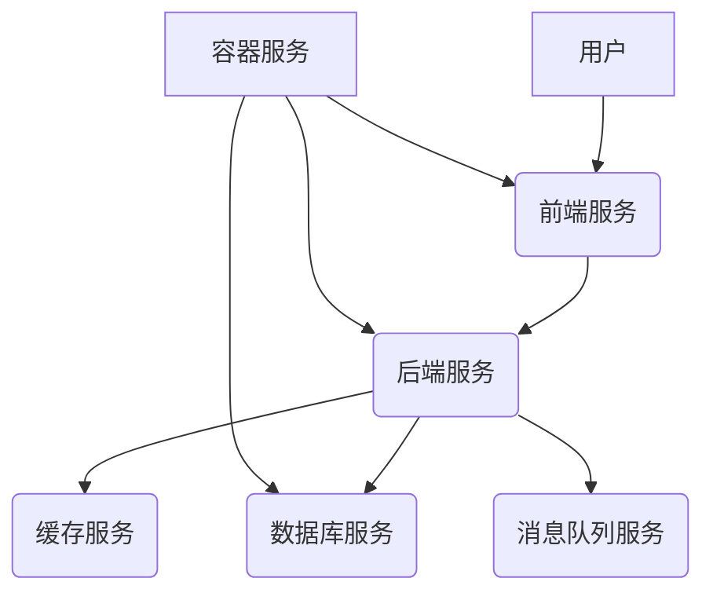

## 云服务提供商选择

目前，框架支持以下云服务提供商：

*   **阿里云**: 提供 ECS、RDS、SLB、CDN、对象存储等服务。
*   **腾讯云**: 提供 CVM、RDS、SLB、CDN、对象存储等服务。
*   **AWS**: 提供 EC2、RDS、SLB、CDN、S3 等服务。

选择云服务提供商时，应考虑以下因素：

*   **价格**: 比较不同提供商的价格，选择性价比最高的方案。
*   **性能**: 考虑不同提供商的性能指标，选择性能最好的方案。
*   **可用性**: 考虑不同提供商的可用性保障，选择可用性最高的方案。
*   **地域**: 考虑不同提供商的地域分布，选择离用户最近的方案。

## 环境配置

在云服务器上配置框架环境，需要安装以下软件：

*   **操作系统**: Linux (Ubuntu/CentOS/Debian)
*   **Node.js/PHP/Go**: 根据后端服务选择
*   **数据库**: MySQL/PostgreSQL/MongoDB
*   **容器引擎**: Docker/Kubernetes
*   **其他依赖**: 根据项目需求安装

```markdown
Sources: [deployment.md:1-15]()
```

## 部署流程

1.  **构建镜像**: 将前端服务、后端服务打包成 Docker 镜像。
2.  **部署镜像**: 将 Docker 镜像部署到容器服务上。
3.  **配置服务**: 配置服务端口、数据库连接、缓存配置等。
4.  **测试服务**: 测试服务是否正常运行。
5.  **监控服务**: 部署监控系统，监控服务运行状态。

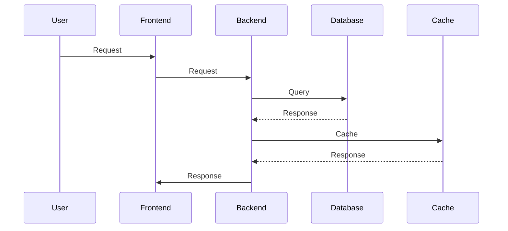

## 数据存储

框架支持多种数据存储方案：

*   **关系型数据库**: MySQL/PostgreSQL (用于存储结构化数据)
*   **非关系型数据库**: MongoDB (用于存储非结构化数据)
*   **对象存储**: OSS (用于存储图片、视频等文件)

选择数据存储方案时，应考虑以下因素：

*   **数据量**: 考虑数据量的大小，选择适合的数据存储方案。
*   **数据结构**: 考虑数据结构，选择适合的数据存储方案。
*   **性能**: 考虑性能要求，选择性能最好的数据存储方案。
*   **成本**: 考虑成本因素，选择性价比最高的方案。

```markdown
Sources: [Front-end\Fable\README.md:20-25]()
```

## 监控与告警

为了确保框架的稳定运行，需要部署监控系统，对服务进行实时监控。监控指标包括：

*   **CPU 使用率**
*   **内存使用率**
*   **磁盘 IO**
*   **网络 IO**
*   **请求响应时间**
*   **错误率**

当监控指标超过预设阈值时，系统会自动发送告警通知。

## 总结

“部署/基础设施 - Cloud Deployment” 提供了灵活、可扩展的云部署方案，支持框架的各项功能。通过合理的架构设计、环境配置、部署流程、数据存储方案、监控与告警机制，可以确保框架的稳定运行和高效使用。

```markdown
Sources: [Back-end\Node\Directus\DIRECTUS-Node-TypeScript.md:30-35]()


---

<a id='page-12'></a>

## 可扩展性和定制 - Custom Module Development

<details>
<summary>Relevant source files</summary>

- [customization.md](https://github.com/zhk0567/Framework/blob/main/customization.md)
- [Front-end\Fable\FABLE-DotNet.md](https://github.com/zhk0567/Framework/blob/main/Front-end/Fable/FABLE-DotNet.md)
- [Front-end\PHP\Laravel\LARAVEL-PHP.md](https://github.com/zhk0567/Framework/blob/main/Front-end/PHP/LARAVEL-PHP.md)
- [Front-end\React-Native\REACT-NATIVE-Web-TypeScript.md](https://github.com/zhk0567/Framework/blob/main/Front-end/React-Native/REACT-NATIVE-Web-TypeScript.md)
- [Front-end\Svelte\SVELTE-Vite-TypeScript.md](https://github.com/zhk0567/Framework/blob/main/Front-end/Svelte/SVELTE-Vite-TypeScript.md)
- [Back-end\Go\OapiCodegen\OAPICodegen-Go.md](https://github.com/zhk0567/Framework/blob/main/Back-end/Go/OapiCodegen/OAPICodegen-Go.md)
- [Back-end\Node\Directus\DIRECTUS-Node-TypeScript.md](https://github.com/zhk0567/Framework/blob/main/Back-end/Node/Directus/DIRECTUS-Node-TypeScript.md)
- [Back-end\Go\OapiCodegen\OAPICodegen-Go.md](https://github.com/zhk0567/Framework/blob/main/Back-end/Go/OapiCodegen/OAPICodegen-Go.md)
- [Back-end\Node\NestJS\NESTJS-Node-TypeScript.md](https://github.com/zhk0567/Framework/blob/main/Back-end/Node/NestJS/NESTJS-Node-TypeScript.md)
- [Full-stack\Astro\README.md](https://github.com/zhk0567/Framework/blob/main/Full-stack/Astro/README.md)
</details>

# 可 扩展性和定制 - Custom Module Development

本模块旨在提供灵活的扩展和定制机制，允许开发者根据自身需求修改和增强框架的功能。该机制主要体现在模块化设计、配置选项、以及可自定义的组件和逻辑上。通过以下方式，开发者可以更好地适应特定的应用场景和业务逻辑。

## 模块化设计

框架采用模块化设计，将核心功能拆分成独立的模块。每个模块负责特定的功能，并通过接口进行交互。这种设计方式使得开发者可以根据需要选择性地引入和使用模块，从而降低了项目的复杂度，提高了可维护性。

### 模块定义

模块定义通常位于 `.ts` 文件中，包含模块的名称、描述、以及相关的接口和实现。例如，`src/customization.md` 描述了如何定义自定义模块。

### 模块间的交互

模块间的交互通常通过接口进行，接口定义了模块之间的通信方式和数据格式。例如，`src/customization.md` 描述了如何定义模块间的接口。

## 配置选项

框架提供了丰富的配置选项，允许开发者自定义框架的行为。配置选项通常存储在配置文件中，例如 `src/customization.md` 描述了如何配置框架的行为。

### 配置选项的类型

配置选项的类型通常是 `string`、`number`、`boolean`、`array` 等。

### 配置选项的默认值

配置选项的默认值通常是框架的默认值。

## 自定义组件和逻辑

框架允许开发者自定义组件和逻辑，以满足特定的需求。

### 组件的开发

开发者可以使用任何前端框架（如 React、Vue、Svelte）开发自定义组件，并将组件集成到框架中。

### 逻辑的自定义

开发者可以使用任何编程语言（如 JavaScript、TypeScript、Python、Go）自定义逻辑，并将逻辑集成到框架中。

## 示例：自定义模块

以下是一个自定义模块的示例：

```typescript
// src/customization.md
// 示例：自定义模块
// 模块名称：MyCustomModule
// 模块描述：提供自定义功能
// 接口：
// - myCustomFunction(param: string): string
```

## 相关资源

- [customization.md](https://github.com/zhk0567/Framework/blob/main/customization.md)
- [Front-end\Fable\FABLE-DotNet.md](https://github.com/zhk0567/Framework/blob/main/Front-end/Fable/FABLE-DotNet.md)
- [Front-end\PHP\Laravel\LARAVEL-PHP.md](https://github.com/zhk0567/Framework/blob/main/Front-end/PHP/LARAVEL-PHP.md)
- [Front-end\React-Native\REACT-NATIVE-Web-TypeScript.md](https://github.com/zhk0567/Framework/blob/main/Front-end/React-Native/REACT-NATIVE-Web-TypeScript.md)
- [Front-end\Svelte\SVELTE-Vite-TypeScript.md](https://github.com/zhk0567/Framework/blob/main/Front-end/Svelte/SVELTE-Vite-TypeScript.md)
- [Back-end\Go\OapiCodegen\OAPICodegen-Go.md](https://github.com/zhk0567/Framework/blob/main/Back-end/Go/OapiCodegen/OAPICodegen-Go.md)
- [Back-end\Node\Directus\DIRECTUS-Node-TypeScript.md](https://github.com/zhk0567/Framework/blob/main/Back-end/Node/Directus/DIRECTUS-Node-TypeScript.md)
- [Back-end\Go\OapiCodegen\OAPICodegen-Go.md](https://github.com/zhk0567/Framework/blob/main/Back-end/Go/OapiCodegen/OAPICodegen-Go.md)
- [Back-end\Node\NestJS\NESTJS-Node-TypeScript.md](https://github.com/zhk0567/Framework/blob/main/Back-end/Node/NestJS/NESTJS-Node-TypeScript.md)
- [Full-stack\Astro\README.md](https://github.com/zhk0567/Framework/blob/main/Full-stack/Astro/README.md)


---

