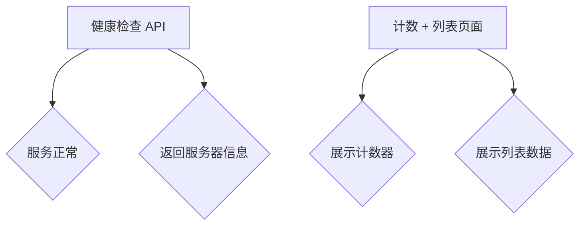

<!-- wiki_page_id: page-1 -->

## 项目概述 - 项目概述

Relevant source files

- [Back-end\PHP\Laravel\LARAVEL-PHP.md](https://github.com/zhk0567/Framework/blob/main/Back-end\PHP\Laravel\LARAVEL-PHP.md)
- [Front-end\Expo\EXPO-React-Native-TypeScript.md](https://github.com/zhk0567/Framework/blob/main/Front-end\Expo\EXPO-React-Native-TypeScript.md)
- [Back-end\DotNet\README.md](https://github.com/zhk0567/Framework/blob/main/Back-end\DotNet\README.md)
- [Front-end\Tauri\README.md](https://github.com/zhk0567/Framework/blob/main/Front-end\Tauri\README.md)
- [Front-end\Fable\FABLE-DotNet.md](https://github.com/zhk0567/Framework/blob/main/Front-end\Fable\FABLE-DotNet.md)
- [Back-end\Node\Directus\DIRECTUS-Node-TypeScript.md](https://github.com/zhk0567/Framework/blob/main/Back-end\Node\Directus\DIRECTUS-Node-TypeScript.md)
- [Back-end\Go\OapiCodegen\OAPICodegen-Go.md](https://github.com/zhk0567/Framework/blob/main/Back-end\Go\OapiCodegen\OAPICodegen-Go.md)

# 项目概述 - 项目概述

本项目提供了一个框架示例，包含多种后端和前端技术栈，旨在展示不同技术在构建全栈应用时的应用场景。项目采用模块化设计，每个子目录对应一种技术或框架，并提供基本的 API 接口和页面展示。本概述将对每个子目录进行简要介绍，并提供关键信息。

## 后端技术栈概述

项目后端包含以下技术栈：

*   **Laravel (PHP)**：一个全栈约定式框架，提供路由、Eloquent ORM、队列、Artisan 等功能。
*   **Symfony (PHP)**：一个组件化企业栈，提供 HttpKernel、Routing、DependencyInjection 等组件。
*   **DotNet (C#)**：使用 ASP.NET Core 构建后端 API，支持健康检查和信息展示。
*   **Node (JavaScript)**：使用 Directus 作为 Headless CMS，提供数据管理接口和页面展示。
*   **Go (Golang)**：使用 OpenAPI Codegen 生成 API 接口，支持健康检查和信息展示。
*   **Python (Django)**：使用 Django 构建后端 API，支持健康检查和信息展示。

## 前端技术栈概述

项目前端包含以下技术栈：

*   **React Native (JavaScript)**：使用 React Native 构建原生移动应用，支持计数和列表展示。
*   **Svelte (JavaScript)**：使用 Svelte 构建 SPA，支持文件系统路由和组合模式。
*   **Astro (JavaScript)**：使用 Astro 构建静态站点，支持多种前端框架集成。
*   **TanStack Router (JavaScript)**：使用 TanStack Router 构建前端路由。

## 技术栈对比

| 技术栈       | 核心特点                               | 适用场景                               |
|--------------|----------------------------------------|---------------------------------------|
| Laravel      | 全栈约定式，易上手                       | 中小型项目，快速开发                     |
| Symfony      | 组件化企业栈，灵活可扩展                  | 大型项目，高可维护性                     |
| DotNet       | .NET 平台，与 .NET 生态集成                | .NET 开发者，企业级应用                   |
| Node         | 灵活的 JavaScript 平台，生态丰富          | 快速开发，Node.js 开发者                 |
| Go           | 高性能，并发处理，适合微服务架构          | 高性能需求，分布式系统                   |
| Python       | 易于学习，丰富的第三方库，适合快速原型 | 快速开发，Python 开发者                 |
| React Native | 原生移动应用，性能好，生态丰富             | 移动应用开发，跨平台                       |
| Svelte       | 编译时框架，性能好，体积小                 | 性能敏感的应用，小型项目                   |
| Astro        | 静态站点，易于部署，性能好                | 博客，文档，营销网站                     |
| TanStack Router| 文件系统路由，易于使用，类型安全            | 各种前端应用，需要灵活路由的场景         |

## 关键组件

*   **健康检查 API (`/api/health`)**:  用于判断后端服务是否正常运行。
*   **信息展示 API (`/api/info`)**:  用于返回服务器信息，例如版本号、环境等。
*   **计数 + 列表页面**:  展示计数器和列表数据，作为示例页面。

## 总结

本项目展示了多种技术栈在构建全栈应用时的应用场景。选择合适的框架和技术栈取决于具体的项目需求和团队的技术栈。

---
