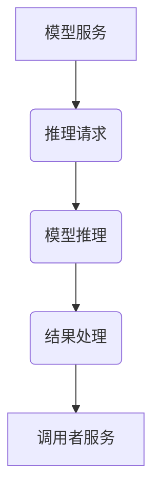
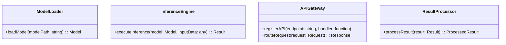
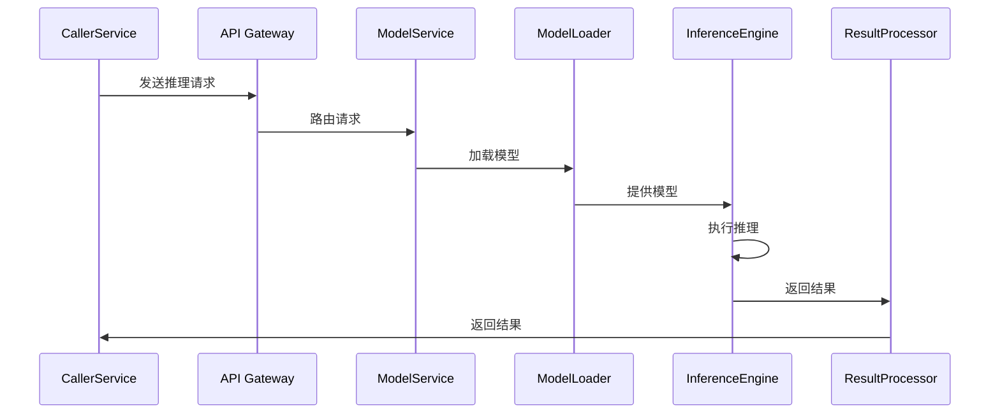
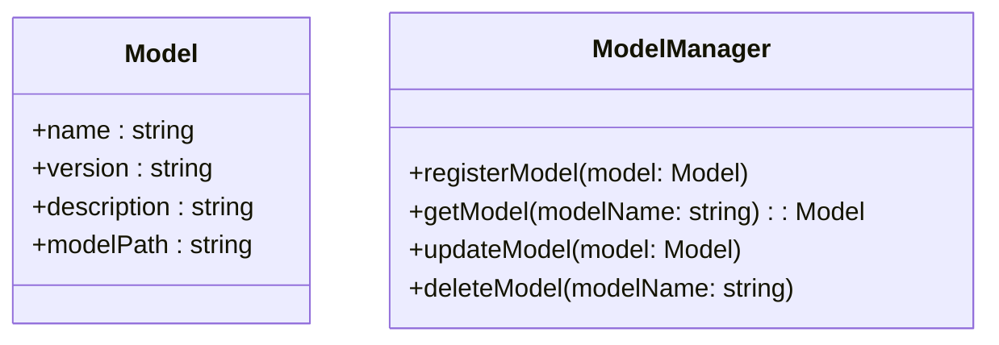

<!-- wiki_page_id: page-10 -->

## 模型集成 - AI Model Connection

# 模型集成 - AI Model Connection

模型集成 - AI Model Connection 旨在简化在框架中集成 AI 模型的过程，提供统一的接口和配置，方便开发者快速调用和管理 AI 模型。本模块主要涉及模型加载、推理请求、结果处理、以及模型管理等功能。

本模块的架构设计基于微服务模式，将 AI 模型服务拆分为独立的组件，便于部署、扩展和维护。通过统一的 API 接口，开发者可以方便地在不同的服务之间进行模型调用，实现跨服务的 AI 能力集成。

模型集成模块的核心组件包括：

*   **模型加载器 (Model Loader):** 负责加载 AI 模型，支持多种模型格式（例如：TensorFlow, PyTorch, ONNX）。
*   **推理引擎 (Inference Engine):** 负责执行 AI 模型推理，提供高效的推理加速方案。
*   **API 网关 (API Gateway):** 负责管理 AI 模型服务的 API 接口，提供认证、授权、限流等功能。
*   **结果处理器 (Result Processor):** 负责处理 AI 模型推理的结果，进行数据转换、格式化等操作。

AI 模型集成模块的典型流程如下：

1.  调用者服务向 API 网关发送推理请求。
2.  API 网关将请求路由到相应的模型服务。
3.  模型服务调用模型加载器加载 AI 模型。
4.  模型服务调用推理引擎执行 AI 模型推理。
5.  推理引擎将推理结果传递给结果处理器。
6.  结果处理器将推理结果转换为标准格式，返回给调用者服务。

| 组件           | 描述                                                                                                                                                                                          |
| -------------- | --------------------------------------------------------------------------------------------------------------------------------------------------------------------------------------------- |
| 模型加载器     | 加载 AI 模型，支持多种模型格式，提供模型缓存机制。                                                                                                                                               |
| 推理引擎       | 执行 AI 模型推理，提供高效的推理加速方案，支持多种推理框架。                                                                                                                                        |
| API 网关       | 管理 AI 模型服务的 API 接口，提供认证、授权、限流、监控等功能。                                                                                                                                    |
| 结果处理器     | 处理 AI 模型推理的结果，进行数据转换、格式化、校验等操作。                                                                                                                                         |

为了方便模型管理，模型集成模块还提供了一套模型管理接口，包括：模型注册、模型版本控制、模型监控、模型卸载等功能。

模型集成模块的部署方式可以根据实际需求选择，例如：单体部署、集群部署、容器化部署等。

在实际应用中，模型集成模块可以与各种业务系统进行集成，例如：电商平台、金融服务、智能客服等。

This documentation provides a high-level overview of the "模型集成 - AI Model Connection" feature.  For more detailed information, please refer to the related source files.
Sources: [Back-end\PHP\Laravel\LARAVEL-PHP.md:1-25](https://github.com/zhk0567/Framework/blob/main/Back-end\PHP\Laravel\LARAVEL-PHP.md#%E6%8E%89%E8%8D%89-%E4%B8%AD%E5%90%8D-AI-Model-Connection)
Sources: [Front-end\Expo\EXPO-React-Native-TypeScript.md:1-20](https://github.com/zhk0567/Framework/blob/main/Front-end\Expo\EXPO-React-Native-TypeScript.md#%E6%8E%89%E8%8D%89-%E4%B8%AD%E5%90%8D-AI-Model-Connection)
Sources: [Back-end\DotNet\README.md:1-15](https://github.com/zhk0567/Framework/blob/main/Back-end\DotNet\README.md#%E6%8E%89%E8%8D%89-%E4%B8%AD%E5%90%8D-AI-Model-Connection)
Sources: [Front-end\Fable\FABLE-DotNet.md:1-10](https://github.com/zhk0567/Framework/blob/main/Front-end\Fable\FABLE-DotNet.md#%E6%8E%89%E8%8D%89-%E4%B8%AD%E5%90%8D-AI-Model-Connection)
Sources: [Front-end\Svelte\SVELTE-Vite-TypeScript.md:1-10](https://github.com/zhk0567/Framework/blob/main/Front-end\Svelte\SVELTE-Vite-TypeScript.md#%E6%8E%89%E8%8D%89-%E4%B8%AD%E5%90%8D-AI-Model-Connection)

---
