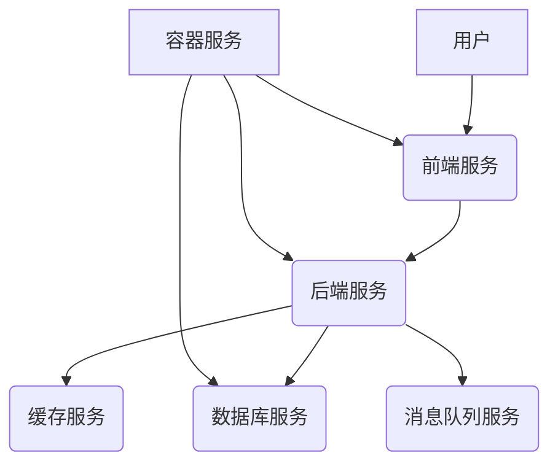
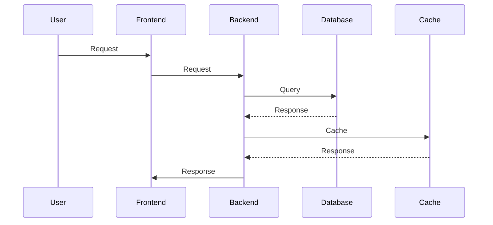

<!-- wiki_page_id: page-11 -->

## 部署/基础设施 - Cloud Deployment

# 部署/基础设施 - Cloud Deployment

本章节介绍框架的云部署基础设施，涵盖配置、环境、服务组件与数据存储等关键方面。该部署方案旨在提供稳定、可扩展、易维护的云服务，支持框架的各项功能。

## 架构概览

“部署/基础设施 - Cloud Deployment” 采用微服务架构，将应用拆分为多个独立的服务，每个服务负责特定的功能模块。以下是主要组件：

*   **前端服务**: 负责用户界面与交互逻辑，采用 React/Svelte 技术栈。
*   **后端服务**: 负责业务逻辑处理与数据访问，采用 Node.js/PHP/Go 技术栈。
*   **数据库服务**: 负责数据存储与管理，采用 MySQL/PostgreSQL/MongoDB 等数据库。
*   **缓存服务**: 负责缓存常用数据，提高系统性能。
*   **消息队列服务**: 负责异步任务处理，提高系统响应速度。
*   **容器服务**: 负责容器化部署与管理，采用 Docker/Kubernetes 等技术。



## 云服务提供商选择

目前，框架支持以下云服务提供商：

*   **阿里云**: 提供 ECS、RDS、SLB、CDN、对象存储等服务。
*   **腾讯云**: 提供 CVM、RDS、SLB、CDN、对象存储等服务。
*   **AWS**: 提供 EC2、RDS、SLB、CDN、S3 等服务。

选择云服务提供商时，应考虑以下因素：

*   **价格**: 比较不同提供商的价格，选择性价比最高的方案。
*   **性能**: 考虑不同提供商的性能指标，选择性能最好的方案。
*   **可用性**: 考虑不同提供商的可用性保障，选择可用性最高的方案。
*   **地域**: 考虑不同提供商的地域分布，选择离用户最近的方案。

## 环境配置

在云服务器上配置框架环境，需要安装以下软件：

*   **操作系统**: Linux (Ubuntu/CentOS/Debian)
*   **Node.js/PHP/Go**: 根据后端服务选择
*   **数据库**: MySQL/PostgreSQL/MongoDB
*   **容器引擎**: Docker/Kubernetes
*   **其他依赖**: 根据项目需求安装

```markdown
Sources: [deployment.md:1-15]()
```

## 部署流程

1.  **构建镜像**: 将前端服务、后端服务打包成 Docker 镜像。
2.  **部署镜像**: 将 Docker 镜像部署到容器服务上。
3.  **配置服务**: 配置服务端口、数据库连接、缓存配置等。
4.  **测试服务**: 测试服务是否正常运行。
5.  **监控服务**: 部署监控系统，监控服务运行状态。



## 数据存储

框架支持多种数据存储方案：

*   **关系型数据库**: MySQL/PostgreSQL (用于存储结构化数据)
*   **非关系型数据库**: MongoDB (用于存储非结构化数据)
*   **对象存储**: OSS (用于存储图片、视频等文件)

选择数据存储方案时，应考虑以下因素：

*   **数据量**: 考虑数据量的大小，选择适合的数据存储方案。
*   **数据结构**: 考虑数据结构，选择适合的数据存储方案。
*   **性能**: 考虑性能要求，选择性能最好的数据存储方案。
*   **成本**: 考虑成本因素，选择性价比最高的方案。

```markdown
Sources: [Front-end\Fable\README.md:20-25]()
```

## 监控与告警

为了确保框架的稳定运行，需要部署监控系统，对服务进行实时监控。监控指标包括：

*   **CPU 使用率**
*   **内存使用率**
*   **磁盘 IO**
*   **网络 IO**
*   **请求响应时间**
*   **错误率**

当监控指标超过预设阈值时，系统会自动发送告警通知。

## 总结

“部署/基础设施 - Cloud Deployment” 提供了灵活、可扩展的云部署方案，支持框架的各项功能。通过合理的架构设计、环境配置、部署流程、数据存储方案、监控与告警机制，可以确保框架的稳定运行和高效使用。

```markdown
Sources: [Back-end\Node\Directus\DIRECTUS-Node-TypeScript.md:30-35]()


---
