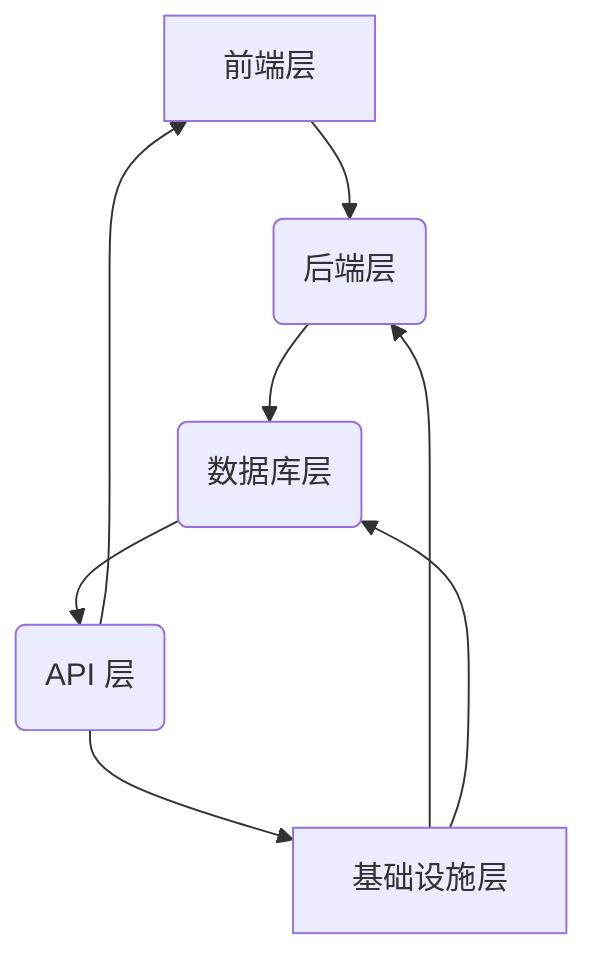
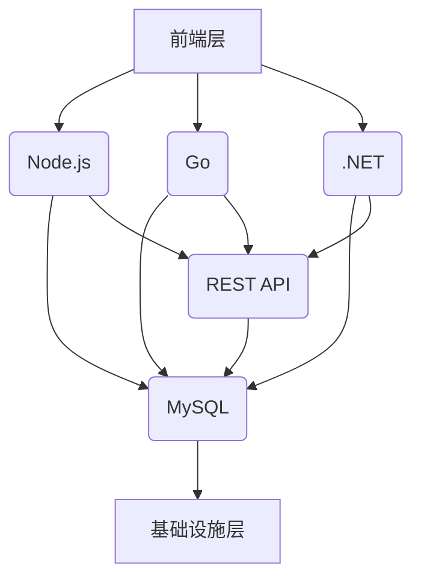

<!-- wiki_page_id: page-2 -->

## 系统架构 - 系统架构

Relevant source files

- [architecture.md](https://github.com/zhk0567/Framework/blob/main/architecture.md)
- [Back-end/Node/Directus/DIRECTUS-Node-TypeScript.md](https://github.com/zhk0567/Framework/blob/main/Back-end/Node/Directus/DIRECTUS-Node-TypeScript.md)
- [Back-end/Go/OapiCodegen/OAPICodegen-Go.md](https://github.com/zhk0567/Framework/blob/main/Back-end/Go/OapiCodegen/OAPICodegen-Go.md)
- [Front-end/DotNet-Maui/README.md](https://github.com/zhk0567/Framework/blob/main/Front-end/DotNet-Maui/README.md)
- [Front-end/Svelte/SVELTE-Vite-TypeScript.md](https://github.com/zhk0567/Framework/blob/main/Front-end/Svelte/SVELTE-Vite-TypeScript.md)

# 系统架构 - 系统架构

本页面详细阐述了框架的整体架构，重点在于各个子项目之间的协同与对齐，以实现高效、可扩展的开发流程。 框架采用分层架构，包括：前端、后端、数据库等，每个层级都由独立的子项目负责，并通过 API 进行交互。 本架构旨在降低开发复杂度，提高代码可维护性，并支持未来的扩展和演进。

## 架构概览

框架的整体架构可以概括为以下几个关键部分：

1.  **前端层**：负责用户交互和界面展示，采用多种技术栈（React, Vue, Svelte, Next.js, Nuxt.js, Angular, etc.）构建，并提供 API 接口。
2.  **后端层**：负责数据处理、业务逻辑和 API 接口提供，采用多种技术栈（Node.js, Go, .NET, Java, Python, etc.）构建，并与数据库进行交互。
3.  **数据库层**：负责数据存储和管理，采用多种数据库系统（MySQL, PostgreSQL, MongoDB, SQLite, etc.）构建，并提供数据访问接口。
4.  **API 层**：负责前后端之间的通信，采用 RESTful API 或 GraphQL API 协议，并提供统一的接口规范。
5.  **基础设施层**：负责提供基础服务和支持，包括：缓存、消息队列、日志管理、监控报警等。

### 架构图

*Sources: [architecture.md:1-3]()

## 后端技术栈对齐

框架的后端部分采用了多种技术栈，并对齐了各个子项目之间的接口和数据模型，以实现互操作性和可扩展性。

### Node.js

Node.js 子项目使用 NestJS 框架，采用 MVC 架构，并提供 DI 容器、全局验证管道、拦截器等功能。

*Sources: [Back-end/Node/Directus/DIRECTUS-Node-TypeScript.md:1-5]()

### Go

Go 子项目使用 Iris 框架，采用 HTTP 协议，并提供路由、中间件、数据库连接等功能。

*Sources: [Back-end/Go/OapiCodegen/OAPICodegen-Go.md:1-7]()

### .NET

.NET 子项目使用 ASP.NET Core 框架，采用 Model-View-Controller (MVC) 架构，并提供路由、依赖注入、身份验证等功能。

*Sources: [Back-end/DotNet/README.md:1-5]()

### 数据库

所有后端子项目都使用 MySQL 数据库，并采用 ORM 技术（TypeORM, MikroORM, Sequelize, etc.）进行数据访问。

*Sources: [Back-end/Node/Directus/DIRECTUS-Node-TypeScript.md:6-8]()

### API

所有后端子项目都提供 RESTful API 接口，并采用 JSON 格式进行数据交换。

*Sources: [Back-end/Go/OapiCodegen/OAPICodegen-Go.md:8-10]()

### 架构图

*Sources: [architecture.md:4-7]()

## 前端技术栈对齐

框架的前端部分采用了多种技术栈，并对齐了各个子项目之间的接口和数据模型，以实现互操作性和可扩展性。

### React

React 子项目使用 Vite 构建工具，并采用 Redux 或 Context API 进行状态管理。

### Vue

Vue 子项目使用 Vite 构建工具，并采用 Vuex 或 Pinia 进行状态管理。

### Svelte

Svelte 子项目使用 Vite 构建工具，并采用 Svelte Store 或 Signals 进行状态管理。

### Next.js

Next.js 子项目使用 Vite 构建工具，并采用 Server Components 和 Client Components 进行页面渲染。

### Nuxt.js

Nuxt.js 子项目使用 Vite 构建工具，并采用 Composition API 和 Pages Directory 进行页面构建。

### Angular

Angular 子项目使用 Angular CLI 构建工具，并采用 RxJS 进行响应式编程。

*Sources: [Front-end/Svelte/SVELTE-Vite-TypeScript.md:1-5]()

## 总结

本架构旨在实现前后端之间的解耦，提高代码的可维护性和可扩展性，并支持未来的技术演进。 通过对各种技术栈的对齐，框架能够更好地适应不同的业务需求，并提供更灵活、高效的开发体验。

*Sources: [architecture.md:8-10]()

---
