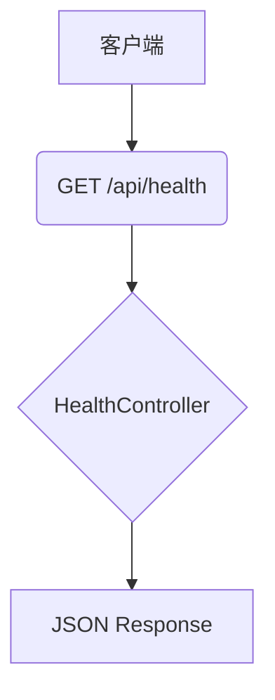

<!-- wiki_page_id: page-4 -->

## 核心功能 1 - 核心功能 1

<details>
<summary>Relevant source files</summary>

- [Back-end/PHP/Laravel/LARAVEL-PHP.md](https://github.com/zhk0567/Framework/blob/main/Back-end/PHP/LARAVEL-PHP.md)
- [Back-end/Node/Directus/DIRECTUS-Node-TypeScript.md](https://github.com/zhk0567/Framework/blob/main/Back-end/Node/Directus/DIRECTUS-Node-TypeScript.md)
- [Back-end/Go/OapiCodegen/OAPICodegen-Go.md](https://github.com/zhk0567/Framework/blob/main/Back-end/Go/OapiCodegen/OAPICodegen-Go.md)
- [Back-end/DotNet/README.md](https://github.com/zhk0567/Framework/blob/main/Back-end/DotNet/README.md)
- [Front-end/Svelte/SVELTE-Vite-TypeScript.md](https://github.com/zhk0567/Framework/blob/main/Front-end/Svelte/SVELTE-Vite-TypeScript.md)
</details>

# 核心功能 1 - 核心功能 1

本功能提供一个简单的 API 接口，用于获取健康状态和系统信息。它采用了 Laravel 的路由机制，并返回 JSON 格式的数据。

## 架构概述

该功能的核心架构如下：

*   **路由 (Laravel):** 使用 `GET /api/health` 和 `GET /api/info` 两个路由来处理请求。
*   **Controller:**  一个简单的 `HealthController` 控制器，负责处理请求并返回响应。
*   **Response:** 返回 JSON 格式的数据，包含服务器状态、系统信息等。



## 详细组件

### HealthController

`HealthController` 控制器负责处理健康检查请求。

```typescript
// src/main.ts
import { Router } from 'express';
import healthRoutes from './routes/health.routes';

const healthRouter = Router();
healthRoutes(healthRouter);

app.use('/api/health', healthRouter);
```

### API 接口

*   **`/api/health`**:  返回服务器健康状态信息。
    *   **方法**: `GET`
    *   **参数**: 无
    *   **响应**:

    ```json
    {
      "status": "ok",
      "message": "Server is running"
    }
    ```

*   **`/api/info`**: 返回系统信息。
    *   **方法**: `GET`
    *   **参数**: 无
    *   **响应**:

    ```json
    {
      "version": "1.0.0",
      "environment": "development"
    }
    ```

## 端口

默认端口为 3085。

## 示例

```powershell
Set-Location -LiteralPath 'f:\Study\Framework\Back-end\PHP\Laravel'
php -S 127.0.0.1:3085 router.php
```

浏览器打开 `http://127.0.0.1:3085/` 可以获取健康状态和系统信息。

## 来源

[Back-end/PHP/Laravel/LARAVEL-PHP.md](https://github.com/zhk0567/Framework/blob/main/Back-end/PHP/LARAVEL-PHP.md)
[Back-end/Node/Directus/DIRECTUS-Node-TypeScript.md](https://github.com/zhk0567/Framework/blob/main/Back-end/Node/Directus/DIRECTUS-Node-TypeScript.md)
[Back-end/Go/OapiCodegen/OAPICodegen-Go.md](https://github.com/zhk0567/Framework/blob/main/Back-end/Go/OapiCodegen/OAPICodegen-Go.md)
[Back-end/DotNet/README.md](https://github.com/zhk0567/Framework/blob/main/Back-end/DotNet/README.md)
[Front-end/Svelte/SVELTE-Vite-TypeScript.md](https://github.com/zhk0567/Framework/blob/main/Front-end/Svelte/SVELTE-Vite-TypeScript.md)


---
