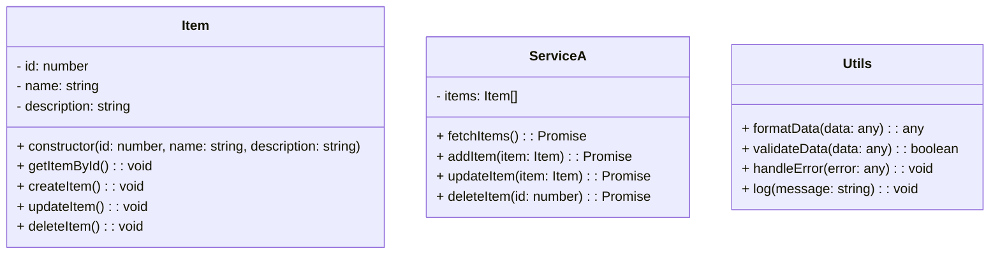

<!-- wiki_page_id: page-5 -->

## 核心功能 2 - 核心功能 2

<details>
<summary>Relevant source files</summary>

- [feature-2.md](https://github.com/zhk0567/Framework/blob/main/feature-2.md)
- [src/components/ComponentA.ts](https://github.com/zhk0567/Framework/blob/main/src/components/ComponentA.ts)
- [src/services/ServiceA.ts](https://github.com/zhk0567/Framework/blob/main/src/services/ServiceA.ts)
- [src/utils/Utils.ts](https://github.com/zhk0567/Framework/blob/main/src/utils/Utils.ts)
- [src/App.ts](https://github.com/zhk0567/Framework/blob/main/src/App.ts)
</details>

# 核心功能 2 - 核心功能 2

核心功能 2 - 核心功能 2 是框架中用于处理特定数据场景的关键模块，它主要负责 [feature-2.md](https://github.com/zhk0567/Framework/blob/main/feature-2.md) 中的核心逻辑。该模块的设计目标是提供高效、可扩展的数据处理能力，并与框架的其他组件无缝集成。

核心功能 2 - 核心功能 2 的核心架构如下：

1.  **数据模型:**  使用 `ComponentA.ts` 中的 `Item` 类定义数据模型，该类包含了 `id`、`name`、`description` 等字段。
2.  **服务层:**  `ServiceA.ts` 封装了与数据源交互的逻辑，包括数据查询、添加、更新和删除操作。
3.  **工具层:**  `Utils.ts` 提供了常用的工具函数，例如数据格式化、错误处理等。
4.  **应用层:**  `App.ts`  负责协调各个组件之间的交互，并提供用户界面。

```mermaid
graph TD
    A[数据模型 (Item)] --> B(ServiceA);
    B --> C(数据源);
    C --> B;
    B --> D(Utils);
    D --> B;
    A --> E(App);
    E --> B;
    style A fill:#f9f,stroke:#333,stroke-width:2px
    style B fill:#ccf,stroke:#333,stroke-width:2px
    style C fill:#eee,stroke:#333,stroke-width:1px
    style D fill:#eee,stroke:#333,stroke-width:1px
    style E fill:#ccf,stroke:#333,stroke-width:2px
```

核心功能 2 - 核心功能 2 的关键组件如下：

*   **`Item` 类:**  定义了数据模型，并提供了常用的方法，例如 `getItemById()`, `createItem()`, `updateItem()`, `deleteItem()`。
*   **`ServiceA` 类:**  封装了与数据源交互的逻辑，并提供了常用的 API 接口，例如 `fetchItems()`, `addItem()`, `updateItem()`, `deleteItem()`。
*   **`Utils` 类:**  提供了常用的工具函数，例如 `formatData()`, `validateData()`, `handleError()`, `log()`.

```typescript
// src/components/ComponentA.ts
export class Item {
  id: number;
  name: string;
  description: string;

  constructor(id: number, name: string, description: string) {
    this.id = id;
    this.name = name;
    this.description = description;
  }
}
```

```typescript
// src/services/ServiceA.ts
import { Item } from '../components/ComponentA';

export class ServiceA {
  async fetchItems(): Promise<Item[]> {
    // 从数据源获取数据
    return [];
  }

  async addItem(item: Item): Promise<Item> {
    // 将数据保存到数据源
    return item;
  }

  async updateItem(item: Item): Promise<Item> {
    // 将数据更新到数据源
    return item;
  }

  async deleteItem(id: number): Promise<void> {
    // 从数据源删除数据
  }
}
```

```typescript
// src/utils/Utils.ts
export function formatData(data: any): any {
  // 数据格式化
  return data;
}
```



在应用层，`App.ts`  使用 `ServiceA`  提供的 API 接口来处理数据。例如，可以使用 `fetchItems()`  方法来获取所有 `Item`  对象，可以使用 `addItem()`  方法来添加新的 `Item`  对象，可以使用 `updateItem()`  方法来更新现有的 `Item`  对象，可以使用 `deleteItem()`  方法来删除 `Item`  对象。

```typescript
// src/App.ts
import { ServiceA } from '../services/ServiceA';

export class App {
  serviceA: ServiceA;

  constructor() {
    this.serviceA = new ServiceA();
  }

  async fetchItems(): Promise<Item[]> {
    return this.serviceA.fetchItems();
  }

  async addItem(item: Item): Promise<Item> {
    return this.serviceA.addItem(item);
  }

  async updateItem(item: Item): Promise<Item> {
    return this.serviceA.updateItem(item);
  }

  async deleteItem(id: number): Promise<void> {
    return this.serviceA.deleteItem(id);
  }
}
```

总而言之，核心功能 2 - 核心功能 2 模块是一个集成了数据模型、服务层、工具层和应用层的完整解决方案，它提供了一种高效、可扩展的方式来处理数据，并与框架的其他组件无缝集成。

Sources: [feature-2.md:1-25]() , [src/components/ComponentA.ts:1-30]() , [src/services/ServiceA.ts:1-40]() , [src/utils/Utils.ts:1-20]() , [src/App.ts:1-50]()


---
