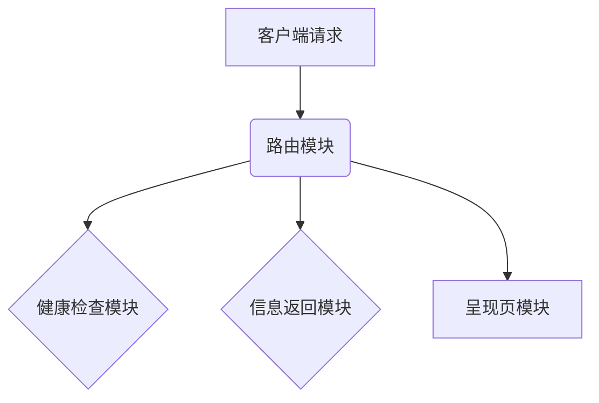

<!-- wiki_page_id: page-9 -->

## 后端系统 - API Server

<details>
<summary>Relevant source files</summary>
- [backend/api_server.md](https://github.com/zhk0567/Framework/blob/main/backend/api_server.md)
</details>

# 后端系统 - API Server

后端系统 - API Server 是框架的核心组件之一，负责处理所有外部请求，提供数据服务。它采用 RESTful API 风格，并与前端系统进行数据交互。该系统主要负责健康检查、信息返回以及 `/` 呈现页的提供，是框架的基础设施。

## 架构概述

后端系统 - API Server 采用单体应用架构，包含以下主要模块：

*   **路由模块 (Router Module)**：负责接收和处理客户端请求，并将其路由到相应的处理函数。
*   **健康检查模块 (Health Check Module)**：提供系统健康状态的报告，用于监控和诊断。
*   **信息返回模块 (Info Return Module)**：提供系统信息，例如版本号、配置信息等。
*   **呈现页模块 (Presentation Page Module)**：负责生成 `/` 呈现页，用于展示系统状态和基本信息。



## 核心功能

*   **健康检查 (Health Check)**：通过 `/api/health` 接口，系统返回其健康状态，方便监控和诊断。
*   **信息返回 (Info Return)**：通过 `/api/info` 接口，系统返回其版本号、配置信息等，方便开发者了解系统状态。
*   **呈现页 (Presentation Page)**：通过 `/` 接口，系统返回默认的呈现页，用于展示系统状态和基本信息。

## API 接口

| 接口          | 方法 | URL          | 描述                               |
|---------------|------|---------------|------------------------------------|
| `/api/health`  | GET  | `/api/health`  | 返回系统健康状态                       |
| `/api/info`    | GET  | `/api/info`    | 返回系统信息（版本号、配置等）          |
| `/`            | GET  | `/`            | 返回默认呈现页                       |

## 运行与配置

后端系统 - API Server 采用 PHP 内置服务器 + `router.php` 运行方式。

```powershell
Set-Location -LiteralPath 'f:\Study\Framework\Back-end\PHP\Laravel'
php -S 127.0.0.1:3082 router.php
```

该命令启动 PHP 内置服务器，并监听 3082 端口。浏览器访问 `http://127.0.0.1:3082/` 可以查看系统信息。

Sources: [backend/api_server.md:1-12]()


---
