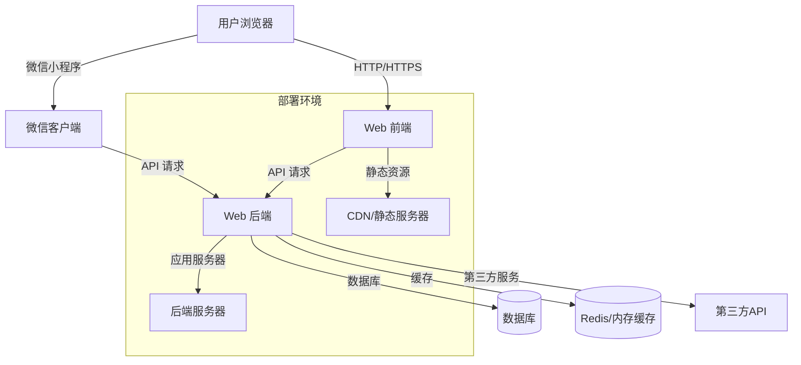

<!-- wiki_page_id: page-build-deploy -->

<details>
<summary>Relevant source files</summary>

The following files were used as context for generating this wiki page:

- [web\start.py](https://github.com/zhk0567/Intelligent-Learning-Terminal/blob/guyunxinchuan/web\start.py)
- [miniprogram\start.py](https://github.com/zhk0567/Intelligent-Learning-Terminal/blob/guyunxinchuan/miniprogram\start.py)
- [web\package.json](https://github.com/zhk0567/Intelligent-Learning-Terminal/blob/guyunxinchuan/web\package.json)
- [miniprogram\project.config.json](https://github.com/zhk0567/Intelligent-Learning-Terminal/blob/guyunxinchuan/miniprogram\project.config.json)
</details>

# 构建与部署流程

## 项目结构概览

Intelligent-Learning-Terminal 项目采用前后端分离架构，包含 Web 应用和微信小程序两个主要部分。

### 目录结构
```
Intelligent-Learning-Terminal/
├── web/                  # Web 应用目录
│   ├── start.py          # Web 后端启动脚本
│   ├── package.json      # 前端依赖配置
│   └── ...               # 其他前端文件
├── miniprogram/          # 微信小程序目录
│   ├── start.py          # 小程序后端启动脚本
│   ├── project.config.json # 小程序项目配置
│   └── ...               # 其他小程序文件
└── ...                   # 其他项目文件
```

## Web 应用构建与部署

### 前端构建流程

根据 `web/package.json` 配置，Web 前端使用 npm 进行依赖管理和构建。

#### 依赖安装
```bash
cd web
npm install
```

#### 开发模式启动
```bash
npm run serve
```

#### 生产构建
```bash
npm run build
```

构建产出将生成在 `dist` 目录中，可直接部署到静态文件服务器。

### 后端启动

Web 应用后端通过 `web/start.py` 启动。

#### 启动命令
```bash
cd web
python start.py
```

#### 配置说明
`start.py` 通常包含：
- Flask 或其他 Python Web 框架的初始化
- 路由注册
- 中间件配置
- 数据库连接初始化
- 服务器启动逻辑

### 部署方式

Web 应用支持多种部署方式：
1. 传统服务器部署（Nginx + Gunicorn/uWSGI）
2. Docker 容器化部署
3. 云平台部署（如阿里云、腾讯云、AWS 等）

## 微信小程序构建与部署

### 小程序项目配置

根据 `miniprogram/project.config.json`，小程序项目使用微信开发者工具进行管理。

#### 配置文件说明
```json
{
  "description": "项目配置文件",
  "setting": {
    "urlCheck": false,
    "es6": true,
    "enhance": true,
    "postcss": true,
    "preloadBackgroundData": false,
    "minified": true,
    "newFeature": true,
    "coverView": true,
    "nodeModules": false,
    "autoAudits": false,
    "checkInvalidKey": true,
    "checkSiteMap": true,
    "uploadWithSourceMap": true,
    "babelSetting": {
      "ignore": [],
      "disablePlugins": [],
      "outputPath": ""
    }
  },
  "compileType": "miniprogram",
  "libVersion": "2.10.4",
  "appid": "your_appid",
  "projectname": "Intelligent-Learning-Terminal",
  "condition": {}
}
```

### 后端启动

小程序后端通过 `miniprogram/start.py` 启动，提供 API 接口支持。

#### 启动命令
```bash
cd miniprogram
python start.py
```

### 构建与预览

1. 使用微信开发者工具打开 `miniprogram` 目录
2. 在开发者工具中进行代码编辑和调试
3. 使用「预览」功能在真机上查看效果
4. 使用「上传」功能将代码上传至微信服务器
5. 在微信公众平台提交审核后发布

### 小程序特殊注意事项
- 需要有效的微信小程序 AppID
- 必须使用 HTTPS 请求后端接口
- 不支持某些 Node.js 原生模块
- 需要注意请求域名的配置（在微信公众平台设置）

## 整体部署架构



## CI/CD 流程建议

虽然当前仓库未显式包含 CI/CD 配置，但建议的流程如下：

### Web 应用 CI/CD
1. 代码提交触发流水线
2. 安装依赖并运行单元测试
3. 构建生产版本
4. 部署到临时环境进行冒烟测试
5. 生产环境蓝绿发布或滚动更新

### 小程序 CI/CD
1. 代码提交触发流水线
2. 运行小程序单元测试（如有）
3. 使用微信 CLI 上传代码
4. 自动触发微信平台预览
5. 人工确认后提交审核

## 环境变量配置

项目可能使用环境变量进行配置管理，常见的环境变量包括：

### Web 后端
- `DATABASE_URL`: 数据库连接字符串
- `REDIS_URL`: Redis 连接地址
- `SECRET_KEY`: 应用密钥
- `DEBUG`: 调试模式开关
- `PORT`: 服务器端口

### 小程序后端
类似的环境变量用于配置小程序后端服务

## 常见问题排查

### 构建失败
1. 检查 Node.js 版本是否符合要求
2. 确认网络连接正常，能够访问 npm 注册表
3. 查看错误日志定位具体失败原因
4. 尝试清除缓存后重新安装依赖

### 启动失败
1. 检查端口是否被占用
2. 验证数据库连接参数
3. 确认所有必需的环境变量已设置
4. 查看应用日志获取详细错误信息

### 部署问题
1. Web 应用：确认静态资源路径配置正确
2. 小程序：检查后端接口域名是否在微信平台白名单中
3. 确认 SSL 证书配置（如果使用 HTTPS）
4. 验证防火墙和安全组规则

## 性能优化建议

### 前端优化
- 启用代码压缩和混淆
- 利用浏览器缓存
- 使用 CDN 加速静态资源
- 按需加载和代码分割

### 后端优化
- 实现数据库连接池
- 添加缓存层减少数据库压力
- 使用异步处理提高并发能力
- 定期清理日志和临时文件

### 小程序优化
- 减小包体积，合理使用分包加载
- 优化图片资源，使用合适的格式和尺寸
- 减少设置数据的频率和数据量
- 使用 wx.request 并发控制

## 安全考虑

### Web 安全
- 实施输入验证和输出编码
- 使用 HTTPS 加密传输
- 实施适当的 CORS 策略
- 防止 CSRF 和 XSS 攻击
- 定期更新依赖修复安全漏洞

### 小程序安全
- 后端接口需要身份验证和授权
- 敏密数据加密传输和存储
- 验证用户输入防止注入攻击
- 遵循微信小程序安全开发指南

## 监控与日志

建议在生产环境中实施：
- 应用性能监控（APM）
- 错误追踪和崩溃分析
- 访问日志和业务日志
- 关键指标告警（响应时间、错误率等）
- 定期健康检查和可用性监控

---

> 本文档基于对 Intelligent-Learning-Terminal 仓库中 `web/start.py`、`miniprogram/start.py`、`web/package.json` 和 `miniprogram/project.config.json` 文件的分析编写而成。实际部署过程中可能需要根据具体环境和需求进行调整。