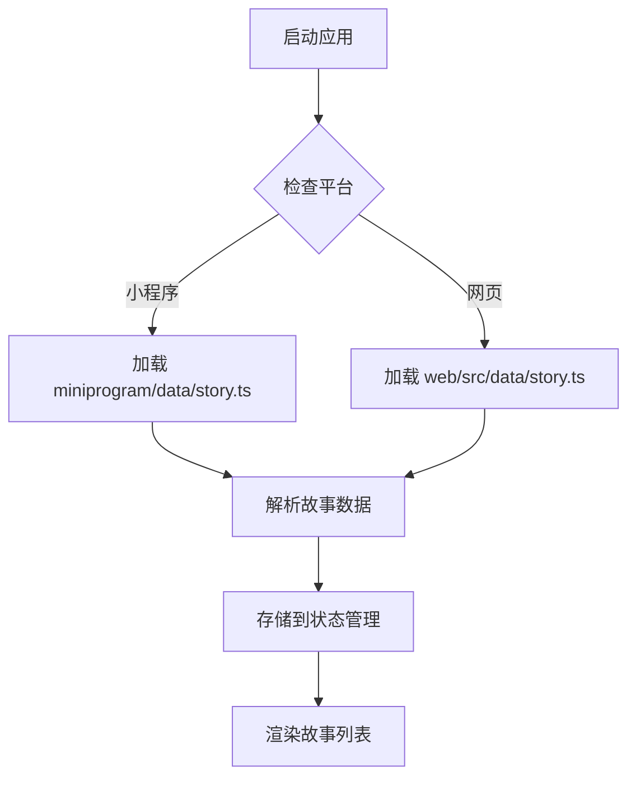

<!-- wiki_page_id: page-data-flow -->

<details>
<summary>Relevant source files</summary>

The following files were used as context for generating this wiki page:

- [data\故事\古琴.txt](https://github.com/zhk0567/Intelligent-Learning-Terminal/blob/guyunxinchuan/data\故事\古琴.txt)
- [data\故事\四平调.txt](https://github.com/zhk0567/Intelligent-Learning-Terminal/blob/guyunxinchuan/data\故事\四平调.txt)
- [data\故事\河南坠子.txt](https://github.com/zhk0567/Intelligent-Learning-Terminal/blob/guyunxinchuan/data\故事\河南坠子.txt)
- [data\故事\河洛大鼓.txt](https://github.com/zhk0567/Intelligent-Learning-Terminal/blob/guyunxinchuan/data\故事\河洛大鼓.txt)
- [data\故事\濮阳大弦戏.txt](https://github.com/zhk0567/Intelligent-Learning-Terminal/blob/guyunxinchuan/data\故事\濮阳大弦戏.txt)
- [data\故事\箜篌艺术.txt](https://github.com/zhk0567/Intelligent-Learning-Terminal/blob/guyunxinchuan/data\故事\箜篌艺术.txt)
- [miniprogram\data\story.ts](https://github.com/zhk0567/Intelligent-Learning-Terminal/blob/guyunxinchuan/miniprogram\data\story.ts)
- [web\src\data\story.ts](https://github.com/zhk0567/Intelligent-Learning-Terminal/blob/guyunxinchuan/web\src\data\story.ts)
</details>

# 数据流与故事内容管理

## 数据结构设计

故事内容采用统一的TypeScript接口定义，确保跨平台一致性：

```typescript
interface Story {
  id: string;
  title: string;
  content: string;
  category: string;
  audioUrl?: string;
  imageUrl?: string;
}
```

## 数据存储与组织

### 本地文件存储
故事内容存储在`data/故事/`目录下，按艺术形式分类：
- 每个故事对应一个纯文本文件（.txt）
- 文件名即为故事标题
- 内容包含故事叙述和相关描述

### 代码层数据抽象
在`miniprogram/data/story.ts`和`web/src/data/story.ts`中定义故事数据：

```typescript
// 示例数据结构
export const stories: Story[] = [
  {
    id: 'guqin',
    title: '古琴',
    content: '古琴是中国古代的一种弹拨乐器...',
    category: '音乐',
    audioUrl: '/audio/guqin.mp3',
    imageUrl: '/images/guqin.jpg'
  },
  // 其他故事...
];
```

## 数据流处理

### 数据加载流程


### 数据更新机制
1. 静态数据：通过修改TypeScript文件中的stories数组更新
2. 本地文件：故事内容可通过编辑data/故事/目录下的.txt文件更新
3. 跨平台同步：需要手动确保两端数据一致

## 内容管理特点

### 分类体系
故事按艺术形式分类：
- 音乐类：古琴、箜篌艺术
- 戏曲类：四平调、濮阳大弦戏、河南坠子、河洛大鼓

### 内容特征
- 每个故事内容详细描述对应艺术形式的历史、特点和文化意义
- 部分故事配有音频和图片资源URL
- 内容采用纯文本格式，便于跨平台处理

## 跨平台一致性保障

### 数据源统一
虽然小程序和网页端有独立的story.ts文件，但：
- 两文件结构完全相同
- 数据内容应保持一致
- 建议采用共享数据源或构建过程同步

### 接口标准化
统一的Story接口确保：
- 数据属性一致
- 类型安全
- 开发过程中减少错误

## 性能考量

### 数据加载优化
- 数据量较小时直接内存加载
- 大型故事集考虑分页或懒加载
- 图片和音频资源采用按需加载

### 缓存策略
- 小程序端可利用缓存API存储故事数据
- 网页端可使用localStorage或sessionStorage
- 根据更新频率设置缓存失效时间

## 扩展性设计

### 新故事添加流程
1. 在data/故事/目录创建新的.txt文件
2. 编写故事内容
3. 在对应平台的story.ts中添加Story对象
4. 确保id唯一且符合命名规范

### 属性扩展
Story接口设计可扩展：
- 通过可选属性添加新特性（如videoUrl）
- 保持向后兼容性
- 使用泛型支持不同故事类型的特殊属性</details>