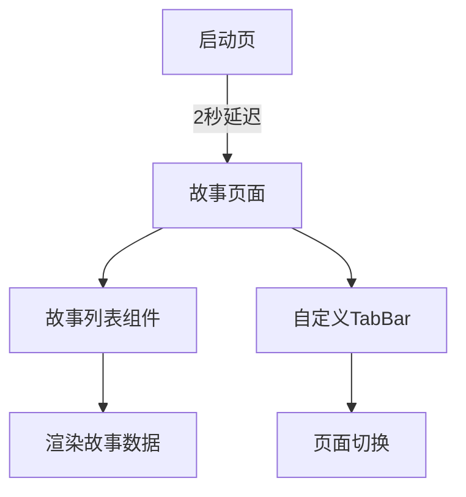

<!-- wiki_page_id: page-mp-arch -->

# 微信小程序架构详解

## 项目概述

Intelligent Learning Terminal 是一个基于微信小程序开发的学习平台，提供故事学习功能。项目采用 TypeScript 开发，结构清晰，遵循微信小程序最佳实践。

## 项目结构

```
miniprogram/
├── custom-tab-bar/           # 自定义tabbar组件
├── pages/                    # 页面目录
│   ├── splash/               # 启动页
│   └── story/                # 故事页面
└── pkg/                      # 自定义组件库
    └── story-list/           # 故事列表组件
```

## 核心配置文件

### app.json
小程序全局配置，定义了页面路径、窗口样式和tabBar：

```json
{
  "pages": [
    "pages/splash/index",
    "pages/story/index"
  ],
  "window": {
    "backgroundTextStyle": "light",
    "navigationBarBackgroundColor": "#fff",
    "navigationBarTitleText": "WeChat",
    "navigationBarTextStyle": "black"
  },
  "tabBar": {
    "custom": true,
    "color": "#999",
    "selectedColor": "#1ad",
    "backgroundColor": "#ffffff",
    "borderStyle": "#eee"
  }
}
```

### 项目配置
- `project.config.json`: 开发工具配置
- `sitemap.json`: 搜索索引配置

## 关键组件

### 自定义TabBar
位于 `custom-tab-bar/` 目录，实现了小程序的自定义导航栏：

**index.json**
```json
{
  "component": true,
  "usingComponents": {}
}
```

**index.ts**
```typescript
Component({
  data: {
    selected: 0,
    list: [
      {
        "pagePath": "pages/splash/index",
        "iconPath": "/image/icon_splash.png",
        "selectedIconPath": "/image/icon_splash_active.png",
        "text": "启动"
      },
      {
        "pagePath": "pages/story/index",
        "iconPath": "/image/icon_story.png",
        "selectedIconPath": "/image/icon_story_active.png",
        "text": "故事"
      }
    ]
  },
  methods: {
    switchTab(e: any) {
      const data = e.currentTarget.dataset
      const url = data.path
      wx.switchTab({url})
    }
  }
})
```

### 启动页 (Splash)
位于 `pages/splash/`，作为应用的入口页面：

**index.json**
```json
{
  "usingComponents": {}
}
```

**index.ts**
```typescript
Page({
  /**
   * 页面的初始数据
   */
  data: {},

  /**
   * 生命周期函数--监听页面加载
   */
  onLoad() {
    setTimeout(() => {
      wx.switchTab({
        url: '/pages/story/index'
      })
    }, 2000)
  }
})
```

### 故事页面
位于 `pages/story/`，是故事学习的主要界面：

**index.json**
```json
{
  "usingComponents": {
    "story-list": "/pkg/story-list/index"
  }
}
```

**index.ts**
```typescript
Page({
  /**
   * 页面的初始数据
   */
  data: {},

  /**
   * 生命周期函数--监听页面加载
   */
  onLoad() {}
})
```

### 故事列表组件
位于 `pkg/story-list/`，复用的故事展示组件：

**index.json**
```json
{
  "component": true,
  "usingComponents": {}
}
```

**index.ts**
```typescript
Component({
  /**
   * 组件的属性列表
   */
  properties: {},

  /**
   * 组件的初始数据
   */
  data: {
    list: [
      {
        id: 1,
        title: "故事标题1",
        desc: "故事描述1",
        img: "/image/story1.jpg"
      },
      {
        id: 2,
        title: "故事标题2",
        desc: "故事描述2",
        img: "/image/story2.jpg"
      }
    ]
  },

  /**
   * 组件的方法列表
   */
  methods: {}
})
```

## 架构特点

1. **模块化设计**：使用自定义组件(`pkg/story-list`)实现代码复用
2. **自定义导航**：通过 `custom-tab-bar` 实现统一的导航体验
3. **分层结构**：清晰分离页面、组件和配置
4. **TypeScript支持**：全部使用TS开发，提供类型安全

## 数据流



## 页面生命周期

1. 启动阶段：展示splash页面，2秒后自动跳转到故事页面
2. 故事页面：加载故事列表组件
3. 组件渲染：故事列表组件展示预定义的故事数据
4. 导航：通过自定义TabBar在故事页面和启动页之间切换

## 依赖关系

- 所有页面和组件均不使用第三方组件库
- 完全基于微信小程序原生能力开发
- 通过`usingComponents`实现局部组件引用

## 开发规范

1. 所有文件使用TypeScript编写（.ts扩展名）
2. 组件采用独立目录结构，包含json、ts、wxml、wxss四部分
3. 配置文件采用JSON格式
4. 路径使用相对路径，便于迁移和维护</details>
