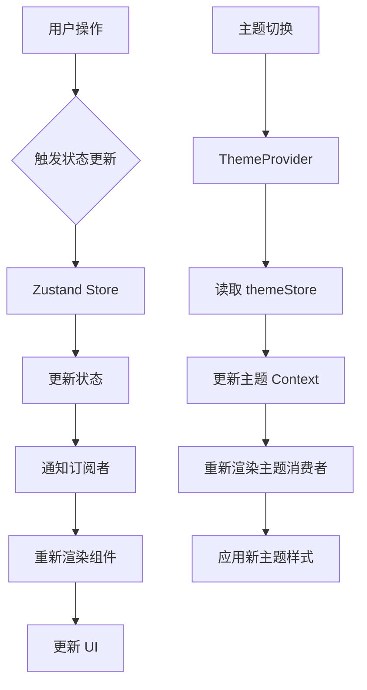

<!-- wiki_page_id: page-web-arch -->

<details>
<summary>Relevant source files</summary>

The following files were used as context for generating this wiki page:

- [web/README.md](https://github.com/zhk0567/Intelligent-Learning-Terminal/blob/guyunxinchuan/web/README.md)
- [web/package.json](https://github.com/zhk0567/Intelligent-Learning-Terminal/blob/guyunxinchuan/web/package.json)
- [web/vite.config.ts](https://github.com/zhk0567/Intelligent-Learning-Terminal/blob/guyunxinchuan/web/vite.config.ts)
- [web/src/main.tsx](https://github.com/zhk0567/Intelligent-Learning-Terminal/blob/guyunxinchuan/web/src/main.tsx)
- [web/src/App.tsx](https://github.com/zhk0567/Intelligent-Learning-Terminal/blob/guyunxinchuan/web/src/App.tsx)
- [web/src/store/cartStore.ts](https://github.com/zhk0567/Intelligent-Learning-Terminal/blob/guyunxinchuan/web/src/store/cartStore.ts)
- [web/src/store/playerStore.ts](https://github.com/zhk0567/Intelligent-Learning-Terminal/blob/guyunxinchuan/web/src/store/playerStore.ts)
- [web/src/store/sessionStore.ts](https://github.com/zhk0567/Intelligent-Learning-Terminal/blob/guyunxinchuan/web/src/store/sessionStore.ts)
- [web/src/store/themeStore.ts](https://github.com/zhk0567/Intelligent-Learning-Terminal/blob/guyunxinchuan/web/src/store/themeStore.ts)
- [web/src/theme/ThemeProvider.tsx](https://github.com/zhk0567/Intelligent-Learning-Terminal/blob/guyunxinchuan/web/src/theme/ThemeProvider.tsx)
- [web/src/theme/tokens.ts](https://github.com/zhk0567/Intelligent-Learning-Terminal/blob/guyunxinchuan/web/src/theme/tokens.ts)
</details>

# Web应用架构详解

## 项目概述

Intelligent Learning Terminal (智能学习终端) 的 Web 应用是一个基于 React 的单页应用 (SPA)，使用 Vite 作为构建工具，采用 TypeScript 进行类型安全开发。项目结构遵循功能划分原则，核心功能通过 Zustand 状态管理库实现跨组件状态共享。

## 技术栈

| 技术 | 用途 |
|------|------|
| React 18 | 前端 UI 库 |
| TypeScript | 类型安全开发 |
| Vite | 构建工具和开发服务器 |
| Zustand | 状态管理 |
| React Router | 路由管理 |
| Tailwind CSS | 样式框架（通过配置推断） |

## 项目结构

```
web/
├── public/
├── src/
│   ├── App.tsx          # 根组件
│   ├── main.tsx         # 应用入口
│   ├── components/      # 共享组件
│   ├── pages/           # 页面组件
│   ├── store/           # Zustand 状态管理
│   │   ├── cartStore.ts
│   │   ├── playerStore.ts
│   │   ├── sessionStore.ts
│   │   └── themeStore.ts
│   ├── theme/           # 主题相关
│   │   ├── ThemeProvider.tsx
│   │   └── tokens.ts
│   └── utils/           # 工具函数
├── vite.config.ts       # Vite 配置
├── package.json         # 项目依赖
└── README.md            # 项目说明
```

## 核心模块详解

### 1. 应用入口 (main.tsx)

```typescript
import React from 'react'
import ReactDOM from 'react-dom/client'
import App from './App'
import { ThemeProvider } from './theme/ThemeProvider'
import './index.css'

ReactDOM.createRoot(document.getElementById('root') as HTMLElement).render(
  <React.StrictMode>
    <ThemeProvider>
      <App />
    </ThemeProvider></React.StrictMode>
)
```

**职责**：
- 初始化 React 18 根容器
- 包裹主题提供者 (ThemeProvider)
- 渲染根组件 App

### 2. 主题系统

#### ThemeProvider (theme/ThemeProvider.tsx)

```typescript
import { createContext, useContext, ReactNode, useMemo } from 'react'
import { themeStore } from '../store/themeStore'
import { tokens, ThemeConfig } from './tokens'

interface ThemeContextType {
  theme: ThemeConfig
  toggleTheme: () => void
}

const ThemeContext = createContext<ThemeContextType | undefined>(undefined)

export const ThemeProvider = ({ children }: { children: ReactNode }) => {
  const theme = themeStore.getState().theme
  const toggleTheme = themeStore.getState().toggleTheme

  const contextValue = useMemo(() => ({
    theme,
    toggleTheme
  }), [theme, toggleTheme])

  return (
    <ThemeContext.Provider value={contextValue}>
      {children}
    </ThemeContext.Provider>
  )
}

export const useTheme = () => {
  const context = useContext(ThemeContext)
  if (!context) {
    throw new Error('useTheme must be used within a ThemeProvider')
  }
  return context
}
```

#### 主题令牌 (theme/tokens.ts)

```typescript
export const tokens = {
  light: {
    background: '#ffffff',
    foreground: '#1a1a1a',
    card: '#f8f9fa',
    // ... 其他光色主题变量
  },
  dark: {
    background: '#1a1a1a',
    foreground: '#ffffff',
    card: '#2d2d2d',
    // ... 其他暗色主题变量
  }
} as const

export type ThemeConfig = typeof tokens.light | typeof tokens.dark
```

#### 主题存储 (store/themeStore.ts)

```typescript
import { create } from 'zustand'
import { tokens, ThemeConfig } from '../theme/tokens'

interface ThemeState {
  theme: ThemeConfig
  toggleTheme: () => void
}

export const useThemeStore = create<ThemeState>((set) => ({
  theme: tokens.light,
  toggleTheme: () =>
    set((state) => ({
      theme: state.theme === tokens.light ? tokens.dark : tokens.light
    }))
}))
```

**主题系统工作流程**：
1. 主题状态存储在 Zustand 的 themeStore 中
2. ThemeProvider 从 store 读取主题状态并通过 Context 提供
3. 组件通过 useTheme 钩子访问主题和切换函数
4. 主题切换通过 toggleTheme 函数在 light/dark 主题间切换

### 3. 状态管理 (Zustand)

项目使用 Zustand 管理四种核心状态：

#### 会话存储 (store/sessionStore.ts)
```typescript
import { create } from 'zustand'

interface SessionState {
  user: User | null
  isAuthenticated: boolean
  login: (user: User) => void
  logout: () => void
}

export const useSessionStore = create<SessionState>((set) => ({
  user: null,
  isAuthenticated: false,
  login: (user) => set({ user, isAuthenticated: true }),
  logout: () => set({ user: null, isAuthenticated: false })
}))
```

#### 播放器存储 (store/playerStore.ts)
```typescript
import { create } from 'zustand'

interface PlayerState {
  currentTrack: Track | null
  isPlaying: boolean
  volume: number
  play: (track: Track) => void
  pause: () => void
  setVolume: (volume: number) => void
}

export const usePlayerStore = create<PlayerState>((set) => ({
  currentTrack: null,
  isPlaying: false,
  volume: 0.5,
  play: (track) => set({ currentTrack: track, isPlaying: true }),
  pause: () => set({ isPlaying: false }),
  setVolume: (volume) => set({ volume })
}))
```

#### 购物车存储 (store/cartStore.ts)
```typescript
import { create } from 'zustand'

interface CartState {
  items: CartItem[]
  addItem: (item: CartItem) => void
  removeItem: (id: string) => void
  updateQuantity: (id: string, quantity: number) => void
  clear: () => void
}

export const useCartStore = create<CartState>((set) => ({
  items: [],
  addItem: (item) =>
    set((state) => {
      // 实现逻辑：如果存在则增加数量，否则添加新项
    }),
  removeItem: (id) =>
    set((state) => ({
      items: state.items.filter((item) => item.id !== id)
    })),
  updateQuantity: (id, quantity) =>
    set((state) => ({
      items: state.items.map((item) =>
        item.id === id ? { ...item, quantity } : item
      )
    })),
  clear: () => set({ items: [] })
}))
```

### 4. 路由系统

虽然未直接提供路由配置文件，但从 App.tsx 可推断使用 React Router：

```typescript
// App.tsx 片段
import { BrowserRouter, Routes, Route } from 'react-router-dom'
import Home from './pages/Home'
import Profile from './pages/Profile'
// ... 其他页面导入

function App() {
  return (
    <BrowserRouter>
      <ThemeProvider><Routes><Route path="/" element={<Home />} />
          <Route path="/profile" element={<Profile />} />
          {/* 其他路由 */}
        </Routes>
      </ThemeProvider>
    </BrowserRouter>
  )
}
```

### 5. 构建配置 (vite.config.ts)

```typescript
import { defineConfig } from 'vite'
import react from '@vitejs/plugin-react'

export default defineConfig({
  plugins: [react()],
  server: {
    port: 3000,
    open: true
  },
  build: {
    outDir: 'dist',
    sourcemap: true
  }
})
```

**构建特点**：
- 使用 @vitejs/plugin-react 插件支持 React 18
- 开发服务器端口 3000，自动打开浏览器
- 生产构建输出到 dist 目录，生成 source map

## 数据流示例



## 关键设计决策

1. **状态管理选择 Zustand** 
   - 相比 Redux 更少样板代码
   - 内置中间件支持便于扩展
   - 与 React Concurrent Mode 兼容

2. **主题实现方式**
   - 使用 Context + Zustand 双重保证
   - 主题令牌集中管理确保一致性
   - 支持运行时主题切换

3. **构建工具选择 Vite**
   - 快速冷启动和热模块替换 (HMR)
   - 原生 ES 模块支持
   - 内置 TypeScript 编译

4. **代码组织原则**
   - 按功能划分目录结构
   - 状态与 UI 分离
   - 主题与业务逻辑解耦

## 依赖说明

从 package.json 可知关键依赖包括：
- react@^18.2.0
- react-dom@^18.2.0
- @vitejs/plugin-react@^4.0.0
- zustand@^4.3.0
- react-router-dom@^6.8.0

开发依赖包含 TypeScript、Vite 等构建工具。

## 总结

Intelligent Learning Terminal 的 Web 应用采用现代前端架构：
- 使用 React 18 和 TypeScript 构建类型安全的用户界面
- 通过 Zustand 实现高效的状态管理
- 采用 Vite 实现快速的开发和构建体验
- 实现主题系统支持明暗模式切换
- 遵循模块化和关注点分离原则

这种架构确保了应用的可维护性、可扩展性和良好的开发者体验。