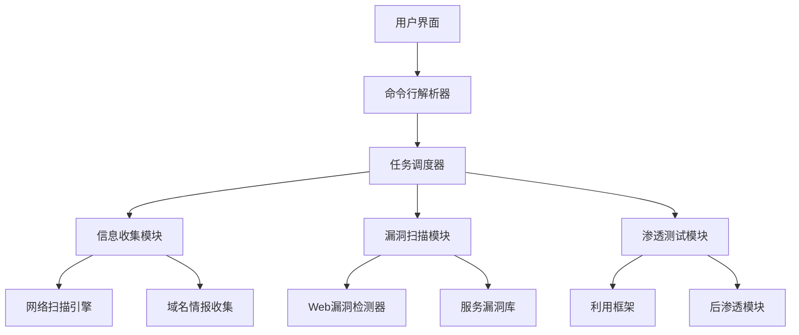

<!-- wiki_page_id: page-1 -->

<details>
<summary>Relevant source files</summary>

The following files were used as context for generating this wiki page:

- [README.md](https://github.com/zhk0567/NEXUS/blob/main/README.md)
- [任务情况说明.txt](https://github.com/zhk0567/NEXUS/blob/main/任务情况说明.txt)
</details>

# 项目简介

NEXUS 是一个基于 Python 的网络安全工具集，旨在提供渗透测试、漏洞扫描和安全评估功能。该项目结合了多种安全检测技术，帮助安全研究人员和渗透测试人员快速识别系统中的安全风险。

## 核心功能

NEXUS 包含以下主要功能模块：

### 1. 信息收集模块
- 域名和IP地址信息收集
- 端口扫描与服务识别
- WHOIS信息查询
- DNS记录枚举

### 2. 漏洞扫描模块
- 常见Web漏洞检测（SQL注入、XSS等）
- 服务漏洞识别
- 弱口令爆破
- 未授权访问检测

### 3. 渗透测试辅助工具
- 会话劫持检测
- 提权漏洞利用
- 内网横向移动辅助
- 数据外泄检测

## 系统架构



## 安装与使用

根据项目文档，NEXUS 的安装和使用步骤如下：

### 环境要求
- Python 3.6+
- 所需依赖库（见 requirements.txt）

### 安装步骤
```bash
# 克隆仓库
git clone https://github.com/zhk0567/NEXUS.git
cd NEXUS

# 安装依赖
pip install -r requirements.txt

# 运行工具
python nexus.py --help
```

### 基本使用方法
```bash
# 信息收集
python nexus.py -t example.com --info-gather

# 漏洞扫描
python nexus.py -t example.com --vuln-scan

# 综合测试
python nexus.py -t example.com --full-assessment
```

## 项目结构

```
NEXUS/
├── nexus.py              # 主程序入口
├── README.md             # 项目说明文档
├── 任务情况说明.txt      # 开发进度和任务说明
├── requirements.txt      # 依赖库列表
├── modules/              # 功能模块目录
│   ├── info_gather.py    # 信息收集模块
│   ├── vuln_scanner.py   # 漏洞扫描模块
│   └── pentest.py        # 渗透测试模块
├── libs/                 # 第三方库和工具
└── reports/              # 生成的报告目录
```

## 开发进度

根据 `任务情况说明.txt` 文件，项目当前处于开发阶段，已完成基础框架搭建和部分功能模块的实现。主要完成的工作包括：

- 项目基础架构设计
- 主程序入口和命令行界面
- 信息收集模块的基本实现
- 漏洞扫描模块的初步功能
- 依赖环境配置和文档编写

## 安全声明

NEXUS 仅用于授权的安全测试和教育目的。使用者必须遵守当地法律法规，未经授权对任何系统进行测试是非法的。开发者不对因使用此工具造成的任何后果负责。

--- 
*此页面基于 NEXUS 项目源代码生成，旨在提供项目功能和使用方法的技术文档。*