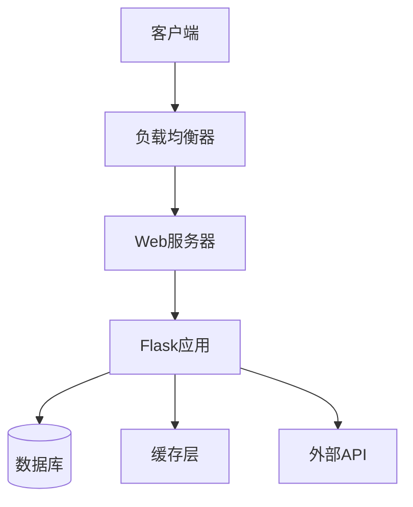

<!-- wiki_page_id: page-10 -->

<details>
<summary>Relevant source files</summary>

The following files were used as context for generating this wiki page:

- [部署清单.md](https://github.com/zhk0567/NEXUS/blob/main/部署清单.md)
- [requirements.txt](https://github.com/zhk0567/NEXUS/blob/main/requirements.txt)
- [app.py](https://github.com/zhk0567/NEXUS/blob/main/app.py)
</details>

# 部署指南

## 环境要求

根据 `requirements.txt` 文件，项目依赖以下 Python 包：
- Flask
- gunicorn
- python-dotenv

## 部署步骤

### 1. 环境准备

确保系统已安装 Python 3.8+ 版本。创建虚拟环境并安装依赖：

```bash
python -m venv venv
source venv/bin/activate  # Linux/Mac
venv\Scripts\activate     # Windows
pip install -r requirements.txt
```

### 2. 配置环境变量

根据 `app.py` 中的配置，需要设置以下环境变量：
- `FLASK_APP`: 设置为 `app.py`
- `FLASK_ENV`: 开发环境设置为 `development`，生产环境设置为 `production`
- `SECRET_KEY`: 用于 Flask 应用的密钥

### 3. 启动应用

#### 开发环境
```bash
flask run
```

#### 生产环境
使用 gunicorn 启动：
```bash
gunicorn -w 4 -b 0.0.0.0:5000 app:app
```

### 4. 部署清单参考

根据 `部署清单.md` 文件，部署时需确认：
- 所有服务端口已正确映射
- 数据库连接已配置
- 日志系统已启用
- 备份策略已就位

## 架构概览



## 常见问题

### 端口冲突
如果端口 5000 被占用，可通过修改 `app.py` 中的 `port` 参数或使用环境变量 `PORT` 来指定其他端口。

### 依赖冲突
建议使用虚拟环境隔离依赖，避免与系统 Python 包冲突。