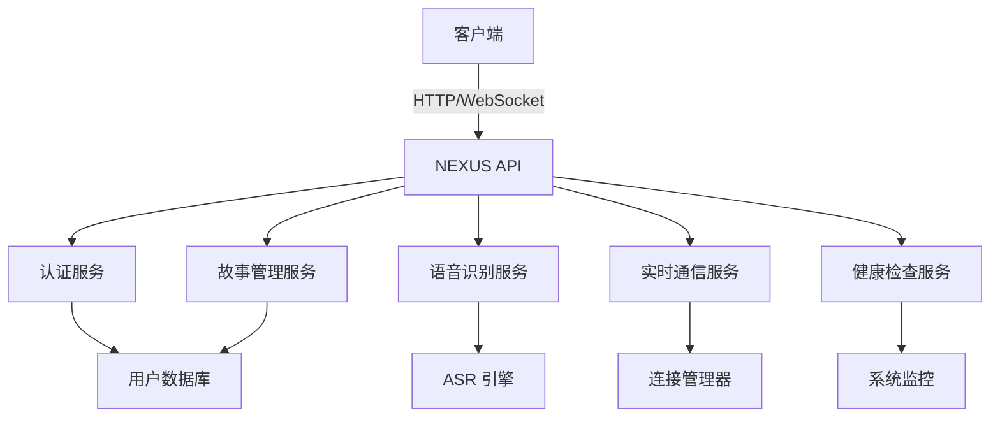

<!-- wiki_page_id: page-11 -->

<details>
<summary>Relevant source files</summary>

The following files were used as context for generating this wiki page:

- [backend/routes/health_routes.py](https://github.com/zhk0567/NEXUS/blob/main/backend/routes/health_routes.py)
- [backend/routes/admin_story_routes.py](https://github.com/zhk0567/NEXUS/blob/main/backend/routes/admin_story_routes.py)
- [backend/routes/asr_routes.py](https://github.com/zhk0567/NEXUS/blob/main/backend/routes/asr_routes.py)
- [backend/routes/auth_routes.py](https://github.com/zhk0567/NEXUS/blob/main/backend/routes/auth_routes.py)
- [backend/routes/realtime_routes.py](https://github.com/zhk0567/NEXUS/blob/main/backend/routes/realtime_routes.py)
- [backend/routes/error_routes.py](https://github.com/zhk0567/NEXUS/blob/main/backend/routes/error_routes.py)
</details>

# API接口文档

## 概述

NEXUS 是一个基于 FastAPI 构建的后端服务，提供语音识别、用户认证、故事管理和实时通信等功能。本文档详细描述了系统中所有可用的 API 接口。

## 认证相关接口

### 用户登录
- **路径**: `POST /auth/login`
- **描述**: 用户通过用户名和密码进行登录，获取访问令牌
- **请求体**:
  ```json
  {
    "username": "string",
    "password": "string"
  }
  ```
- **响应**:
  ```json
  {
    "access_token": "string",
    "token_type": "bearer"
  }
  ```

### 用户注册
- **路径**: `POST /auth/register`
- **描述**: 新用户注册账户
- **请求体**:
  ```json
  {
    "username": "string",
    "email": "string",
    "password": "string"
  }
  ```
- **响应**: 返回创建的用户信息（不包含密码）

## 语音识别相关接口

### 上传音频进行语音识别
- **路径**: `POST /asr/transcribe`
- **描述**: 接收音频文件并返回转录文本
- **请求体**: multipart/form-data
  - `file`: 音频文件 (支持 wav, mp3 等格式)
- **响应**:
  ```json
  {
    "text": "string",
    "language": "string",
    "duration": "number"
  }
  ```

### 实时语音识别流
- **路径**: `WS /asr/stream`
- **描述**: WebSocket 端点用于实时语音识别
- **消息格式**:
  - 客户端发送: 二进制音频数据
  - 服务器响应: 
    ```json
    {
      "type": "transcript",
      "text": "string",
      "is_final": boolean
    }
    ```

## 故事管理接口

### 获取故事列表
- **路径**: `GET /admin/stories`
- **描述**: 获取所有故事的列表（需要管理员权限）
- **查询参数**:
  - `page`: 页码 (默认: 1)
  - `limit`: 每页数量 (默认: 10)
- **响应**:
  ```json
  {
    "stories": [
      {
        "id": "string",
        "title": "string",
        "content": "string",
        "created_at": "string",
        "updated_at": "string"
      }
    ],
    "total": "number",
    "page": "number",
    "limit": "number"
  }
  ```

### 创建新故事
- **路径**: `POST /admin/stories`
- **描述**: 创建一个新故事（需要管理员权限）
- **请求体**:
  ```json
  {
    "title": "string",
    "content": "string"
  }
  ```
- **响应**: 返回创建的故事对象

### 更新故事
- **路径**: `PUT /admin/stories/{story_id}`
- **描述**: 更新指定 ID 的故事（需要管理员权限）
- **路径参数**: `story_id` - 故事的唯一标识
- **请求体**:
  ```json
  {
    "title": "string",
    "content": "string"
  }
  ```
- **响应**: 返回更新后的故事对象

### 删除故事
- **路径**: `DELETE /admin/stories/{story_id}`
- **描述**: 删除指定 ID 的故事（需要管理员权限）
- **路径参数**: `story_id` - 故事的唯一标识
- **响应**: 204 No Content

## 实时通信接口

### 建立实时连接
- **路径**: `WS /realtime/ws/{client_id}`
- **描述**: WebSocket 端点用于实时双向通信
- **路径参数**: `client_id` - 客户端唯一标识
- **消息类型**:
  - 客户端发送:
    ```json
    {
      "type": "message",
      "content": "string",
      "target": "string"
    }
    ```
  - 服务器广播:
    ```json
    {
      "type": "message",
      "sender": "string",
      "content": "string",
      "timestamp": "string"
    }
    ```

### 获取在线用户
- **路径**: `GET /realtime/online`
- **描述**: 获取当前在线的用户列表
- **响应**:
  ```json
  {
    "users": ["string"],
    "count": "number"
  }
  ```

## 健康检查接口

### 基础健康检查
- **路径**: `GET /health`
- **描述**: 检查服务是否正常运行
- **响应**:
  ```json
  {
    "status": "healthy",
    "timestamp": "string",
    "version": "string"
  }
  ```

### 详细健康检查
- **路径**: `GET /health/detailed`
- **描述**: 提供详细的服务状态信息
- **响应**:
  ```json
  {
    "status": "healthy",
    "checks": {
      "database": "healthy",
      "memory": "healthy",
      "cpu": "healthy"
    },
    "timestamp": "string"
  }
  ```

## 错误处理

所有 API 接口在发生错误时返回统一的错误格式：

```json
{
  "error": {
    "code": "string",
    "message": "string",
    "details": "object"
  }
}
```

常见错误码:
- `400`: 请求参数错误
- `401`: 未授权访问
- `403`: 权限不足
- `404`: 资源不存在
- `422`: 验证错误
- `500`: 内部服务器错误

## 依赖关系图



## 使用示例

### 使用 curl 进行语音识别
```bash
curl -X POST "http://localhost:8000/asr/transcribe" \
  -H "Authorization: Bearer<access_token>" \
  -F "file=@audio.wav"
```

### 通过 WebSocket 进行实时通信
```javascript
const ws = new WebSocket("ws://localhost:8000/realtime/ws/client123");

ws.onopen = () => {
  ws.send(JSON.stringify({
    type: "message",
    content: "Hello, world!",
    target: "all"
  }));
};

ws.onmessage = (event) => {
  const data = JSON.parse(event.data);
  console.log("Received:", data);
};
```

## 注意事项

1. 所有需要认证的接口必须在请求头中携带有效的 JWT 令牌：
   ```
   Authorization: Bearer <access_token>
   ```

2. 音频文件大小限制为 100MB，支持的格式包括 wav, mp3, flac, ogg

3. 实时语音识别流需要保持 WebSocket 连接活跃，服务器会在 5 分钟无活动后断开连接

4. 故事管理接口仅对具有管理员角色的用户开放

5. 建议在生产环境中使用 HTTPS 并配置适当的 CORS 策略