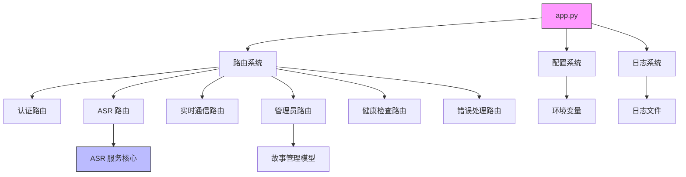

<!-- wiki_page_id: page-2 -->

<details>
<summary>Relevant source files</summary>

The following files were used as context for generating this wiki page:

- [admin_panel.html](https://github.com/zhk0567/NEXUS/blob/main/admin_panel.html)
- [app.py](https://github.com/zhk0567/NEXUS/blob/main/app.py)
- [backend/__init__.py](https://github.com/zhk0567/NEXUS/blob/main/backend/__init__.py)
- [backend/asr_service.py](https://github.com/zhk0567/NEXUS/blob/main/backend/asr_service.py)
- [backend/config.py](https://github.com/zhk0567/NEXUS/blob/main/backend/config.py)
- [backend/logger_config.py](https://github.com/zhk0567/NEXUS/blob/main/backend/logger_config.py)
- [backend/routes/__init__.py](https://github.com/zhk0567/NEXUS/blob/main/backend/routes/__init__.py)
- [backend/routes/admin_story_routes.py](https://github.com/zhk0567/NEXUS/blob/main/backend/routes/admin_story_routes.py)
- [backend/routes/asr_routes.py](https://github.com/zhk0567/NEXUS/blob/main/backend/routes/asr_routes.py)
- [backend/routes/auth_routes.py](https://github.com/zhk0567/NEXUS/blob/main/backend/routes/auth_routes.py)
- [backend/routes/error_routes.py](https://github.com/zhk0567/NEXUS/blob/main/backend/routes/error_routes.py)
- [backend/routes/health_routes.py](https://github.com/zhk0567/NEXUS/blob/main/backend/routes/health_routes.py)
- [backend/routes/realtime_routes.py](https://github.com/zhk0567/NEXUS/blob/main/backend/routes/realtime_routes.py)
- [clear_tables.py](https://github.com/zhk0567/NEXUS/blob/main/clear_tables.py)
- [requirements.txt](https://github.com/zhk0567/NEXUS/blob/main/requirements.txt)
- [任务清单.md](https://github.com/zhk0567/NEXUS/blob/main/任务清单.md)
- [部署清单.md](https://github.com/zhk0567/NEXUS/blob/main/部署清单.md)
</details>

# 项目结构

NEXUS 是一个基于 Flask 的多模态 AI 服务平台，集成了语音识别（ASR）、实时通信和管理后台功能。项目采用模块化设计，核心组件包括后端 API 服务、前端管理界面和数据库交互层。

## 项目目录结构

```
NEXUS/
├── admin_panel.html              # 管理后台前端界面
├── app.py                        # 应用入口点
├── clear_tables.py               # 数据库清理脚本
├── requirements.txt              # 项目依赖列表
├── 任务清单.md                   # 开发任务记录
├── 部署清单.md                   # 部署操作指南
└── backend/
    ├── __init__.py               # 包初始化
    ├── asr_service.py            # ASR 服务核心实现
    ├── config.py                 # 配置管理
    ├── logger_config.py          # 日志配置
    └── routes/
        ├── __init__.py           # 路由包初始化
        ├── admin_story_routes.py # 管理员故事管理路由
        ├── asr_routes.py         # ASR 服务路由
        ├── auth_routes.py        # 认证路由
        ├── error_routes.py       # 错误处理路由
        ├── health_routes.py      # 健康检查路由
        └── realtime_routes.py    # 实时通信路由
```

## 核心模块说明

### 应用入口 (app.py)

`app.py` 是项目的主入口文件，负责初始化 Flask 应用、注册蓝图、配置中间件和启动服务器。

```python
from flask import Flask
from backend.config import Config
from backend.logger_config import setup_logging
from backend.routes import (
    auth_routes,
    asr_routes,
    realtime_routes,
    admin_story_routes,
    health_routes,
    error_routes
)

def create_app():
    app = Flask(__name__)
    app.config.from_object(Config)
    
    # 初始化日志
    setup_logging(app)
    
    # 注册蓝图
    app.register_blueprint(auth_routes.bp)
    app.register_blueprint(asr_routes.bp)
    app.register_blueprint(realtime_routes.bp)
    app.register_blueprint(admin_story_routes.bp)
    app.register_blueprint(health_routes.bp)
    app.register_blueprint(error_routes.bp)
    
    return app

if __name__ == '__main__':
    app = create_app()
    app.run(host='0.0.0.0', port=5000, debug=app.config['DEBUG'])
```

### 配置管理 (backend/config.py)

配置文件定义了项目的运行参数，包括数据库连接、ASR 模型参数、安全设置等。

```python
import os
from dotenv import load_dotenv

load_dotenv()

class Config:
    SECRET_KEY = os.environ.get('SECRET_KEY') or 'dev-key-please-change'
    DEBUG = os.environ.get('FLASK_DEBUG') or False
    
    # 数据库配置
    SQLALCHEMY_DATABASE_URI = os.environ.get('DATABASE_URL') or \
        'sqlite:///nexus.db'
    SQLALCHEMY_TRACK_MODIFICATIONS = False
    
    # ASR 配置
    ASR_MODEL_PATH = os.environ.get('ASR_MODEL_PATH') or './models/asr'
    ASR_SAMPLE_RATE = int(os.environ.get('ASR_SAMPLE_RATE') or 16000)
    ASR_CHUNK_SIZE = int(os.environ.get('ASR_CHUNK_SIZE') or 1024)
    
    # 安全配置
    JWT_SECRET_KEY = os.environ.get('JWT_SECRET_KEY') or 'jwt-secret-string'
    JWT_ACCESS_TOKEN_EXPIRES = int(os.environ.get('JWT_ACCESS_TOKEN_EXPIRES') or 3600)
```

### 日志系统 (backend/logger_config.py)

日志配置模块负责设置应用的日志记录行为，支持控制台和文件输出。

```python
import logging
import os
from logging.handlers import RotatingFileHandler

def setup_logging(app):
    if not app.debug and not app.testing:
        if not os.path.exists('logs'):
            os.mkdir('logs')
        file_handler = RotatingFileHandler(
            'logs/nexus.log', maxBytes=10240, backupCount=10
        )
        file_handler.setFormatter(logging.Formatter(
            '%(asctime)s %(levelname)s: %(message)s [in %(pathname)s:%(lineno)d]'
        ))
        file_handler.setLevel(logging.INFO)
        app.logger.addHandler(file_handler)
        app.logger.setLevel(logging.INFO)
        app.logger.info('NEXUS 启动')
```

### ASR 服务 (backend/asr_service.py)

ASR 服务实现了语音识别的核心功能，使用 Whisper 模型进行语音转文字。

```python
import whisper
import numpy as np
from backend.config import Config

class ASRService:
    _instance = None
    
    def __new__(cls):
        if cls._instance is None:
            cls._instance = super(ASRService, cls).__new__(cls)
            cls._instance._initialize()
        return cls._instance
    
    def _initialize(self):
        self.model = whisper.load_model(
            Config.ASR_MODEL_PATH,
            device="cpu"  # 可根据实际硬件调整
        )
        self.sample_rate = Config.ASR_SAMPLE_RATE
    
    def transcribe(self, audio_data):
        """
        将音频数据转录为文本
        :param audio_data: numpy array 音频数据
        :return: 转录文本
        """
        # 确保音频数据是正确的格式
        if len(audio_data.shape) > 1:
            audio_data = np.mean(audio_data, axis=1)
        
        # 归一化音频
        audio_data = audio_data.astype(np.float32)
        if np.max(np.abs(audio_data)) > 0:
            audio_data = audio_data / np.max(np.abs(audio_data))
        
        # 使用 Whisper 进行转录
        result = self.model.transcribe(
            audio_data,
            language="zh",
            fp16=False
        )
        return result["text"].strip()
```

## 路由系统

项目使用 Flask 蓝图将不同功能模块的路由进行组织。

### 认证路由 (backend/routes/auth_routes.py)

处理用户注册、登录和令牌管理。

```python
from flask import Blueprint, request, jsonify
from flask_jwt_extended import create_access_token, jwt_required
from backend.models import User

bp = Blueprint('auth', __name__)

@bp.route('/register', methods=['POST'])
def register():
    data = request.get_json()
    if User.query.filter_by(username=data['username']).first():
        return jsonify({'msg': '用户名已存在'}), 400
    
    user = User(username=data['username'])
    user.set_password(data['password'])
    # db.session.add(user)
    # db.session.commit()
    return jsonify({'msg': '注册成功'}), 201

@bp.route('/login', methods=['POST'])
def login():
    data = request.get_json()
    user = User.query.filter_by(username=data['username']).first()
    if user and user.check_password(data['password']):
        access_token = create_access_token(identity=user.id)
        return jsonify(access_token=access_token)
    return jsonify({'msg': '用户名或密码错误'}), 401
```

### ASR 路由 (backend/routes/asr_routes.py)

提供语音识别服务的 API 端点。

```python
from flask import Blueprint, request, jsonify
from flask_jwt_extended import jwt_required
from backend.asr_service import ASRService
import numpy as np
import base64

bp = Blueprint('asr', __name__)
asr_service = ASRService()

@bp.route('/transcribe', methods=['POST'])
@jwt_required()
def transcribe():
    if 'audio' not in request.files:
        return jsonify({'error': '未提供音频文件'}), 400
    
    audio_file = request.files['audio']
    # 读取并处理音频数据
    audio_data = np.frombuffer(audio_file.read(), dtype=np.int16)
    text = asr_service.transcribe(audio_data)
    
    return jsonify({'text': text})
```

### 实时通信路由 (backend/routes/realtime_routes.py)

使用 SocketIO 实现实时音频流处理和通信。

```python
from flask import Blueprint
from flask_socketio import emit
from backend.asr_service import ASRService
import numpy as np

bp = Blueprint('realtime', __name__)
asr_service = ASRService()

def init_socketio(socketio):
    @socketio.on('audio_stream')
    def handle_audio_stream(data):
        try:
            # 解码 base64 音频数据
            audio_bytes = base64.b64decode(data['audio'])
            audio_array = np.frombuffer(audio_bytes, dtype=np.int16)
            
            # 实时转录
            text = asr_service.transcribe(audio_array)
            emit('transcription_result', {'text': text})
        except Exception as e:
            emit('error', {'message': str(e)})

    @socketio.on('connect')
    def handle_connect():
        emit('status', {'msg': '已连接到实时服务'})
```

### 管理员路由 (backend/routes/admin_story_routes.py)

提供故事内容的管理功能，包括创建、读取、更新和删除操作。

```python
from flask import Blueprint, request, jsonify
from flask_jwt_extended import jwt_required
from backend.models import Story

bp = Blueprint('admin_story', __name__)

@bp.route('/stories', methods=['GET'])
@jwt_required()
def get_stories():
    stories = Story.query.all()
    return jsonify([{
        'id': s.id,
        'title': s.title,
        'content': s.content,
        'created_at': s.created_at.isoformat()
    } for s in stories])

@bp.route('/stories', methods=['POST'])
@jwt_required()
def create_story():
    data = request.get_json()
    story = Story(
        title=data['title'],
        content=data['content']
    )
    # db.session.add(story)
    # db.session.commit()
    return jsonify({'id': story.id, 'msg': '故事创建成功'}), 201
```

### 健康检查路由 (backend/routes/health_routes.py)

提供服务健康状态检查端点。

```python
from flask import Blueprint, jsonify
import time

bp = Blueprint('health', __name__)

@bp.route('/ping')
def ping():
    return jsonify({'status': 'ok', 'timestamp': time.time()})

@bp.route('/ready')
def ready():
    # 检查数据库连接、模型加载等关键服务状态
    return jsonify({'status': 'ready'})
```

### 错误处理路由 (backend/routes/error_routes.py)

集中处理应用中的各种错误情况。

```python
from flask import Blueprint, jsonify
from werkzeug.exceptions import HTTPException

bp = Blueprint('error', __name__)

@bp.app_errorhandler(404)
def not_found(error):
    return jsonify({'error': '资源未找到'}), 404

@bp.app_errorhandler(500)
def internal_error(error):
    return jsonify({'error': '内部服务器错误'}), 500

@bp.app_errorhandler(Exception)
def handle_exception(error):
    # 记录错误日志
    # logger.error(f'Unhandled exception: {error}')
    if isinstance(error, HTTPException):
        return jsonify({'error': error.description}), error.code
    return jsonify({'error': '未知错误'}), 500
```

## 前端界面

管理后台使用单个 HTML 文件实现，集成了基本的 UI 组件和交互逻辑。

```html
<!-- admin_panel.html -->
<!DOCTYPE html>
<html lang="zh-CN">
<head>
    <meta charset="UTF-8">
    <meta name="viewport" content="width=device-width, initial-scale=1.0"><title>NEXUS 管理后台</title>
    <link href="https://cdn.jsdelivr.net/npm/bootstrap@5.1.3/dist/css/bootstrap.min.css" rel="stylesheet"></head>
<body>
    <div class="container mt-4">
        <h1>故事管理</h1>
        <div id="stories-list"></div>
        <form id="story-form">
            <div class="mb-3">
                <label class="form-label">标题</label>
                <input type="text" class="form-control" id="title" required>
            </div>
            <div class="mb-3">
                <label class="form-label">内容</label>
                <textarea class="form-control" id="content" rows="3" required></textarea>
            </div>
            <button type="submit" class="btn btn-primary">提交</button></form></div><script src="https://cdn.jsdelivr.net/npm/bootstrap@5.1.3/dist/js/bootstrap.bundle.min.js"></script><script>
        // 前端交互逻辑
        document.getElementById('story-form').addEventListener('submit', function(e) {
            e.preventDefault();
            const title = document.getElementById('title').value;
            const content = document.getElementById('content').value;
            
            fetch('/api/admin/story/stories', {
                method: 'POST',
                headers: {
                    'Content-Type': 'application/json',
                    'Authorization': `Bearer ${localStorage.getItem('token')}`
                },
                body: JSON.stringify({title, content})
            })
            .then(response => response.json())
            .then(data => {
                if data.msg === '故事创建成功') {
                    loadStories();
                    this.reset();
                }
            });
        });
        
        function loadStories() {
            fetch('/api/admin/story/stories', {
                headers: {
                    'Authorization': `Bearer ${localStorage.getItem('token')}`
                }
            })
            .then(response => response.json())
            .then(stories => {
                const container = document.getElementById('stories-list');
                container.innerHTML = '';
                stories.forEach(story => {
                    const div = document.createElement('div');
                    div.className = 'card mb-3';
                    div.innerHTML = `
                        <div class="card-body">
                            <h5 class="card-title">${story.title}</h5><p class="card-text">${story.content}</p>
                            <small class="text-muted">${new Date(story.created_at).toLocaleString()}</small>
                        </div>
                    `;
                    container.appendChild(div);
                });
            });
        }
        
        // 页面加载时获取故事列表
        loadStories();
    </script></body>
</html>
```

## 依赖管理

项目依赖通过 `requirements.txt` 文件管理，包含所有必要的 Python 包。

```
Flask==2.3.2
Flask-JWT-Extended==4.5.2
Flask-SocketIO==5.3.4
openai-whisper==20231117
numpy==1.24.3
python-dotenv==1.0.0
```

## 数据库初始化和维护

`clear_tables.py` 脚本用于清理数据库表，主要用于开发和测试环境。

```python
# clear_tables.py
from backend import create_app
from backend.models import db

def clear_database():
    app = create_app()
    with app.app_context():
        db.drop_all()
        db.create_all()
        print("数据库表已清理并重新创建")

if __name__ == '__main__':
    clear_database()
```

## 部署和运维

部署过程详见 `部署清单.md`，主要步骤包括：

1. 环境变量配置
2. 依赖安装
3. 数据库初始化
4. 服务启动
5. 反向代理设置（如 Nginx）

开发任务跟踪见 `任务清单.md`，记录了已完成和待办的功能项。

## 模块间关系



此架构设计实现了职责分离，使得每个模块都有明确的职责边界，便于维护和扩展。后端服务通过蓝图机制组织路由，前端管理界面提供直观的操作体验，ASR 服务则封装了复杂的语音识别逻辑。