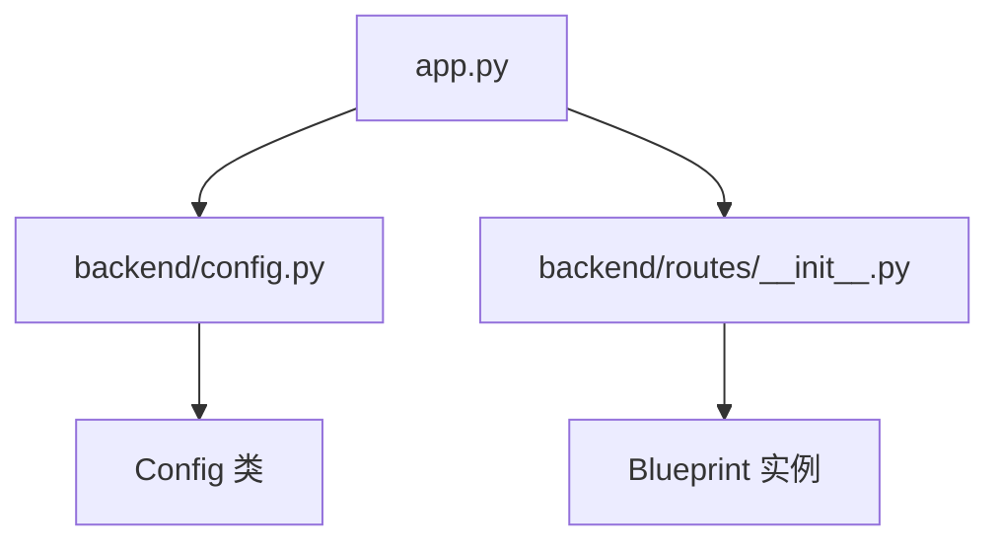

<!-- wiki_page_id: page-3 -->

<details>
<summary>Relevant source files</summary>

The following files were used as context for generating this wiki page:

- [app.py](https://github.com/zhk0567/NEXUS/blob/main/app.py)
- [backend/__init__.py](https://github.com/zhk0567/NEXUS/blob/main/backend/__init__.py)
- [backend/config.py](https://github.com/zhk0567/NEXUS/blob/main/backend/config.py)
- [backend/routes/__init__.py](https://github.com/zhk0567/NEXUS/blob/main/backend/routes/__init__.py)
</details>

# 系统架构概览

NEXUS 是一个基于 Flask 的轻量级 Web 应用框架，采用模块化设计，核心组件包括应用入口、配置管理和路由系统。

## 核心组件

### 应用入口 (app.py)
应用的主入口文件，负责创建 Flask 应用实例、加载配置和注册蓝图。

```python
from flask import Flask
from backend.config import Config
from backend.routes import bp as main_bp

def create_app():
    app = Flask(__name__)
    app.config.from_object(Config)
    app.register_blueprint(main_bp)
    return app
```

### 配置管理 (backend/config.py)
集中管理应用配置，包括调试模式、主机和端口设置。

```python
class Config:
    DEBUG = True
    HOST = '0.0.0.0'
    PORT = 5000
```

### 路由系统 (backend/routes/__init__.py)
定义应用的 URL 路由和视图函数，使用 Flask 蓝图实现模块化路由注册。

```python
from flask import Blueprint, render_template

bp = Blueprint('main', __name__)

@bp.route('/')
def index():
    return render_template('index.html')
```

## 架构特点

### 模块化设计
- 应用通过 `create_app()` 工厂函数创建，支持不同环境的配置
- 路由使用蓝图机制，便于功能模块的扩展和维护
- 配置与应用逻辑解耦，便于环境适配

### 依赖关系


### 数据流
1. 应用启动时执行 `create_app()`
2. 从 `Config` 加载配置参数
3. 注册主蓝图 `main_bp` 到 Flask 应用
4. 路由蓝图处理 HTTP 请求并返回响应

## 扩展点

- 通过修改 `Config` 类调整运行参数
- 在 `backend/routes/` 目录下新增蓝图模块扩展功能
- 通过应用工厂模式支持多实例部署

该架构设计确保了代码的可维护性和可扩展性，适用于小到中型的 Web 应用开发。