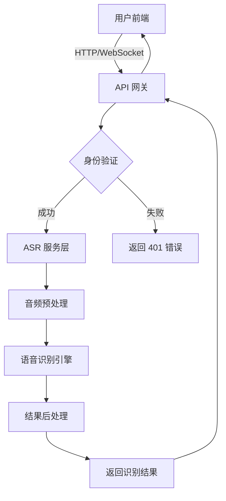

<!-- wiki_page_id: page-4 -->

<details>
<summary>Relevant source files</summary>

The following files were used as context for generating this wiki page:

- [backend/asr_service.py](https://github.com/zhk0567/NEXUS/blob/main/backend/asr_service.py)
- [backend/routes/asr_routes.py](https://github.com/zhk0567/NEXUS/blob/main/backend/routes/asr_routes.py)
- [backend/routes/realtime_routes.py](https://github.com/zhk0567/NEXUS/blob/main/backend/routes/realtime_routes.py)
- [backend/routes/auth_routes.py](https://github.com/zhk0567/NEXUS/blob/main/backend/routes/auth_routes.py)</details>

# 数据流与交互

## 概述

NEXUS 系统采用模块化架构，核心围绕语音识别（ASR）服务展开数据流与交互。用户通过 Web 界面或 API 触发语音处理请求，系统完成身份验证、音频处理、语音识别及结果返回的完整链条。

## 核心组件

### 后端服务模块

| 组件 | 负责职责 |
|------|----------|
| `asr_service.py` | 核心 ASR 引擎封装，处理音频流并调用识别模型 |
| `asr_routes.py` | 处理同步语音识别请求的 REST API 路由 |
| `realtime_routes.py` | 管理实时语音流的 WebSocket 连接 |
| `auth_routes.py` | 用户身份验证与令牌管理 |

### 数据流方向



## 详细交互流程

### 1. 身份验证阶段

用户请求首先到达 `auth_routes.py` 中的端点：
- 登录接口 `/api/auth/login` 验证凭证并返回 JWT 令牌
- 后续所有受保护端点通过 `verify_token` 中间件验证令牌有效性
- 令牌携带用户身份信息，用于审计和权限控制

### 2. 同步语音识别流程

通过 `asr_routes.py` 处理：
1. 用户上传音频文件至 `/api/asr/transcribe` 端点
2. 系统调用 `asr_service.py` 中的 `transcribe_audio` 函数
3. 音频经过采样率转换、噪声抑制等预处理
4. 调用底层 ASR 模型（如 Whisper）进行识别
5. 返回包含文本、时间戳、置信度的 JSON 响应

### 3. 实时语音流处理

通过 `realtime_routes.py` 管理 WebSocket 连接：
1. 建立连接后，服务器发送欢迎消息确认会话
2. 客户端持续发送二进制音频块
3. 服务器缓存音频流，达到阈值（如 1秒）后触发识别
4. 使用 `asr_service.py` 的流式识别接口处理音频块
5. 识别结果通过 WebSocket 实时推送至客户端
6. 支持端点检测和中间结果更新

## 关键数据结构

### 音频处理管道

在 `asr_service.py` 中定义：
- 输入：原始 PCM 音频字节流或文件
- 预处理：重采样至 16kHz 单声道，归一化
- 模型输入：符合 Whisper 等模型要求的特征序列
- 输出：时间戳级别的转录结果

### WebSocket 消息格式

在 `realtime_routes.py` 中约定：
- 客户端 → 服务器：二进制音频帧
- 服务器 → 客户端：JSON 消息
  ```json
  {
    "type": "transcript",
    "text": "识别的文本",
    "is_final": false,
    "timestamp": 1234567890
  }
  ```

## 错误处理与容错

- 所有 API 路由统一使用异常捕获中间件
- ASR 服务异常转换为 HTTP 500 或 WebSocket 错误消息
- 音频格式不支持时返回 400 错误及具体提示
- 网络中断时，WebSocket 会自动尝试重连（由客户端实现）

## 性能考量

- 音频预处理采用流式处理，避免一次性加载大文件
- 实时识别使用滑动窗口策略平衡延迟与准确率
- 模型推理批处理大小可通过环境变量调节
- 建议使用 GPU 加速以获得最佳吞吐量

## 安全机制

- 所有传输通过 HTTPS/WSS 加密（反向代理层实现）
- 令牌采用 HS256 算法签名，定期轮换
- 音频数据仅在内存中处理，不持久化存储
- 速率限制防止 API 滥用（在路由层配置）</details>