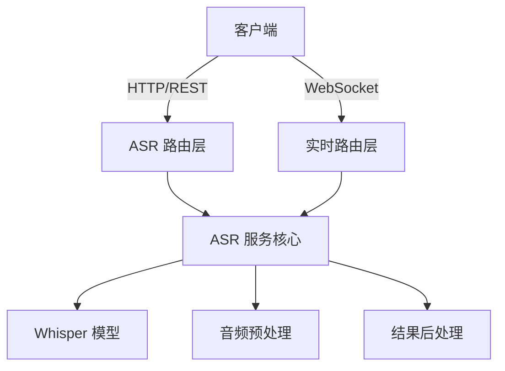

<!-- wiki_page_id: page-5 -->

# 语音识别服务

## 概述

语音识别服务（ASR Service）是 NEXUS 系统中的核心组件，负责将音频流转换为文本。该服务支持实时流式识别和批量文件识别，基于 Whisper 模型实现，提供 RESTful API 接口和 WebSocket 实时通信能力。

## 系统架构



## 核心组件

### ASR 服务核心 (`backend/asr_service.py`)

ASR 服务核心实现了音频处理流程，包括：

1. 音频预处理：采样率转换、噪声抑制、音量归一化
2. 特征提取：梅尔频谱图计算
3. 模型推理：使用 Whisper 进行语音识别
4. 结果后处理：文本清理、时间戳对齐、置信度评估

关键类和方法：
- `ASRService`：主服务类
- `transcribe_file()`：批量文件识别方法
- `transcribe_stream()`：流式识别方法
- `_preprocess_audio()`：音频预处理
- `_postprocess_result()`：结果后处理

### 路由层

#### REST API 路由 (`backend/routes/asr_routes.py`)
提供同步的音频文件识别接口：
- `POST /asr/transcribe`：上传音频文件进行识别
- `GET /asr/models`：获取可用模型列表
- `GET /asr/health`：服务健康检查

#### 实时 WebSocket 路由 (`backend/routes/realtime_routes.py`)
提供流式识别能力：
- `WebSocket /realtime/transcribe`：建立实时识别连接
- 支持音频流分块传输
- 实时返回识别结果和中间状态

## 音频处理流程

1. **输入阶段**
   - 支持多种音频格式：WAV, MP3, FLAC, OGG
   - 采样率范围：8kHz - 48kHz（内部统一转换为 16kHz）
   - 单声道处理（多声道自动转换为单声道）

2. **预处理阶段**
   - 音量归一化：防止剪裁和过小信号
   - 降噪：简单谱减法或更高级的噪声抑制
   - 静音检测：去除无语音段落以提高效率

3. **识别阶段**
   - 使用 Whisper 模型进行编码器-解码器推理
   - 支持多种模型尺寸：tiny, base, small, medium, large
   - 自动语言检测或指定语言模式

4. **输出阶段**
   - 原始转录文本
   - 时间戳信息（字级或词级）
   - 语言概率分布
   - 置信度分数

## API 接口

### REST 接口

#### 转录音频文件
```http
POST /asr/transcribe
Content-Type: multipart/form-data

Parameters:
- file: 音频文件 (必需)
- language: 语言代码 (可选, 如 "zh", "en")
- model: 模型尺寸 (可选, 默认 "base")
- prompt: 初始提示词 (可选)
- temperature: 采样温度 (可选, 默认 0.0)

Response:
{
  "text": "识别的文本",
  "language": "检测到的语言",
  "duration": 音频时长(秒),
  "segments": [
    {
      "id": 段落ID,
      "seek": 开始位置,
      "start": 开始时间,
      "end": 结束时间,
      "text": 段落文本,
      "tokens": [token列表],
      "temperature": 温度,
      "avg_logprob": 平均对数概率,
      "completion_ratio": 完成比例,
      "no_speech_prob": 无语音概率
    }
  ]
}
```

#### 健康检查
```http
GET /asr/health
Response:
{
  "status": "healthy",
  "model_loaded": true,
  "model_size": "base",
  "device": "cuda" 或 "cpu"
}
```

### WebSocket 实时接口

#### 连接建立
```javascript
const ws = new WebSocket('ws://server/realtime/transcribe');
```

#### 消息协议

客户端发送音频数据：
```json
{
  "type": "audio",
  "data": "base64编码的PCM音频数据",
  "sample_rate": 16000,
  "channels": 1
}
```

服务器返回识别结果：
```json
{
  "type": "transcript",
  "text": "部分或完整识别文本",
  "is_final": true/false,
  "timestamp": 时间戳,
  "confidence": 置信度分数
}
```

控制消息：
```json
{
  "type": "config",
  "language": "zh",
  "model": "base",
  "vad_filter": true
}
```

## 配置选项

### 模型配置
- 支持的 Whisper 模型：tiny, base, small, medium, large
- 模型存储路径：可通过环境变量 `WHISPER_MODEL_DIR` 配置
- 自动模型下载：首次使用时自动从 Hugging Face 下载

### 性能优化
- 批处理大小：可调整以平衡延迟和吞吐量
- 线程数：CPU 推理时的工作线程数
- GPU 加速：自动检测并使用 CUDA（如果可用）
- 内存管理：音频缓冲区大小和模型加载策略

### 语言支持
- 自动语言检测：支持 90+ 种语言
- 指定语言模式：强制使用特定语言进行识别
- 语言代码标准：使用 ISO 639-1 两字母代码

## 错误处理

服务定义了以下错误类型：
- `InvalidAudioError`: 音频格式不支持或损坏
- `ModelLoadError`: 模型加载失败
- `ProcessingError`: 音频处理过程中发生错误
- `TimeoutError`: 处理超时
- `ResourceError`: 系统资源不足

所有错误通过标准 HTTP 状态码返回：
- 400: 客户端错误（无效输入）
- 422: 处理错误（服务器无法处理有效请求）
- 500: 内部服务器错误
- 503: 服务不可用（模型加载中或资源耗尽）

## 与其他系统的集成

### 前端集成
- 提供 JavaScript SDK 用于 Web 应用实时语音识别
- 支持 React、Vue 和原生 JavaScript 框架
- 包含音频捕获、噪声抑制和结果展示组件

### 后端服务
- 可被其他微服务通过 HTTP 或 gRPC 调用
- 支持认证和速率限制中间件
- 可配置为独立服务或作为单体应用的一部分

### 存储与日志
- 识别结果可选持久化到数据库
- 详细的访问日志和性能指标
- 支持结构化日志输出（JSON 格式）便于 ELK 堆栈集成

## 性能基准

| 模型尺寸 | 相对速度 (CPU) | 相对速度 (GPU) | 内存占用 | 典型准确率 |
|----------|----------------|------------------|----------|------------|
| tiny     | 1x             | 5x               | ~1 GB    | 较低       |
| base     | 0.5x           | 2.5x             | ~1 GB    | 中等       |
| small    | 0.25x          | 1.5x             | ~2 GB    | 良好       |
| medium   | 0.1x           | 0.8x             | ~5 GB    | 很好       |
| large    | 0.05x          | 0.4x             | ~10 GB   | 优秀       |

注：速度基于 16kHz 单声道音频的实时因子 (RTF)，1.0 表示实时处理。

## 安全考虑

- 输入验证：所有上传文件进行大小、类型和内容检查
- 防止 DoS：实现速率限制和并发连接控制
- 数据隐私：音频数据在处理后立即从内存中清除
- 传输安全：WebSocket 连接支持 WSS（TLS 加密）
- 模型安全：仅从可信来源加载模型文件

## 部署指南

### 环境要求
- Python 3.8+
- PyTorch 1.9+ 与对应的 CUDA 版本（如果使用 GPU）
- ffmpeg 用于音频格式转换
- 至少 2GB 可用内存（基础模型）

### 安装步骤
```bash
# 克隆仓库
git clone https://github.com/zhk0567/NEXUS.git
cd NEXUS

# 安装依赖
pip install -r requirements.txt

# 下载模型（首次运行时自动完成）
# 或手动预下载
python -c "import whisper; whisper.load_model('base')"

# 启动服务
uvicorn main:app --host 0.0.0.0 --port 8000
```

### 生产环境建议
- 使用 Gunicorn 或 ubertnetic 作为生产服务器
- 配置反向代理（Nginx）处理 SSL 终止
- 设置日志轮换和监控告警
- 考虑使用 Docker 进行容器化部署
- 实施健康检查和自动重启策略

## 未来改进方向

1. **模型优化**
   - 集成更高效的端到端模型（如 Whisper.cpp）
   - 实现模型量化和剪枝以降低资源消耗
   - 添加领域适配能力（医疗、法律等专业术语）

2. **功能增强**
   - 说话人分离和识别
   - 情感分析和意图识别
   - 多语言混合识别支持
   - 实时翻译功能

3. **架构演进**
   - 微服务化拆分（预处理、识别、后处理独立服务）
   - 添加缓存层以加速重复内容识别
   - 实现分布式处理以支持大规模并发
   - 集成主动学习机制持续改进模型

## 故障排除

### 常见问题
- **模型加载失败**：检查磁盘空间和网络连接，确保有权限写入模型缓存目录
- **识别准确率低**：验证音频质量，尝试调整语言参数或使用更大模型
- **延迟过高**：检查硬件利用率，考虑使用 GPU 或减小模型尺寸
- **内存溢出**：减少批处理大小或升级到更大内存的机器
- **WebSocket 连接频繁断开**：检查网络稳定性和服务器负载

### 调试技巧
- 启用详细日志：设置环境变量 `LOG_LEVEL=DEBUG`
- 使用音频可视化工具检查输入信号质量
- 监控 GPU/CPU 使用率和内存消耗
- 检查 WebSocket 心跳和超时设置
- 查看容器日志和事件以诊断部署问题

--- 

*本文档基于 NEXUS 项目源代码生成，旨在提供语音识别服务的技术参考和使用指南。*
