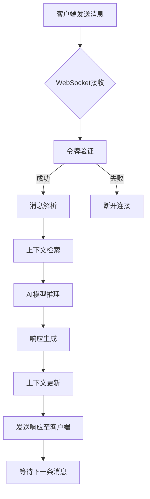

<!-- wiki_page_id: page-6 -->

# AI对话服务

## 概述
AI对话服务是NEXUS系统的核心功能模块，负责处理用户与AI模型之间的实时交互。该服务通过WebSocket连接提供低延迟的对话体验，支持多轮对话、上下文管理以及个性化响应生成。

## 系统架构

### 核心组件
- **WebSocket连接管理**：处理客户端连接的建立、维护和断开
- **认证与授权**：验证用户身份并确保对话安全
- **消息处理流水线**：接收用户输入、调用AI模型、返回响应
- **上下文管理**：维护对话历史以支持多轮交互

### 技术栈
- 后端框架：FastAPI
- 实时通信：WebSocket
- 身份验证：JWT令牌
- 数据存储：内存缓存（用于会话上下文）

## 功能特性

### 实时通信
AI对话服务基于WebSocket协议实现全双工通信，确保消息传递的低延迟和高可靠性。连接生命周期包括：
1. 客户端发起WebSocket握手请求
2. 服务器验证JWT令牌进行身份认证
3. 建立持久连接进行数据交换
4. 心跳机制维持连接状态
5. 优雅关闭连接释放资源

### 安全机制
- 所有WebSocket连接必须携带有效的JWT访问令牌
- 令牌验证失败时立即断开连接
- 支持令牌刷新机制延长会话有效期
- 防止未授权访问和中间人攻击

### 消息处理流程


## 接口规范

### WebSocket端点
- **URL**: `/ws/chat/{client_id}`
- **方法**: WebSocket连接
- **路径参数**:
  - `client_id`: 客户端唯一标识符（字符串）
- **查询参数**:
  - `token`: JWT访问令牌（必填）

### 消息格式
#### 客户端 → 服务器
```json
{
  "type": "chat_message",
  "content": "用户输入的文本内容",
  "metadata": {
    "timestamp": "ISO 8601格式时间戳",
    "client_info": {
      "user_agent": "浏览器信息",
      "version": "客户端版本"
    }
  }
}
```

#### 服务器 → 客户端
```json
{
  "type": "ai_response",
  "content": "AI生成的响应文本",
  "metadata": {
    "timestamp": "ISO 8601格式时间戳",
    "model_info": {
      "name": "使用的AI模型名称",
      "version": "模型版本"
    },
    "usage": {
      "prompt_tokens": 输入token数量,
      "completion_tokens": 输出token数量,
      "total_tokens": 总token数量
    }
  }
}
```

### 系统消息类型
| 消息类型 | 方向 | 描述 |
|----------|------|------|
| `chat_message` | 客户端→服务器 | 用户发送的聊天消息 |
| `ai_response` | 服务器→客户端 | AI生成的响应 |
| `connection_established` | 服务器→客户端 | 连接成功建立 |
| `connection_error` | 服务器→客户端 | 连接过程中发生错误 |
| `ping` | 双向 | 心跳检测消息 |
| `pong` | 双向 | 心跳响应消息 |

## 实现细节

### 连接管理
在`backend/routes/realtime_routes.py`中实现了WebSocket连接处理逻辑：
- 使用`websocket.accept()`建立连接
- 通过`Depends(get_current_user)`验证JWT令牌
- 维护活跃连接字典以支持广播功能
- 实现异常处理机制确保连接异常时正确清理资源

### 认证集成
服务与`backend/routes/auth_routes.py`中的认证系统紧密集成：
- 复用JWT令牌生成和验证逻辑
- 共享用户会话管理机制
- 统一的错误响应格式
- 支持相同的密码加密和盐值策略

### 错误处理
- 连接建立失败：返回403错误码
- 令牌过期：主动断开连接并提示重新登录
- 消息解析错误：发送错误消息给客户端但保持连接
- AI服务不可用：返回服务不可用提示并建议稍后重试
- 意外异常：记录日志并优雅关闭连接

## 性能优化

### 连接效率
- 使用异步I/O操作避免阻塞
- 实现连接复用减少握手开销
- 采用消息批处理降低频繁小包传输
- 启用WebSocket压缩扩展（permessage-deflate）

### 资源管理
- 设置最大连接数限制防止资源耗尽
- 实现空闲连接超时机制
- 使用弱引用避免内存泄漏
- 定期清理过期的会话上下文

### 响应延迟优化
- 流式响应生成减少首字节延迟
- 预热AI模型降低冷启动时间
- 智能上下文截断控制token消耗
- 本地缓存常用响应模板

## 部署与配置

### 环境变量
| 变量名 | 描述 | 默认值 |
|--------|------|--------|
| `WS_HEARTBEAT_TIMEOUT` | 心跳超时时间（秒） | 30 |
| `WS_MAX_CONNECTIONS` | 最大并发WebSocket连接数 | 1000 |
| `AI_MODEL_NAME` | 使用的AI模型标识 | "gpt-3.5-turbo" |
| `CONTEXT_WINDOW_SIZE` | 对话上下文窗口大小 | 4096 |

### 监控与日志
- 记录所有WebSocket连接事件（建立、断开、错误）
- 监控消息吞吐量和平均响应延迟
- 跟踪认证失败率和异常断开原因
- 支持通过Prometheus导出关键指标

## 使用示例

### 建立连接
```javascript
const token = "your_jwt_token_here";
const clientId = "user_123";
const ws = new WebSocket(`ws://localhost:8000/ws/chat/${clientId}?token=${token}`);

ws.onopen = () => {
  console.log('Connected to AI chat service');
};

ws.onmessage = (event) => {
  const data = JSON.parse(event.data);
  if (data.type === 'ai_response') {
    console.log('AI Response:', data.content);
  }
};

ws.onclose = () => {
  console.log('Disconnected from AI chat service');
};
```

### 发送消息
```javascript
ws.send(JSON.stringify({
  type: 'chat_message',
  content: '你好，今天天气怎么样？',
  metadata: {
    timestamp: new Date().toISOString()
  }
}));
```

## 未来改进方向
1. 引入对话摘要功能以支持更长的上下文窗口
2. 添加多模态输入支持（图像、语音）
3. 实现对话主题检测和切换
4. 添加个性化AI角色定制功能
5. 引入反馈机制持续优化模型响应质量
6. 支持对话导出和共享功能
7. 实现多语言实时翻译对话
8. 添加内容安全过滤和合规性检查</response>
