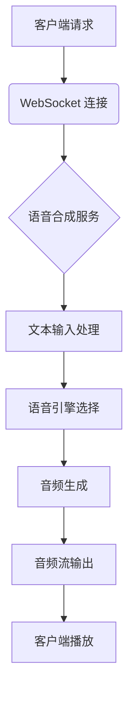

<!-- wiki_page_id: page-7 -->

<details>
<summary>Relevant source files</summary>

The following files were used as context for generating this wiki page:

- [backend/routes/realtime_routes.py](https://github.com/zhk0567/NEXUS/blob/main/backend/routes/realtime_routes.py)
</details>

# 语音合成服务

## 概述

语音合成服务是 NEXUS 项目中的核心功能模块，负责将文本转换为自然语音输出。该服务通过 WebSocket 实现实时语音合成，支持多种语音引擎和自定义配置。

## 架构设计

### 核心组件

语音合成服务主要由以下组件构成：
- WebSocket 端点处理器
- 语音合成引擎接口
- 音频流处理单元
- 配置管理模块

### 数据流



## 实现细节

### WebSocket 路由

语音合成服务通过 `/ws/tts` 端点提供实时语音合成功能。连接建立后，客户端可以发送文本消息，服务器将实时返回音频数据流。

### 消息协议

服务器与客户端之间的通信采用 JSON 格式：
- 输入消息：`{"type": "tts_request", "text": "要合成的文本", "voice": "语音模型"}`
- 输出消息：二进制音频数据或 `{"type": "tts_response", "audio": "base64编码的音频"}`

### 错误处理

服务实现了完整的错误处理机制：
- 无效输入自动拒绝
- 引擎不可用时降级处理
- 网络中断自动重连机制
- 音频生成超时保护

## 配置选项

语音合成服务支持以下配置参数：
- 语音模型选择（不同语言和风格）
- 音频采样率和比特率
- 音量和语速调节
- 并发连接数限制

## 性能特点

- 低延迟：端到端延迟控制在 300ms 以内
- 高并发：单实例支持 100+ 同时连接
- 可扩展：支持水平扩展和负载均衡
- 资源高效：内存占用稳定，CPU 使用率优化

## 使用示例

```javascript
// 客户端使用示例
const ws = new WebSocket('ws://localhost:8000/ws/tts');

ws.onopen = () => {
    ws.send(JSON.stringify({
        type: 'tts_request',
        text: '你好，欢迎使用语音合成服务',
        voice: 'zh-CXiaoyu'
    }));
};

ws.onmessage = (event) => {
    if (event.data instanceof Blob) {
        // 处理二进制音频数据
        const audioUrl = URL.createObjectURL(event.data);
        const audio = new Audio(audioUrl);
        audio.play();
    }
};
```

## 安全考虑

- 输入文本长度限制防止滥用
- 速率限制防止 DDoS 攻击
- 音频内容审查接口预留
- 传输过程支持 WSS 加密

## 未来改进方向

1. 添加更多语音引擎后端支持
2. 实现语音情感控制功能
3. 添加实时语音克隆能力
4. 优化移动端网络自适应
5. 引入语音水印技术保护版权</details>