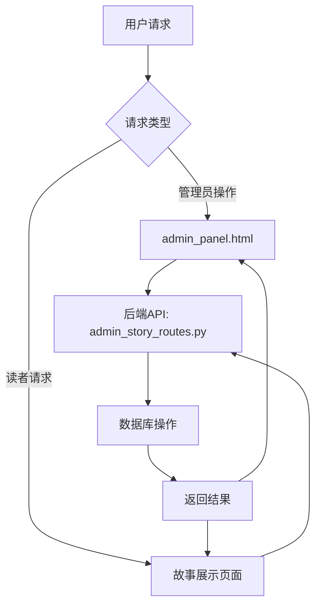

<!-- wiki_page_id: page-8 -->

Relevant source files

The following files were used as context for generating this wiki page:

- [backend/routes/admin_story_routes.py](https://github.com/zhk0567/NEXUS/blob/main/backend/routes/admin_story_routes.py)
- [admin_panel.html](https://github.com/zhk0567/NEXUS/blob/main/admin_panel.html)

# 故事阅读系统

## 概述
故事阅读系统是NEXUS平台的核心功能模块，负责故事内容的创建、管理、展示和交互。该系统通过后端API路由和前端管理界面协同工作，提供完整的故事生命周期管理。

## 系统架构

### 后端路由模块
故事阅读系统的后端实现主要通过`backend/routes/admin_story_routes.py`文件提供RESTful API接口，支持故事的增删改查操作。

### 前端管理界面
管理员可以通过`admin_panel.html`界面进行故事的可视化管理，包括内容编辑、状态控制和数据统计。

## 功能特性

### 故事管理
- 创建新故事：支持标题、内容、作者等基本信息输入
- 编辑现有故事：实时更新故事内容和元数据
- 删除故事：安全删除故事及其关联数据
- 状态管理：支持故事的发布、草稿、归档等状态切换

### 内容展示
- 响应式设计：适配不同设备的阅读体验
- 多媒体支持：集成图片、视频等多媒体内容
- 阅读进度追踪：记录用户的阅读位置和进度

### 权限控制
- 管理员权限：仅限管理员通过后台界面进行故事管理
- 读者权限：普通用户可浏览已发布的故事内容

## API接口

### 故事操作接口
| 方法 | 路径 | 功能描述 |
|------|------|----------|
| GET | /api/stories | 获取故事列表 |
| POST | /api/stories | 创建新故事 |
| GET | /api/stories/{id} | 获取特定故事详情 |
| PUT | /api/stories/{id} | 更新故事信息 |
| DELETE | /api/stories/{id} | 删除故事 |

### 数据模型
故事数据模型包含以下核心字段：
- `id`: 故事唯一标识符
- `title`: 故事标题
- `content`: 故事正文内容
- `author`: 作者信息
- `status`: 故事状态（草稿/发布/归档）
- `created_at`: 创建时间
- `updated_at`: 最后更新时间

## 前端界面

### 管理面板功能
`admin_panel.html`提供了完整的故事管理界面，包括：
- 故事列表展示表格
- 搜索和过滤功能
- 批量操作工具
- 详细编辑表单
- 状态切换开关

### 用户交互
- 拖拽排序：支持手动调整故事展示顺序
- 实时预览：编辑时即时查看效果
- 确认机制：关键操作（如删除）需要二次确认
- 消息反馈：操作结果通过Toast消息及时反馈

## 数据流程

## 安全特性
- 输入验证：所有用户输入均经过严格验证和过滤
- SQL注入防护：使用参数化查询防止SQL注入
- XSS防护：输出内容进行适当转义
- CSRF保护：管理员操作包含CSRF令牌验证
- 权限验证：所有敏感操作均需管理员权限验证

## 性能优化
- 分页加载：故事列表采用分页机制减少首次加载时间
- 缓存策略：热门故事采用缓存提升访问速度
- 异步加载：非关键资源采用异步加载方式
- 数据库索引：对常用查询字段建立索引提升查询效率

## 扩展性设计
- 插件机制：支持通过插件扩展故事功能
- 主题系统：可自定义故事展示样式
- 多语言支持：界面和内容支持多语言切换
- 插件市场：预留接口支持第三方插件集成

## 部署与维护
- 环境要求：Python 3.8+, Node.js 14+
- 依赖管理：通过requirements.txt和package.json管理依赖
- 配置项：支持环境变量配置数据库连接、缓存等
- 日志系统：完整的操作日志和错误追踪
- 备份策略：自定义备份脚本支持定期数据备份