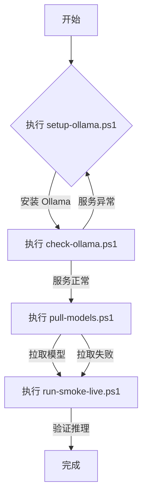

<!-- wiki_page_id: page-10 -->

# Ollama 本地模型使用指南

## 系统概述

本指南介绍了在 llm-agents 项目中如何使用 Ollama 进行本地大语言模型的部署、管理和测试。通过提供的一系列 PowerShell 脚本和配置文件，用户可以快速搭建本地模型环境，进行模型拉取、服务验证和烟雾测试。

## 功能模块

### 1. 环境初始化 (setup-ollama.ps1)

`setup-ollama.ps1` 脚本负责 Ollama 服务的初始安装和配置。

#### 主要功能
- 检查并安装 Ollama（如果未安装）
- 配置 Ollama 服务以在后台运行
- 设置必要的环境变量
- 验证安装是否成功

#### 使用方法
```powershell
.\scripts\setup-ollama.ps1
```

### 2. 服务状态检查 (check-ollama.ps1)

`check-ollama.ps1` 用于验证 Ollama 服务是否正常运行以及 API 是否可达。

#### 检查内容
- Ollama 服务进程状态
- 本地 API 端口（默认 11434）是否响应
- 模型列表接口是否可访问

#### 使用方法
```powershell
.\scripts\check-ollama.ps1
```

### 3. 模型管理 (pull-models.ps1)

`pull-models.ps1` 根据配置文件自动拉取指定的大语言模型。

#### 配置驱动
读取 `config/ollama.json` 中定义的模型列表，支持多模型批量拉取。

#### 使用方法
```powershell
.\scripts\pull-models.ps1
```

### 4. 烟雾测试 (run-smoke-live.ps1)

`run-smoke-live.ps1` 执行端到端的功能验证，确保模型能够正常响应推理请求。

#### 测试流程
- 发送测试提示词到指定模型
- 验证返回结果是否符合预期格式
- 检查响应延迟和成功率

#### 使用方法
```powershell
.\scripts\run-smoke-live.ps1
```

## 配置文件说明

### config/ollama.json

定义 Ollama 服务的行为和要管理的模型。

#### 结构示例
```json
{
  "models": [
    {
      "name": "llama2",
      "tag": "7b",
      "pull": true
    },
    {
      "name": "codellama",
      "tag": "7b",
      "pull": true
    }
  ],
  "server": {
    "host": "localhost",
    "port": 11434
  }
}
```

#### 字段说明
- `models`: 要拉取和使用的模型列表
  - `name`: 模型名称（如 llama2、codellama）
  - `tag`: 模型版本或大小标识（如 7b、13b）
  - `pull`: 是否在初始化时自动拉取
- `server`: Ollama 服务连接配置
  - `host`: 服务主机地址
  - `port`: 服务端口号

## 工作流程



## 使用注意事项

1. 确保具有管理员权限以安装服务和修改系统配置
2. 首次运行可能需要较长时间用于模型下载（取决于网络和模型大小）
3. 建议在资源充足的机器上运行（特别是较大模型如 13B+ 参数）
4. 服务默认监听本地端口 11434，确保防火墙允许本地访问
5. 模型数据存储在默认的 Ollama 数据目录中，可通过环境变量 `OLLAMA_MODELS` 自定义

## 故障排除

| 症状 | 可能原因 | 解决方案 |
|------|----------|----------|
| Ollama 服务未启动 | 安装失败或服务崩溃 | 重新运行 setup-ollama.ps1 并检查输出日志 |
| API 无法连接 | 服务未运行或端口被占用 | 检查服务状态，更改 config/ollama.json 中的端口 |
| 模型拉取失败 | 网络问题或模型名称错误 | 验证网络连接，检查模型名称和标签是否正确 |
| 烟雾测试失败 | 模型未正确加载或提示词问题 | 确认模型已成功拉取，检查 run-smoke-live.ps1 中的测试提示词 |

## 最佳实践

- 在生产环境中，考虑将 Ollama 服务作为系统服务启动以确保可靠性
- 定义明确的模型版本策略，避免因模型更新导致的不兼容性
- 监控资源使用情况（特别是内存和显存），根据负载调整并发请求数
- 将敏感配置（如自定义端点）通过环境变量注入，而非硬编码在脚本中</details>
