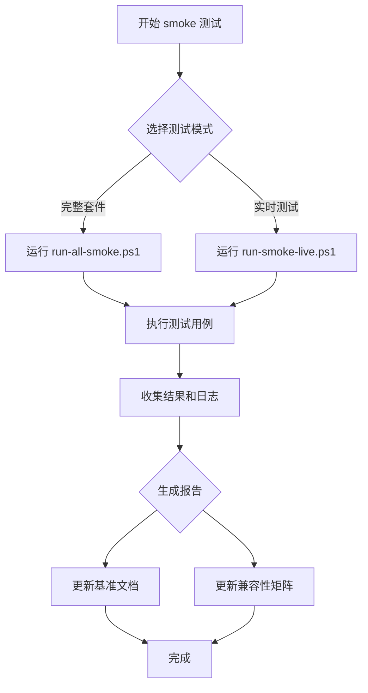

<!-- wiki_page_id: page-12 -->

# Smoke 测试与验证

## 概述

Smoke 测试是 llm-agents 项目中的自动化验证机制，用于快速检查核心功能是否正常工作。该系统通过 PowerShell 脚本执行一系列预定义的测试用例，验证代理（Agent）在不同配置下的基本行为，并生成可追踪的测试结果和性能基准。

## 核心组件

### 脚本系统

Smoke 测试由三个主要 PowerShell 脚本驱动：

1. **run-all-smoke.ps1** - 执行完整的 smoke 测试套件
2. **run-smoke-live.ps1** - 运行针对真实服务的实时测试
3. **update-matrix-from-smoke.ps1** - 根据测试结果更新兼容性矩阵

### 测试验证

项目包含以下测试文件以确保 smoke 测试系统本身的正确性：

- `tests/test_config.py` - 验证配置加载和解析逻辑
- `tests/test_mock_search.py` - 测试模拟搜索功能的行为

### 文档和日志

- `docs/smoke-log.txt` - 记录历史 smoke 测试运行的详细输出
- `docs/benchmarks.md` - 包含性能基准和趋势分析

## 工作流程

## 配置验证

根据 `tests/test_config.py`，smoke 测试系统验证以下配置方面：

- 配置文件的存在和可读性
- 必需字段的存在（如 API 端点、模型名称）
- 数据类型正确性（字符串、整数、布尔值）
- 默认值的正确应用

## 模拟搜索测试

`tests/test_mock_search.py` 确保 smoke 测试中使用的模拟搜索组件：

- 正确返回预定义的测试数据
- 按预期处理查询参数
- 在不同输入条件下保持一致行为
- 正确处理边界情况（空结果、异常等）

## 性能基准

根据 `docs/benchmarks.md`，smoke 测试用于建立以下性能基准：

- Agent 初始化时间
- 响应延迟（不同上下文长度）
- 吞吐量测量（请求/秒）
- 资源消耗监控（内存、CPU）

## 日志记录

`docs/smoke-log.txt` 包含详细的执行记录，包括：

- 时间戳和测试运行 ID
- 每个测试用例的通过/失败状态
- 错误消息和堆栈跟踪（如适用）
- 性能指标和资源使用情况
- 环境信息（Python 版本、依赖项等）

## 更新矩阵

`update-matrix-from-smoke.ps1` 脚本负责：

- 解析 smoke 测试结果
- 根据通过/失败状态更新功能兼容性矩阵
- 生成易于阅读的状态报告
- 维护历史趋势数据以检测回归

## 最佳实践

1. **隔离环境**：smoke 测试应在干净、受控的环境中运行
2. **幂等性**：测试运行应产生一致的结果
3. **快速反馈**：设计为在几分钟内完成
4. **全面覆盖**：涵盖核心功能而非边缘情况
5. **可观察性**：提供清晰的通过/失败指标和诊断信息

## 故障排除

常见问题及解决方案参考 `docs/smoke-log.txt`：

- 配置错误：检查 `test_config.py` 中的验证规则
- 服务不可用：验证网络连接和服务端点
- 性能退化：与 `benchmarks.md` 中的基准进行比较
- 测试不稳定：查找资源竞争或时序问题的迹象

## 集成点

Smoke 测试系统与以下组件集成：

- 持续集成管道（通过 GitHub Actions 或类似系统）
- 发布门禁机制
- 性能监控仪表板
- 开发者本地工作流程（通过脚本直接调用）

此系统确保在代码合并到主分支之前，llm-agents 的核心功能保持稳定和可靠。
