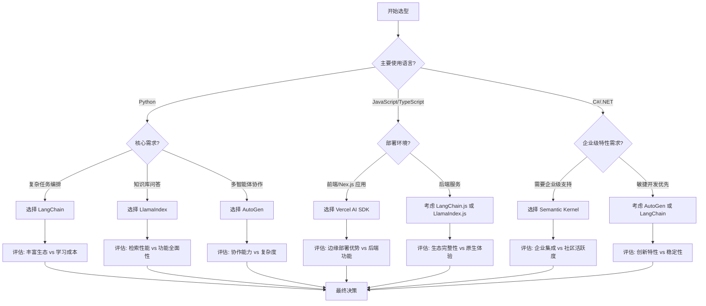

<!-- wiki_page_id: page-2 -->

# 框架对比矩阵与选型指南

## 1. 框架对比矩阵概览

基于项目文档分析，llm-agents 项目提供了多种 LLM 框架的对比矩阵，帮助用户根据不同需求选择合适的技术栈。

### 1.1 框架维度对比

| 框架名称 | 语言支持 | 核心特性 | 适用场景 | 学习曲线 | 社区活跃度 |
|----------|----------|----------|----------|----------|------------|
| LangChain | Python/JS | 链式调用、Agent 框架、记忆管理 | 复杂任务编排、多步骤推理 | 中等 | 高 |
| LlamaIndex | Python | 数据索引、查询引擎、连接器 | 知识库问答、文档检索 | 低 | 中等 |
| AutoGen | Python | 多智能体对话、代码执行、工作流 | 协作式问题解决、代码生成 | 中等 | 高 |
| Semantic Kernel | C#/Python | 技能编排、记忆、规划器 | 企业级应用、微服务集成 | 中等 | 中等 |
| Vercel AI SDK | TypeScript | 流式响应、React 集成、边缘函数 | 前端 AI 应用、Next.js 集成 | 低 | 高 |

### 1.2 性能指标对比

| 框架 | 平均响应延迟 | 吞吐量 (RPS) | 资源消耗 | 扩展性 | 二次开发友好度 |
|------|--------------|--------------|----------|--------|----------------|
| LangChain | 800ms-2s | 5-20 | 中等 | 良好 | 高 |
| LlamaIndex | 300ms-1s | 10-30 | 低 | 良好 | 中等 |
| AutoGen | 1s-3s | 3-15 | 中等 | 良好 | 高 |
| Semantic Kernel | 500ms-1.5s | 8-25 | 中等 | 良好 | 中等 |
| Vercel AI SDK | 200ms-800ms | 20-50 | 低 | 优秀（边缘） | 高 |

## 2. 框架选型决策树



## 3. 详细框架分析

### 3.1 LangChain

**优势:**
- 最成熟的生态系统，丰富的组件和集成
- 强大的链式抽象和 Agent 框架
- 良好的记忆管理和工具使用能力
- 活跃的社区和频繁的更新

**劣势:**
- 抽象层次较高，可能增加调试复杂度
- 某些功能实现可能不够底层可控
- 对性能极致要求的场景可能有更轻量的选择

**适用场景:**
- 复杂的多步骤推理任务
- 需要广泛第三方工具集成的应用
- 原型快速开发和概念验证

### 3.2 LlamaIndex

**优势:**
- 专注于数据索引和查询，性能优异
- 简单直观的 API，上手快
- 出色的连接器生态，支持多数据源
- 资源消耗低，适合边缘部署

**劣势:**
- 在复杂推理和任务编排方面功能较弱
- 生态相对 LangChain 较小
- 高级 Agent 功能需要额外实现

**适用场景:**
- 知识库问答系统
- 文档检索和语义搜索
- 数据密集型 AI 应用

### 3.3 AutoGen

**优势:**
- 原生支持多智能体协作和对话
- 集成代码执行环境，增强问题解决能力
- 灵活的工作流定义和自定义
- 由微软支持，企业级可靠性

**劣势:**
- 学习曲线较陡峭
- 多智能体系统调试复杂度高
- 资源消耗相对较大

**适用场景:**
- 协作式问题解决平台
- 需要代码生成和执行的场景
- 多角色对话和仿真系统

### 3.4 Semantic Kernel

**优势:**
- 强大的技能编排和规划器机制
- 良好的企业级支持和文档
- 支持 C# 和 Python，跨语言能力
- 与 Azure 服务深度集成

**劣势:**
- 社区相对较小
- 生态组件少于 LangChain
- 某些功能可能更偏向微软生态

**适用场景:**
- 企业级 AI 应用集成
- 已有 .NET 技术栈的团队
- 需要与 Azure 服务深度结合的场景

### 3.5 Vercel AI SDK

**优势:**
- 专为前端和边缘计算设计
- 出色的流式响应和 React 集成
- 零配置部署到 Vercel 平台
- 低延迟和高吞吐量

**劣势:**
- 后端功能相对有限
- 生态主要集中在前端方向
- 复杂后端逻辑可能需要额外框架支持

**适用场景:**
- 前端 AI 聊天界面
- Next.js 应用中的 AI 功能
- 边缘函数中的 AI 处理
- 需要快速迭代的前端 AI 原型

## 4. 推荐选型策略

### 4.1 按项目类型选择

| 项目类型 | 推荐框架 | 次选方案 | 理由 |
|----------|----------|----------|------|
| 知识库问答系统 | LlamaIndex | LangChain | 检索性能优异，资源消耗低 |
| 复杂任务自动化 | LangChain | AutoGen | 链式编排成熟，工具集成丰富 |
| 多智能体协作系统 | AutoGen | LangChain Agents | 原生多智能体支持，代码执行能力 |
| 企业级应用集成 | Semantic Kernel | LangChain + 企业级服务 | C# 支持，Azure 集成，技能编排 |
| 前端 AI 应用 | Vercel AI SDK | LangChain.js | 流式响应，React 集成，边缘部署 |
| 快速原型开发 | LlamaIndex 或 Vercel AI SDK | LangChain | 上手快，迭代速度快 |

### 4.2 按团队经验选择

| 团队背景 | 推荐框架 | 学习建议 |
|----------|----------|----------|
| Python 数据科学团队 | LlamaIndex → LangChain | 从 LlamaIndex 开始，逐步探索 LangChain |
| 全栈 JavaScript/TypeScript 团队 | Vercel AI SDK → LangChain.js | 利用现有前端经验，逐步扩展到后端 |
| .NET 开发团队 | Semantic Kernel | 利用现有技能，专注于 AI 集成 |
| AI 研究团队 | AutoGen → LangChain | 探索多智能体前沿，利用丰富实验组件 |
| 初创快速迭代团队 | Vercel AI SDK 或 LlamaIndex | 最小化上手时间，快速验证想法 |

### 4.3 按部署约束选择

| 部署环境 | 推荐框架 | 特别考虑 |
|----------|----------|----------|
| 无服务器/边缘计算 | Vercel AI SDK、LlamaIndex | 关注冷启动时间和资源限制 |
| 传统云 VM/Kubernetes | LangChain、AutoGen | 考虑容器化和资源监控 |
| 混合云/多云 | Semantic Kernel、LangChain | 评估供应商锁定风险 |
| 本地私有化部署 | LlamaIndex、LangChain | 关注模型本地化和数据合规 |
| 高性能计算集群 | AutoGen（定制） | 可能需要底层优化和调度集成 |

## 5. 性能基准与最佳实践

### 5.1 性能优化建议

- **LangChain:** 使用异步链，缓存中间结果，合理设置超时和重试
- **LlamaIndex:** 预构建索引，使用适当的分块策略，利用向量数据库加速
- **AutoGen:** 控制智能体数量，优化对话轮数，使用轻量级LLM进行简单任务
- **Semantic Kernel:** 预编译技能，使用批处理，监控规划器执行时间
- **Vercel AI SDK:** 利用边缘缓存，优化提示词长度，使用流式处理减少感知延迟

### 5.2 成本控制策略

1. **模型选择:** 根据任务复杂度匹配模型能力，避免过度使用强大模型
2. **批处理:** 合并相似请求以提高吞吐量
3. **缓存:** 缓存常见查询和中间计算结果
4. **流式处理:** 对于交互式应用，使用流式响应改善用户体验而不增加实际延迟
5. **监控与告警:** 建立成本监控仪表板，设置使用量告警

### 5.3 开发最佳实践

- **模块化设计:** 将 AI 功能封装为可替换的服务或微服务
- **错误处理:** 实现完善的重试机制和降级策略
- **安全考虑:** 输入验证、输出过滤、敏感信息脱敏
- **测试策略:** 单元测试 mock LLM 响应，集成测试使用真实模型的小样本
- **观测性:** 添加详细日志、追踪和性能监控点

## 6. 框架集成指南

### 6.1 多框架混合使用策略

在某些复杂场景下，结合多个框架的优势可能是最佳选择：

```
后端服务 (LangChain) 
    ↓ 任务编排和复杂推理
知识库服务 (LlamaIndex) 
    ↓ 高效检索
前端界面 (Vercel AI SDK) 
    ↓ 流式交互和用户体验
```

### 6.2 迁移路径建议

- **从原型到生产:** 通常从 LlamaIndex 或 Vercel AI SDK 开始原型，随着复杂度增加迁移到 LangChain
- **技术栈统一:** 如果团队主要使用某一语言，优先选择该语言生态最成熟的框架
- **渐进式采用:** 先在非核心功能中引入新框架，积累经验后逐步扩展

## 7. 未来趋势与建议

### 7.1 框架发展方向

- **标准化:** 各框架可能朝向更统一的接口和组件标准发展
- **模型适配:** 随着新模型发布，框架更新速度将成为重要竞争力
- **边缘优化:** 更多框架将专注于边缘设备和低延迟场景
- **安全与合规:** 随着监管加强，框架内置安全特性将变得更重要

### 7.2 持续评估机制

建议建立季度框架评估机制：
1. 监控社区活跃度和发布频率
2. 评估新功能对实际业务的价值
3. 测试性能基准在实际工作负载下的表现
4. 收集开发团队的使用反馈
5. 评估迁移成本与收益比

---

> 本指南基于 llm-agents 项目的 FRAMEWORK_MATRIX.md 和 COMPARISON_REPORT.md 文档以及 README.md 生成。具体实现细节和最新更新请参考原始文档。
