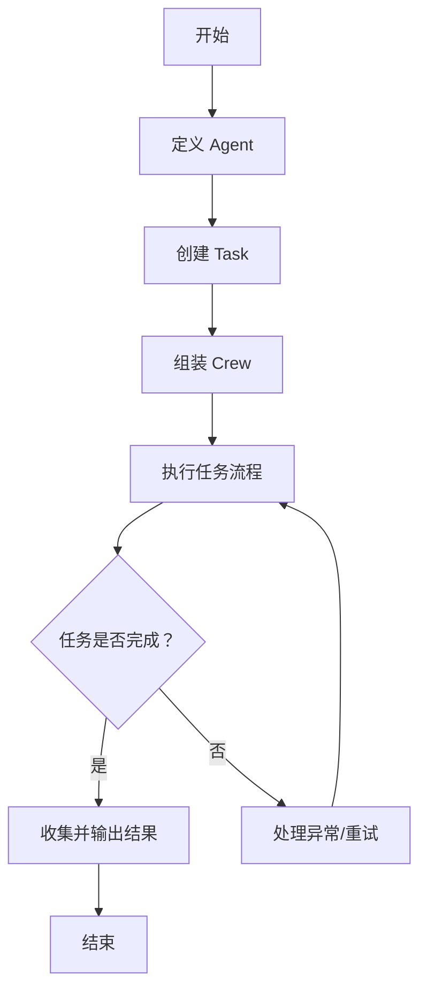

<!-- wiki_page_id: page-4 -->

# Python 框架实现：CrewAI

## 项目概述

CrewAI 是一个基于 Python 的多智能体协作框架，旨在通过组织专门化的 AI 代理（Agents）形成团队（Crew）来完成复杂任务。该框架支持代理之间的角色分配、任务分解、协作执行以及结果整合，适用于研究、内容创作、问题解决等场景。

## 核心架构

CrewAI 的核心架构围绕三个主要组件展开：Agent（代理）、Task（任务）和 Crew（团队）。

### Agent（代理）

Agent 是 CrewAI 中的基本执行单元，每个代理具备特定的角色、目标和背景故事，以决定其行为方式和决策逻辑。

#### 主要属性
- **role**：代理在团队中的角色定义（如研究员、作家、分析师）
- **goal**：代理需要达成的具体目标
- **backstory**：代理的背景故事，影响其思考方式和专业视角
- **tools**：代理可使用的工具列表（如搜索引擎、文件操作、API 调用）
- **verbose**：是否启用详细日志输出
- **allow_delegation**：是否允许代理将任务委托给其他代理

### Task（任务）

Task 表示需要由 Agent 完成的具体工作单元，包含任务描述、预期输出以及分配的执行者。

#### 主要属性
- **description**：任务的详细描述
- **expected_output**：任务完成后应产出的结果格式和内容
- **agent**：负责执行该任务的 Agent 实例
- **context**：任务执行所需的上下文信息（可从前置任务继承）
- **tools**：任务专用工具（可覆盖 Agent 默认工具）
- **async_execution**：是否支持异步执行
- **output_file**：任务输出保存路径（可选）

### Crew（团队）

Crew 是由多个 Agent 组成的协作团队，负责编排任务执行流程、管理代理间依赖关系以及汇总最终结果。

#### 关键特性
- **任务调度**：根据任务依赖关系自动确定执行顺序
- **上下文传递**：后续任务可自动继承前置任务的输出作为上下文
- **结果聚合**：自动收集并整理所有任务执行结果
- **错误处理**：支持任务失败时的重试机制和异常捕获

## 工作流程

CrewAI 的典型工作流程包括以下阶段：

1. **代理定义**：创建具有不同角色和专长的 Agent 实例
2. **任务创建**：为每个目标定义具体的 Task，明确描述、期望输出和分配的 Agent
3. **团队组装**：将 Agent 和 Task 组织成 Crew，设定任务执行顺序
4. **执行协作**：Crew 按顺序执行任务，在执行过程中自动传递上下文
5. **结果输出**：收集所有任务结果并生成最终报告或交付物



## 关键实现机制

### 上下文传递机制

CrewAI 实现了自动上下文传递，使得后续任务能够无缝访问前置任务的输出结果。当一个任务完成后，其输出会被存储并在团队共享上下文中可供后续任务引用。

### 任务依赖管理

框架通过分析任务之间的数据依赖关系（如后续任务引用前置任务输出）来自动确定安全的执行顺序，无需开发者手动指定复杂的执行流程。

### 错误容错与重试

在任务执行过程中，如果遇到异常或超时，CrewAI 支持配置重试次数和间隔，提高系统鲁棒性。同时提供详细的错误日志以便调试。

## 使用示例

以下是基于仓库中 `crew_research.py` 和 `main.py` 的典型使用模式：

```python
from crewai import Agent, Task, Crew
from crewai_tools import SerperDevTool

# 定义工具
search_tool = SerperDevTool()

# 创建研究员代理
researcher = Agent(
    role='高级研究员',
    goal='发现用户指定主题的最新和最相关信息',
    backstory='你是一位经验丰富的研究员，擅长在复杂主题中发现关键洞察',
    tools=[search_tool],
    verbose=True
)

# 创建作家代理
writer = Agent(
    role='内容作家',
    goal='将研究发现转化为引人入胜且结构清晰的叙述',
    backstory='你是一位才华横溢的作家，擅长将技术信息转化为易于理解的内容',
    verbose=True
)

# 定义研究任务
research_task = Task(
    description='调查人工智能在医疗保健中的最新应用',
    expected_output='一份包含关键发现、统计数据和趋势分析的研究报告大纲',
    agent=researcher
)

# 定义写作任务（依赖研究任务输出）
writing_task = Task(
    description='基于研究结果撰写一篇面向专业人士的 informative 文章',
    expected_output='一篇约800字的专业文章，包含引言、主体和结论',
    agent=writer,
    context=[research_task]  # 自动继承研究任务的输出作为上下文
)

# 组装团队并执行
crew = Crew(
    agents=[researcher, writer],
    tasks=[research_task, writing_task],
    verbose=2
)

result = crew.kickoff()
print("最终输出：")
print(result)
```

## 配置与扩展

### 工具集成

CrewAI 支持通过自定义工具扩展代理能力。工具需要继承基础工具类并实现 `_run` 方法，例如：

```python
from crewai_tools import BaseTool

class CustomSearchTool(BaseTool):
    name: str = "自定义搜索"
    description: str = "用于执行专业领域搜索的工具"

    def _run(self, query: str) -> str:
        # 实现具体搜索逻辑
        return f"关于'{query}'的搜索结果..."
```

### 输出格式控制

通过在 Task 中指定 `expected_output` 和使用 `output_file` 参数，可以控制任务结果的格式和存储位置，支持文本、JSON、Markdown 等多种输出形式。

### 日志与监控

通过调整 `verbose` 参数（0-2 级别）可控制日志详细度，便于在开发、测试和生产环境中进行适当的监控和调试。

## 最佳实践

1. **明确角色定义**：为每个 Agent 设定清晰、互补的角色和目标，避免职责重叠
2. **渐进式任务分解**：将复杂目标分解为可管理的子任务，每个任务有明确的输入和输出
3. **上下文最小化**：仅在必要时将前置任务输出作为后置任务上下文，防止信息过载
4. **工具精准匹配**：为代理分配与其角色直接相关的工具，提高任务执行效率
5. **迭代优化**：根据执行结果反馈调整 Agent 背景故事、任务描述或工具配置

## 限制与注意事项

- 代理决策质量高度依赖于底层 LLM 的能力和提示词设计
- 复杂依赖链可能导致执行时间增加，需要注意任务粒度控制
- 上下文传递机制在处理大量数据时可能受到模型上下文窗口限制
- 需要妥善管理 API 密钥和工具凭证的安全性

## 总结

CrewAI 提供了一种直观且强大的方式来构建多智能体 AI 系统，通过角色专属化、任务导向和协作编排，使开发者能够将复杂问题分解为可管理的协作流程。其设计理念强调人类团队协作的最佳实践在 AI 系统中的映射，适用于需要多方面专长和迭代优化的场景。通过合理设计 Agent、Task 和 Crew 的交互，可以构建出既灵活又可靠的智能解决方案。
