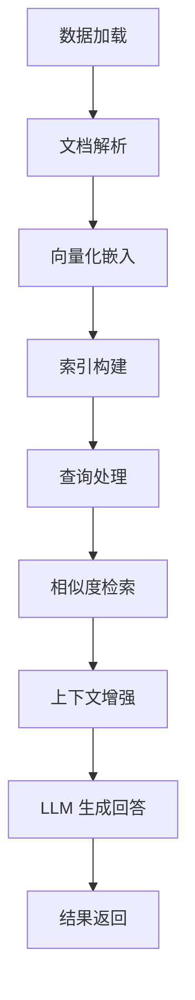
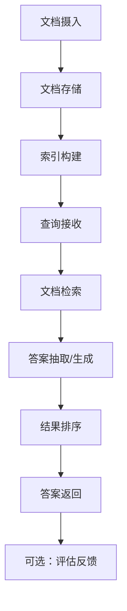
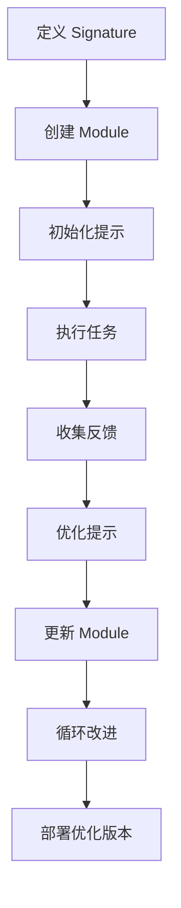

<!-- wiki_page_id: page-5 -->

# Python 框架实现：LlamaIndex、Haystack、DSPy 等

## 项目概述

本项目演示了如何使用不同的 LLM 框架（LlamaIndex、Haystack、DSPy）构建智能代理（Agent）系统。每个框架都有其独特的设计理念和实现方式，适用于不同的场景。

## LlamaIndex 实现

### 核心概念

LlamaIndex（前身为 GPT Index）专注于将私有数据与大语言模型连接起来，提供数据索引、检索和查询增强功能。

### 文件结构

- `python/llamaindex/README.md`: 框架说明和使用指南
- `python/llamaindex/main.py`: 核心实现代码

### 主要功能

根据 README.md 内容，LlamaIndex 实现包含：
- 数据加载和索引构建
- 查询引擎（Query Engine）
- 检索增强生成（RAG） pipeline
- 与各种 LLM 提供商的集成

### 代码特点

main.py 中展示了：
- 使用 `VectorStoreIndex` 进行向量索引
- 通过 `ServiceContext` 配置 LLM 和嵌入模型
- 使用 `QueryEngine` 执行自然语言查询
- 支持多种数据源（文档、数据库等）

### 工作流程

## Haystack 实现

Haystack 是一个开源框架，用于构建强大的问答系统和语义搜索应用，特别适合处理大规模文档集合。

- `python/haystack/README.md`: 框架介绍和部署指南
- `python/haystack/main.py`: 核心实现代码

根据 README.md 内容，Haystack 实现包含：
- 文档存储和检索（Document Store）
- 检索器（Retriever） - BM25、嵌入检索等
- 阅读器（Reader） - 用于答案抽取的 QA 模型
- 管道（Pipeline） - 组织各组件的工作流
- 评估工具 - 评估系统性能

main.py 中展示了：
- 使用 `ElasticsearchDocumentStore` 或 `InMemoryDocumentStore`
- 配置 `BM25Retriever` 或 `EmbeddingRetriever`
- 使用 `FARMReader` 或 `TransformersReader` 进行答案抽取
- 构建 `ExtractiveQAPipeline` 或 `GenerativeQAPipeline`
- 支持批量查询和评估

## DSPy 实现

DSPy（Declare and Solve Problems in Python）是一个用于用程序化方式而非提示工程来优化 LM 提示和权重的框架。它将提示编程化，使得 LM 行为可以通过优化算法自动改进。

- `python/dspy/README.md`: 框架原理和使用方法
- `python/dspy/main.py`: 核心实现代码

根据 README.md 内容，DSPy 实现包含：
- 声明式编程范式（Signature）
- 自动提示优化（Teleprompter）
- 模块化 LM 调用（Module）
- 优化器（Optimizer）如 BootstrapFewShot、MIPRO
- 评估和反馈机制

main.py 中展示了：
- 使用 `Signature` 定义输入输出行为
- 通过 `Module` 构建可重用的 LM 组件
- 应用 `Teleprompter` 进行自动提示优化
- 使用 `BootstrapFewShot` 进行少样本学习
- 支持反馈循环和自改进

## 框架比较

| 特性 | LlamaIndex | Haystack | DSPy |
|------|------------|----------|------|
| 核心焦点 | 数据索引与检索增强 | 问答系统与语义搜索 | 提示编程与自动优化 |
| 主要组件 | 索引、查询引擎 | 文档存储、检索器、阅读器 | Signature、Module、Teleprompter |
| 优化方式 | 检索策略调整 | 模型选择和管道配置 | 提示权重自动优化 |
| 适用场景 | 私有知识库问答 | 大规模文档检索 | 需要反馈循环的任务 |
| 学习曲线 | 中等 | 较高 | 较高（概念新颖） |
| 社区生态 | 活跃 | 成熟 | 新兴但快速增长 |

## 集成与扩展

所有三个框架都支持：
- 与主流 LLM 提供商集成（OpenAI、Anthropic、本地模型等）
- 自定义数据源和处理管道
- 生产环境部署选项
- 监控和日志记录功能

## 最佳实践

1. **LlamaIndex**：适用于需要快速构建知识库问答系统的场景，重点优化索引策略和查询模板
2. **Haystack**：适用于复杂的问答系统或语义搜索引擎，利用其丰富的检索和阅读器组件
3. **DSPy**：适用于需要通过数据反馈持续改进 LM 行为的场景，特别是当有明确的评估指标时

## 开发指南

每个框架的目录中都包含详细的 README.md，提供了：
- 环境设置说明
- 依赖安装指令
- 运行示例代码
- 常见问题解答
- 性能调优建议

## 结论

本仓库提供了三种主流 LLM 框架的实用实现，展示了它们在构建智能代理系统时的不同方法论。开发者可以根据具体需求选择最合适的框架：
- 选择 LlamaIndex 进行快速原型开发和知识库集成
- 选择 Haystack 构建生产级问答系统
- 选择 DSPy 进行提示编程和自动优化研究

每个实现都遵循了框架的最佳实践，并提供了清晰的代码结构和文档，便于二次开发和定制扩展。
