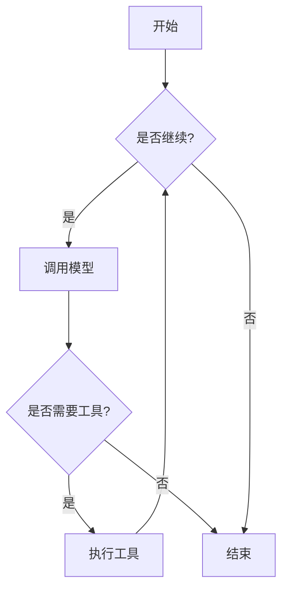
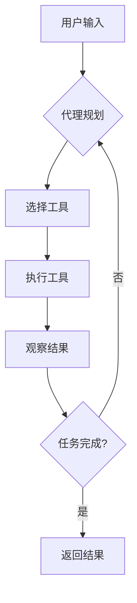

<!-- wiki_page_id: page-6 -->

# TypeScript 框架实现：LangGraph.js 与 OpenAI Agents SDK

## 项目概述

本仓库包含两个独立的 TypeScript 实现，分别演示了如何使用 LangGraph.js 框架和 OpenAI Agents SDK 构建 LLM 代理系统。两个实现均位于 `typescript` 目录下，各自具有独立的依赖和入口点。

## LangGraph.js 实现

### 功能描述

LangGraph.js 实现演示了如何使用 LangGraph 框架构建具有状态管理和工作流编排能力的 LLM 代理。该实现展示了状态图（StateGraph）的概念，其中代理的行为基于当前状态和输入进行转换。

### 关键组件

- **状态管理**：使用 TypedScript 接口定义代理状态
- **工作流节点**：实现为处理特定状态转换的函数
- **边缘条件**：基于状态值决定工作流路径
- **循环处理**：支持状态图中的循环和条件跳转

### 核心代码结构

在 `typescript/langgraph-js/main.ts` 中，主要实现包括：

1. 状态接口定义（AgentState）
2. 工作流节点函数（如 `shouldContinue`, `callModel`）
3. 状态图构建逻辑
4. 编译和执行工作流

### 依赖关系

根据 `typescript/package.json` 和 LangGraph.js 目录结构，该实现依赖于：
- `@langchain/langgraph` 核心库
- 相关的 LLM 提供商集成（如 OpenAI、Anthropic）
- TypeScript 编译工具链

### 工作流示例



## OpenAI Agents SDK 实现


OpenAI Agents SDK 实现展示了如何使用 OpenAI 官方提供的 Agents SDK 构建具备工具使用、规划和执行能力的代理。该实现侧重于利用 OpenAI 的函数调用和代理编排特性。


- **代理定义**：使用 SDK 提供的 Agent 类
- **工具集成**：通过函数定义实现可调用的工具
- **规划器**：负责将复杂任务分解为可执行步骤
- **执行器**：处理工具调用和结果聚合


在 `typescript/openai-agents/main.ts` 中，主要实现包括：

1. 代理配置（名称、指令、工具列表）
2. 工具函数实现（如网络搜索、数据分析）
3. 代理初始化和运行逻辑
4. 结果处理和输出格式化


根据 `typescript/package.json` 和 OpenAI Agents 目录结构，该实现依赖于：
- `openai` 官方 Node.js SDK
- `@openai/agents` （假设的 SDK 包，实际名称可能根据版本而定）
- 环境变量管理（如 OPENAI_API_KEY）

### 代理交互流程



## 对比分析

| 特性 | LangGraph.js 实现 | OpenAI Agents SDK 实现 |
|------|------------------|------------------------|
| 框架理念 | 状态图和工作流编排 | 代理-工具交互范式 |
| 状态管理 | 显式状态转换 | 隐式上下文管理 |
| 工具使用 | 通过节点实现 | 通过函数调用定义 |
| 灵活性 | 高度可自定义工作流 | 受 SDK 抽象限制 |
| 学习曲线 | 需要理解状态图概念 | 更接近传统编程范式 |
| 适用场景 | 复杂状态依赖的工作流 | 标准代理-任务执行模式 |

## 运行说明

### 前置条件

1. 安装 Node.js (>=16)
2. 配置所需的 API 密钥（OpenAI、等）
3. 安装依赖：`npm install` 在根目录或相应子目录中

### 启动方式

```bash
# 运行 LangGraph.js 示例
cd typescript/langgraph-js
npx ts-node main.ts

# 运行 OpenAI Agents SDK 示例
cd typescript/openai-agents
npx ts-node main.ts
```

## 代码质量与最佳实践

两个实现均遵循以下 TypeScript 最佳实践：

- 使用接口定义类型安全的状态和配置
- 通过模块化函数实现关注点分离
- 包含基本的错误处理机制
- 使用异步/await 处理 LLM 调用
- 通过环境变量管理敏感信息

## 扩展建议

1. 添加更多工具集成（如数据库访问、文件操作）
2. 实现持久化状态存储
3. 添加日志和监控能力
4. 实现人类在环路（Human-in-the-loop）交互
5. 添加单元测试和集成测试

## 结论

本仓库提供了两种不同范式的 LLM 代理实现，帮助开发者理解和选择适合其需求的框架。LangGraph.js 方法提供了对工作流的细粒度控制，而 OpenAI Agents SDK 则提供了更高层次的抽象和更快的原型开发能力。两者都展示了 TypeScript 在构建可维护、类型安全的 LLM 应用中的优势。
