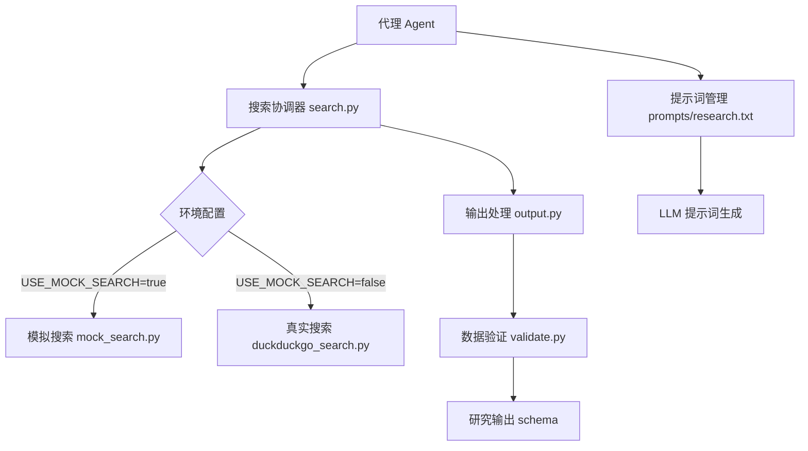

<!-- wiki_page_id: page-9 -->

# 共享工具与通用组件

## 概述

`llm-agents` 项目中的共享工具与通用组件位于 `shared/` 和 `python/llm_agents_common/` 目录下，为代理（Agent）系统提供统一的搜索、输出处理、验证和提示词管理功能。这些组件设计为可复用、易于测试，并支持真实工具（如 DuckDuckGo 搜索）与模拟工具（用于测试）之间的无缝切换。

## 核心组件

### 搜索工具（Search Tools）

搜索功能通过抽象接口实现，支持多种后端实现。

#### 接口定义

所有搜索工具遵循统一的调用签名：
```python
def search(query: str, max_results: int = 5) -> List[Dict[str, Any]]:
    """
    执行搜索查询
    
    Args:
        query: 搜索关键词
        max_results: 返回结果的最大数量
        
    Returns:
        包含搜索结果的字典列表，每个字典包含:
        - title: 结果标题
        - url: 结果链接
        - snippet: 结果摘要
    """
```

#### 真实搜索工具：DuckDuckGo

文件：`shared/tools/duckduckgo_search.py`

- 使用 `duckduckgo-search` 库执行实际搜索
- 实现错误处理和结果格式化
- 返回结构化结果列表

```python
from duckduckgo_search import DDGS

def duckduckgo_search(query: str, max_results: int = 5) -> List[Dict]:
    with DDGS() as ddgs:
        results = []
        for r in ddgs.text(query, max_results=max_results):
            results.append({
                "title": r.get("title", ""),
                "url": r.get("href", ""),
                "snippet": r.get("body", "")
            })
        return results
```

#### 模拟搜索工具（Mock Search）

文件：`shared/tools/mock_search.py` 和 `python/llm_agents_common/mock_search.py`

- 用于测试和开发环境
- 返回预定义的模拟结果
- 支持可配置的响应延迟以模拟网络请求

```python
def mock_search(query: str, max_results: int = 5) -> List[Dict]:
    # 返回固定的模拟结果用于测试
    return [
        {
            "title": f"模拟结果 {i+1} 对于 '{query}'",
            "url": f"https://example.com/result/{i}",
            "snippet": f"这是关于 '{query}' 的模拟搜索结果第 {i+1} 条。"
        }
        for i in range(min(max_results, 3))  # 限制返回数量
    ]
```

### 搜索协调器（Search Coordinator）

文件：`python/llm_agents_common/search.py`

- 负责在真实搜索和模拟搜索之间切换
- 通过环境变量或配置控制行为
- 提供统一的搜索入口点

```python
import os
from .mock_search import mock_search
from shared.tools.duckduckgo_search import duckduckgo_search

def search(query: str, max_results: int = 5) -> List[Dict]:
    """
    主搜索函数，根据环境选择后端
    
    环境变量:
        USE_MOCK_SEARCH: 设置为 "true" 启用模拟搜索
    """
    if os.getenv("USE_MOCK_SEARCH", "false").lower() == "true":
        return mock_search(query, max_results)
    return duckduckgo_search(query, max_results)
```

### 输出处理（Output Handling）

文件：`python/llm_agents_common/output.py`

- 定义代理输出的标准格式
- 提供结果序列化和反序列化功能
- 支持 JSON 输出以便与其他系统集成

```python
from typing import Dict, Any, List
import json

class AgentOutput:
    def __init__(self, 
                 task: str,
                 results: List[Dict[str, Any]],
                 metadata: Dict[str, Any] = None):
        self.task = task
        self.results = results
        self.metadata = metadata or {}
    
    def to_json(self) -> str:
        return json.dumps({
            "task": self.task,
            "results": self.results,
            "metadata": self.metadata
        }, ensure_ascii=False, indent=2)
    
    @classmethod
    def from_json(cls, json_str: str) -> 'AgentOutput':
        data = json.loads(json_str)
        return cls(
            task=data["task"],
            results=data["results"],
            metadata=data.get("metadata", {})
        )
```

### 数据验证（Validation）

文件：`python/llm_agents_common/validate.py`

- 确保搜索结果和代理输出符合预期 schema
- 防止由于格式错误导致的下游处理失败
- 基于 JSON Schema 进行验证

```python
from jsonschema import validate, ValidationError
import json

# 研究输出的 JSON Schema
RESEARCH_OUTPUT_SCHEMA = {
    "type": "object",
    "properties": {
        "task": {"type": "string"},
        "results": {
            "type": "array",
            "items": {
                "type": "object",
                "properties": {
                    "title": {"type": "string"},
                    "url": {"type": "string", "format": "uri"},
                    "snippet": {"type": "string"}
                },
                "required": ["title", "url", "snippet"]
            }
        },
        "metadata": {"type": "object"}
    },
    "required": ["task", "results"]
}

def validate_research_output(data: Dict[str, Any]) -> bool:
    """
    验证研究输出数据是否符合 schema
    
    Args:
        data: 待验证的数据字典
        
    Returns:
        如果验证通过返回 True
        
    Raises:
        ValidationError: 如果数据不符合 schema
    """
    validate(instance=data, schema=RESEARCH_OUTPUT_SCHEMA)
    return True
```

### 提示词管理（Prompt Management）

文件：`shared/prompts/research.txt`

- 存储用于研究任务的提示词模板
- 支持轻松修改而无需更改代码
- 使用清晰的占位符进行变量替换

```
你是一个专业的研究助理。请根据以下查询进行深入研究：

查询: {query}

请提供：
1. 关键事实和发现
2. 相关来源和参考链接
3. 可能的后续研究方向

将结果以清晰、结构化的方式呈现。
```

### 输出 Schema 定义

文件：`shared/schema/research_output.json`

- 正式定义研究输出的数据结构
- 用于文档生成、验证和 API 契约
- 与 `validate.py` 中的 schema 保持同步

```json
{
  "$schema": "http://json-schema.org/draft-07/schema#",
  "title": "Research Output",
  "type": "object",
  "properties": {
    "task": {
      "type": "string",
      "description": "研究任务的描述"
    },
    "results": {
      "type": "array",
      "description": "搜索结果列表",
      "items": {
        "type": "object",
        "properties": {
          "title": {
            "type": "string",
            "description": "结果标题"
          },
          "url": {
            "type": "string",
            "format": "uri",
            "description": "结果链接"
          },
          "snippet": {
            "type": "string",
            "description": "结果摘要或片段"
          }
        },
        "required": ["title", "url", "snippet"],
        "additionalProperties": false
      }
    },
    "metadata": {
      "type": "object",
      "description": "额外的元数据，如时间戳、使用的工具等"
    }
  },
  "required": ["task", "results"],
  "additionalProperties": false
}
```

## 组件关系



## 使用示例

### 基础搜索使用

```python
from python.llm_agents_common.search import search

results = search("大语言模型最新进展", max_results=10)
for result in results:
    print(f"{result['title']}: {result['url']}")
```

### 带验证的输出处理

```python
from python.llm_agents_common.output import AgentOutput
from python.llm_agents_common.validate import validate_research_output
from python.llm_agents_common.search import search

# 执行搜索
raw_results = search("人工智能伦理")

# 创建标准输出
output = AgentOutput(
    task="研究人工智能伦理准则",
    results=raw_results,
    metadata={"timestamp": "2024-01-15", "tool": "duckduckgo"}
)

# 验证输出格式
try:
    validate_research_output({
        "task": output.task,
        "results": output.results,
        "metadata": output.metadata
    })
    print("输出验证通过")
    
    # 序列化为 JSON
    json_output = output.to_json()
    print(json_output)
except ValidationError as e:
    print(f"输出验证失败: {e}")
```

### 在测试中使用模拟搜索

```bash
# 设置环境变量启用模拟搜索
export USE_MOCK_SEARCH=true

# 运行测试
python -m pytest tests/
```

## 配置与扩展

### 环境变量

| 变量名 | 值 | 描述 |
|--------|----|------|
| `USE_MOCK_SEARCH` | `true`/`false` | 控制是否使用模拟搜索工具，默认为 `false` |

### 扩展新搜索后端

要添加新的搜索实现：
1. 在 `shared/tools/` 目录下创建新的搜索模块（例如 `google_search.py`）
2. 实现符合标准签名的 `search` 函数
3. 修改 `python/llm_agents_common/search.py` 以包含新后端的选择逻辑
4. 更新环境变量条件或添加新的配置选项

## 设计原则

1. **抽象化**：搜索功能通过接口抽象，使上层代理无需关心具体实现
2. **可测试性**：模拟工具确保单元测试快速、可靠且不依赖外部服务
3. **一致性**：统一的数据格式和验证机制确保组件间兼容性
4. **可配置性**：通过环境变量控制行为，支持不同部署环境
5. **职责单一**：每个模块有明确的职责（搜索、输出、验证等）

## 依赖关系

- `duckduckgo-search`: 用于真实网络搜索
- `jsonschema`: 用于数据验证
- 标准库: `json`, `os`, `typing`

这些共享工具形成了 llm-agents 系统的基础层，确保了代理之间的一致行为、易于维护的代码库以及可靠的测试基础设施。通过将变化点（如搜索后端）与稳定点（如输出格式）分离，系统能够在保持核心功能不变的同时适应不同的需求和环境。
