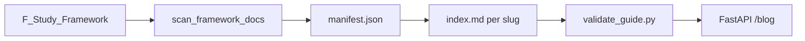

# atelier 架构说明

## 内容分工

| 路径 | 体裁 | 站点 URL |
|------|------|----------|
| `Blog/framework-guides/` | 124 篇技术栈**官方指南**（人工精写） | `/blog/series/framework`、`/blog/{slug}` |
| `Blog/algorithm-guides/` | 82 篇 Algorithm **专题双语指南** | `/blog/series/algorithm`、`/blog/{slug}` |
| `Blog/认识简谱/` | 独立博文 | `/blog/jianpu` |
| `Wiki/{project}/` | DeepWiki 导出的**项目文档** | `/docs/{wiki_slug}/{page}` |
| `zhita_settings.xlsx` | 证书、爱好、书籍等表格 | `/browse/{hub_id}` |

**易混点**：`Wiki/Framework/` 与 `Blog/framework-guides/` 都关于 GitHub `zhk0567/Framework`，但前者是 Wiki 分页导出，后者是读者向教程；URL 与目录均已分离。Algorithm 专题教程在 `Blog/algorithm-guides/`，源码在 GitHub `zhk0567/Algorithm`；单题 LeetCode 题解不在 atelier 展开。

## 运行时结构

```
main.py              → uvicorn 入口
app/
  config.py          → config/*.json + FRAMEWORK_ROOT
  constants.py       → UI 文案、站点身份
  context.py         → Jinja 公共 context、壁纸
  projects.py        → config/projects.json + xlsx 合并
  routes/            → FastAPI 路由
  markdown/          → 博客 / Wiki 渲染
site_data.py         → xlsx 解析、manifest 聚合
config/
  site.example.json
  projects.json
templates/  static/
```

## Framework 指南流水线



维护命令见 [Blog/framework-guides/README.md](../Blog/framework-guides/README.md)。

## 配置

复制 `config/site.example.json` 为 `config/site.local.json`（已 gitignore），设置本机 `framework_root`。环境变量 `FRAMEWORK_ROOT` 优先级最高。
